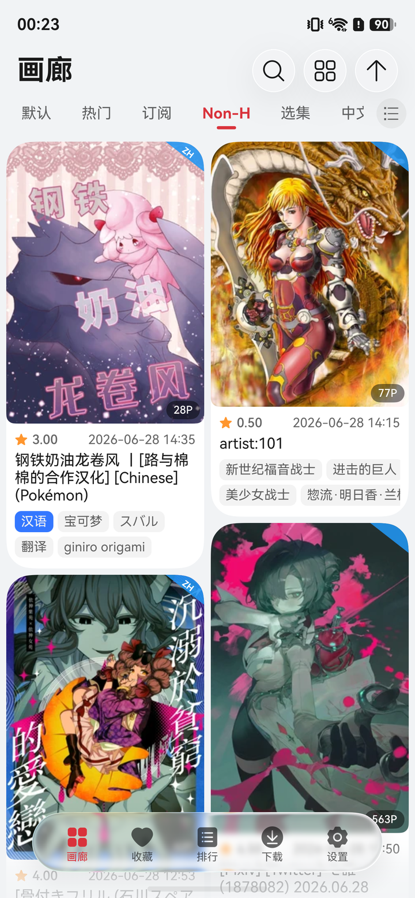
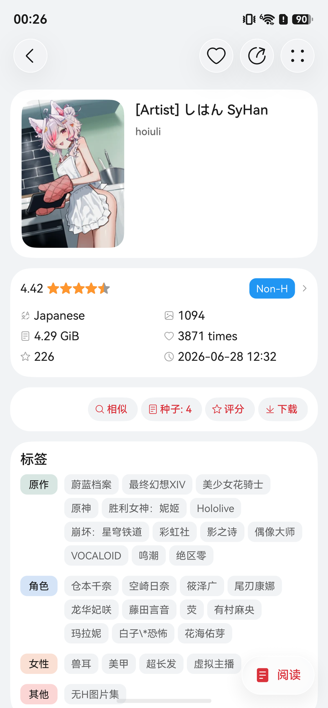
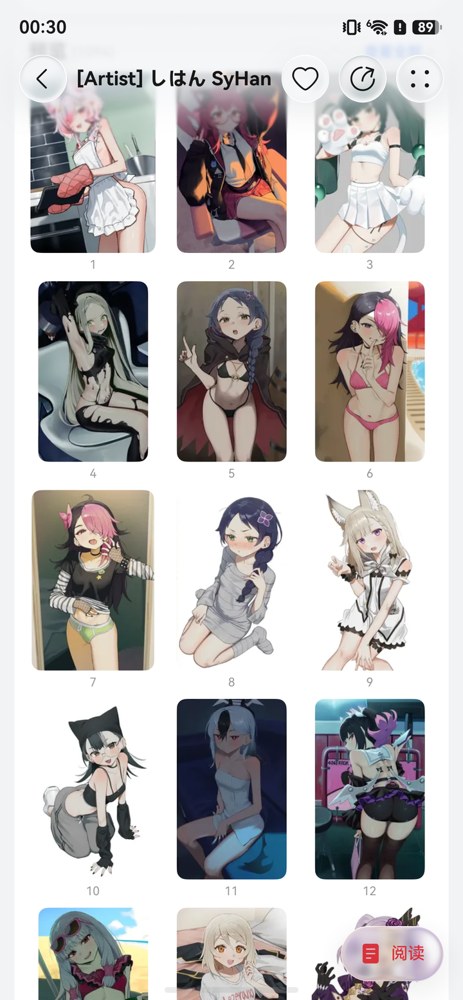
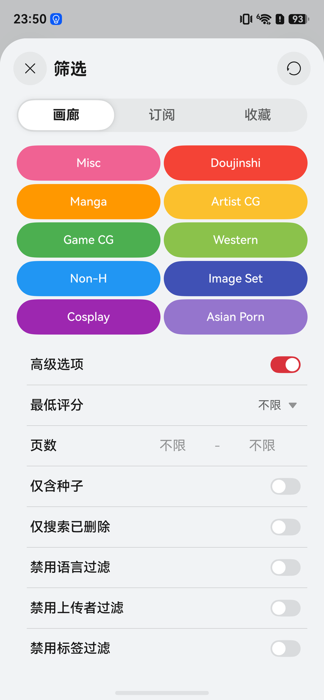
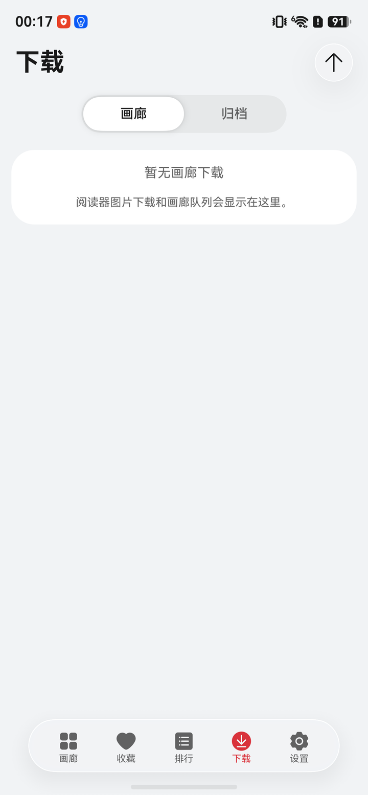
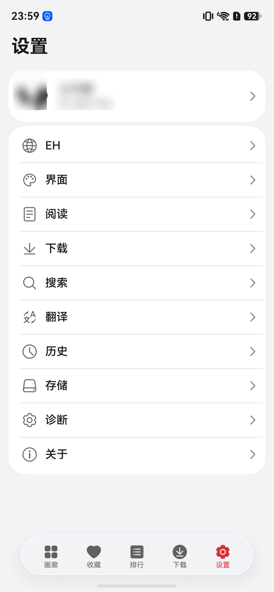

<h1 align="center">
  
  <br>
  NextE
</h1>

原生 **HarmonyOS NEXT** E-Hentai / ExHentai 客户端。

NextE 以 [eros_fe](https://github.com/3003h/Eros-FE) 作为功能与交互参考，按 HarmonyOS 原生体验重写。

> NextE 是非官方客户端，与 E-Hentai 无隶属关系。

## 功能概览

- 画廊浏览、收藏、排行、历史和自定义 SubTab。
- 列表、简洁、网格、瀑布流、封面墙等多种布局。
- 画廊详情、标签、缩略图、评论、种子和归档入口。
- 阅读器、搜索筛选、标签翻译、My Tags、本地屏蔽和下载队列。
- 云同步、WebDAV 同步、本地备份和常用设置。

## 截图

| 首页 | 画廊详情 | 缩略图预览 |
| --- | --- | --- |
|  |  |  |

| 搜索筛选 | 下载 | 设置 |
| --- | --- | --- |
|  |  |  |

## 构建

需要 DevEco Studio / HarmonyOS SDK。

```bash
ohpm install
hvigorw assembleHap --mode module -p product=default -p buildMode=debug --no-daemon
```

本地签名包：

```bash
bash scripts/setup-local-build-profile.sh
bash scripts/build_hvigor_signed.sh
```

## 开发

```bash
node scripts/test_v1_decorator_inventory_contract.mjs
node scripts/test_version_consistency_contract.mjs
python3 scripts/check_i18n_duplicates.py
```

架构、路线图和开发约束见 [docs](docs/) 与 [AGENTS.md](AGENTS.md)。

## 参考与致谢

- 功能与交互参考：[eros_fe](https://github.com/3003h/Eros-FE)、[E-HentaiViewer](https://github.com/kayanouriko/E-HentaiViewer)、[EhViewer](https://github.com/seven332/EhViewer)
- HarmonyOS 架构参考：V2Next
- 标签翻译数据：[EhTagTranslation/Database](https://github.com/EhTagTranslation/Database)

## 许可

[MIT](LICENSE)
