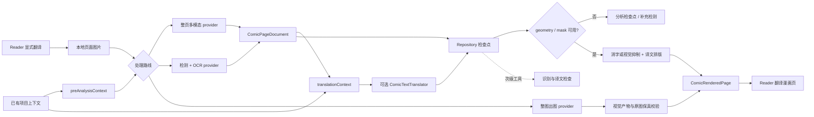

# NextE 漫画翻译设计与演进指南

- **状态**：端侧视觉 Reader V1 方向已确认；现有外部 sidecar 仅作为研发原型与可选后端保留
- **首次整理**：2026-07-20
- **最近复核**：2026-07-23
- **外部调研**：[漫画翻译工作流调研](research/manga-translation-workflows.md)
- **实测对照**：[视觉后端与可替换技术栈](research/manga-translation-backend-comparison.md)
- **适用范围**：Reader 漫画页检测/转录、翻译、跨页上下文、消字修复、排版渲染、人工修订与缓存

## 文档角色

本文件是漫画翻译领域的长期设计入口，用来保持数据语义、阶段接口和实施顺序一致。它不是全局任务
队列，也不授权模型费用、设备操作、远端上传或发布。每次实施仍由用户最新请求决定范围，并按
[Plan Lifecycle](plans/README.md) 建立有边界的 active plan。

当前产品方向是：**先交付低操作成本的 Reader 阅读翻译，但其用户结果仍是一张可直接阅读的视觉译制
漫画页。** 正式默认路线必须在端侧完成文字检测、OCR、原文处理、排版和渲染，只把翻译与必要的图像
语境判断交给用户选择的 LLM 源。普通用户不得为了使用漫画翻译而部署 Docker、填写制图服务地址或维护
第二套服务账号；首次使用最多需要下载并管理本地视觉模型包。可持久化的画廊/页面翻译文档衔接各阶段，
整页多模态和 OCR 只是可替换的上游分析器。中间文档、转录文本、质量信号和调试面板都不能替代视觉页面。

专业漫画制作是共享同一底层文档与渲染能力的后续产品分支，不是当前 V1 的同义词。Reader 分支追求
少操作、可失败回退、可缓存和足够好的即时阅读；制作分支才要求逐框编辑、精细修复、字体与布局调优、
批量校对和成品导出。两条分支可以兼得，但必须分别定义入口和验收，不能用制作工具的复杂度阻塞 Reader，
也不能用文字列表冒充“轻量阅读”。

## 产品不变量

- “漫画翻译”表示 Reader 在原漫画空间内呈现对应译文，用户继续通过漫画页而不是文本列表阅读；
- 当前产品是“轻量 Reader 阅读翻译”，其中“轻量”只降低操作、等待和专业校对要求，不降低为文字面板；
- “AI 辅助漫画制作”是后续独立工作流；它复用页面文档、术语、修订和渲染阶段，但增加可编辑中间产物、
  批量质检与导出，不反向改变 Reader 的主结果；
- 有文字页面只有在“区域定位 -> 原文处理 -> 译文排版 -> 渲染”形成闭环，或整图出图 provider 直接返回
  通过校验的视觉译制页后，才是可展示结果；只得到原文/译文文档时属于分析检查点；
- 整页多模态、OCR、检测器、文本模型、网关和本地/远端渲染都是内部实现选择，不得改变用户结果；
- 正式 Reader 默认路径不得要求外部视觉服务；网络侧只要求用户已明确选择的 LLM 源，图片是否发送给
  LLM 继续受该源能力、隐私说明和显式翻译动作约束；
- 用户可主动选择独立的云端整图路线；该路线由一个 provider 对最终成图负责，不得把其内部 OCR、修复、
  排版子阶段拆入端侧管线。默认端侧路线与云端整图路线只在统一视觉产物边界汇合；
- 外部 sidecar 只能作为研发验收、质量对照或用户主动开启的高级后端，不能出现在普通漫画翻译配置的
  必填路径，也不能成为“功能已完成”的隐藏前提；
- 原文/译文对照、识别详情和待复核项只能作为翻译页的次级检查工具，不能成为主结果或阶段完成替代品；
- 任何阶段可以只交付基础设施，但必须明确标为基础设施，不能以“V1 漫画翻译完成”描述；
- 以后若要把视觉翻译页降级成文字阅读辅助，属于改变产品语义，必须先取得用户明确决定，不能写进计划后
  再视作默认授权。

## 目标与非目标

### 目标

- 用户在 Reader 中显式翻译当前页，并直接看到位于原文字区域的中文漫画页；
- 用户不需要进入专业编辑器即可完成日常阅读，失败时能立即回到原图；
- 文字区域、原文抑制/修复、译文布局和渲染结果具有可追溯的页面身份与 revision；
- 人名、地名、称谓和口癖可以在同一画廊内持续复用并由用户锁定；
- 整页多模态、检测/OCR 和未来其他后端能输出同一内部文档；
- 页面切换、失败重试、模型切换和应用重启不会把结果发到错误页面；
- 修改译文或术语不重新运行无关的视觉分析；
- 人工修改是一等数据，不被缓存清理或模型重跑静默覆盖；
- 分析、翻译和渲染可以独立重试，但只有组合后的翻译页进入 Reader 主阅读路径。

### 第一版非目标

- 第一版不承诺可发布印刷质量、原字体一比一还原或可编辑 PSD；
- 第一版不承诺所有艺术字、拟声词和复杂背景都能无人工复核地完美修复；
- 第一版不提供专业制作台、整章人工工作流或成品导出；
- 在图片预取过程中默认调用付费模型；
- 一次请求上传整本画廊图片；
- 把某个模型厂商的请求或响应格式变成内部持久化格式；
- 默认同步图片、模型原始响应、API Key 或可再生成的大体积缓存。

## 当前源码落点与边界

- Reader 的 [ReaderPage.ets](../feature/reader/src/main/ets/pages/ReaderPage.ets) 已通过
  `rememberImageFile(page, filePath, bytes)` 记录稳定的本地图片路径，可以作为显式翻译动作的输入。
- `ReaderCacheWarmers()` 和多个图片组件也会调用 `onImageFileReady`。因此文件就绪只表示图片可用，
  **不得直接触发模型请求**，否则预加载会产生不可见费用和队列竞争。
- 当前 [CommentTranslationService.ets](../shared/src/main/ets/services/CommentTranslationService.ets) 的
  `ChatMessage.content` 是纯字符串，缓存和调度也围绕评论文本设计。漫画翻译应建立独立 orchestrator、
  repository 和 provider 接口，不继续扩张评论服务。
- [EhGalleryImage.ets](../shared/src/main/ets/model/EhGalleryImage.ets) 明确把 `imageUrl` 定义为 one-shot
  per-IP 运行时地址。模型适配器应读取本地缓存文件，再按厂商能力使用文件上传、受控网关或编码后的
  图片输入，不能依赖模型服务器直接抓取 EH 地址。
- 当前 [AxiosHttpClient.ets](../shared/src/main/ets/network/AxiosHttpClient.ets) 的文本 POST 接口只接受
  字符串请求体。Phase 0 adapter 以受限大小的本地图片 data URI 调用 Responses 协议，没有改变现有
  评论翻译契约；文件上传、网关上传仍属于后续独立能力。
- [ComicResponsesPageAnalyzer.ets](../shared/src/main/ets/services/ComicResponsesPageAnalyzer.ets) 已提供公开
  Responses API 与实验性 Codex OAuth 两条整页分析路径，并共同输出 `ComicPageDocument`；当前适配器明确
  声明 `geometry=false` 并要求 `polygon=[]`，因此只能作为转录/翻译分析候选，不能单独产生 Reader 翻译页。
  Codex 路径已用原创两页样例取得真实结构与质量证据，但该证据不覆盖文字定位、消字、排版或渲染质量。
  默认 Responses transport 会在 Axios/平台 HTTP 接收阶段把响应限制为 8 MiB，协议解析层保留相同上限；
  远端异常大响应不会等到完整进入应用内存后才被拒绝，自定义 transport 也仍受协议层二次校验。
- [ComicTranslationSettingsPage.ets](../feature/settings/src/main/ets/pages/ComicTranslationSettingsPage.ets)
  选择共享 LLM 源和漫画使用的模型；API 与 Codex OAuth 源统一由 LLM 源管理维护，同一 Codex 源也可供
  评论翻译选择。普通漫画翻译页面已移除外部“制图服务”地址与账号；sidecar 配置代码仅为研发/实验后端
  保留，不再参与默认运行时或普通用户配置。
- [ComicTranslationRepository.ets](../shared/src/main/ets/services/ComicTranslationRepository.ets) 与
  [ComicTranslationOrchestrator.ets](../shared/src/main/ets/services/ComicTranslationOrchestrator.ets) 已建立
  provider/model/prompt/language/image/revision 分键、并发去重、前两页上下文和成功后写入边界。当前实现是
  有界内存前置加 RDB 生成文档缓存；应用进程重启后可以按完整请求身份恢复，但缓存仍不进入备份或同步。
- [ComicTranslationRuntimeService.ets](../shared/src/main/ets/services/ComicTranslationRuntimeService.ets) 已把
  Reader 的稳定本地文件转换为带 SHA-256、尺寸、MIME 与上下文 revision 的请求。Reader 只在用户点击
  `翻译当前页` 后调用它，并以路由/画廊/页/文件/UI epoch 围住结果发布；成功产物是经过校验的本地衍生
  图片，重新进入现有 Reader 图片路径。旧文字半模态已退出主结果路径，失败时继续显示原图。
- 模块依赖继续遵守 [architecture.md](architecture.md)：`feature/reader` 只负责入口和展示；可跨页面
  复用的模型、存储、provider 和服务放在 `shared`；feature 之间不互相导入。
- 任何 UI/响应式状态实现只使用 State Management V2。

## 核心架构



中间文档是唯一稳定衔接面：provider 原始 JSON 只在适配器内部解析和校验，Reader、上下文、缓存和
渲染器都不直接依赖厂商格式。

## 领域数据语义

下面是概念模型，不提前锁定 ArkTS 类名或 RDB 列形状；实现时可以在不改变语义的前提下细化。

### `ComicTranslationProject`

代表一个画廊在一种目标语言下的翻译项目：

```text
projectId
galleryIdentity
sourceFingerprint
sourceLanguage
targetLanguage
glossaryRevision
styleGuideRevision
contextRevision
documentRevision
rollingSummary
styleGuide
pages[]
```

- `galleryIdentity` 表示稳定画廊身份；`sourceFingerprint` 用页数和页面内容身份区分内容变化。
- `sourceLanguage` 可以来自用户选择或经过复核的自动判断，不能隐藏在 provider 私有请求中。
- 同一画廊的不同目标语言是不同项目，不能共用译文修订号。
- `rollingSummary` 是相关前情的短摘要，不保存无限增长的全部提示词。

### `ComicPageDocument`

```text
projectId
pageIndex
imageHash
imageWidth
imageHeight
imagePreparationProfile
analysisRevision
translationRevision
renderRevision
analysisState
translationState
renderState
hasText
pageSummary
blocks[]
qualitySignals[]
lastError?
```

- `pageIndex` 使用 Reader 内部的从 0 开始页序；来源协议若使用从 1 开始的 `image.page`，由接入适配层转换。
- `imageWidth`、`imageHeight` 是原图像素尺寸。`polygon` 也统一保存为原图像素坐标，provider 返回的归一化坐标、
  缩放图坐标或分块坐标必须由适配层换算后再进入文档。
- `imagePreparationProfile` 记录实际送入 provider 的格式、尺寸和分块策略，供缓存键和结果追溯使用；它不改变
  页面文档的原图坐标空间。
- 明确识别为无文字的页面仍完成了分析，因此保留当前 `analysisRevision`，但使用
  `hasText=false`、空 `blocks`、`translationState=missing` 和 `translationRevision=0`。请求与缓存只对这一
  完整组合放行零翻译修订；有文字页面不得借此绕过翻译修订匹配。

不要使用一个单线性 `status` 表示全部工作。分析、翻译和渲染可以独立缺失、就绪、过期或失败：

- `analysisState`: `missing | ready | stale | failed`
- `translationState`: `missing | provisional | ready | stale | failed | review_required`
- `renderState`: `unavailable | ready | stale | failed`

排队、运行和取消是任务运行态，不等于已持久化结果。应用重启后以最后成功 revision 恢复，不把旧的
`running` 状态当成仍在执行。

### `ComicTextBlock`

```text
blockId
readingOrder
kind
sourceText
normalizedSourceText?
translatedText?
polygon?
maskRef?
speakerId?
styleHint?
sourceOrigin            // vision | ocr | manual
translationOrigin       // vision | text | manual
providerConfidence?     // 仅为质量信号，不是事实
sourceRevision
translationRevision
manualSource
manualTranslation
```

- 整页多模态可以只提供阅读顺序、原文和上下文感知译文；这时页面只能成为分析检查点，不能发布为
  Reader 翻译结果。
- 分阶段渲染路线中，每个需要呈现的文本块必须具有原图坐标空间内的有效 geometry；mask 可以由分析器
  提供，也可以由后续区域处理器生成。缺失能力时编排器必须补充检测或返回明确未就绪，不能回退为主结果
  文本面板。整图出图路线可以没有 block geometry，但必须直接产出独立视觉页，并记录完整 artifact/provider
  identity；该结果不能伪装成可逐框编辑的结构文档。
- 所有模式都必须保存原文，不能只保存译文。
- 区域检测结果和区域内 OCR 文本是两种不同证据。区域存在但 OCR 错字时，已接收整页图像的多模态
  `ComicTextTranslator` 可以按图像静默纠正识别错误；`blockId`、区域和顺序仍是结构边界，OCR 文本不能
  被当成不可质疑的真值。若区域本身没有被检测到，翻译器不得凭空增加没有 geometry/template 的块；该页
  必须记录检测覆盖缺失，并由补充检测、残留原文检查或人工修订解决。
- 人工原文和人工译文具有更高优先级。重新分析时先产生候选 revision，再显式解决与人工内容的冲突。
- provider 自报 confidence 通常未校准，只能和空结果、重复文本、结构校验、跨引擎差异等共同构成
  `qualitySignals`。

### `ComicGlossaryTerm`

```text
sourceTerm
aliases[]
targetTerm
status                 // provisional | locked
provenance             // model | user | imported
firstSeenPageIndex
updatedRevision
notes?
```

- `provisional` 是模型建议，可以被后文证据或用户修改；
- `locked` 是用户确认或明确采用的译法，模型不得静默覆盖；
- 术语变更提高 `glossaryRevision`，只让受影响的翻译过期，不让视觉分析过期；
- 实现应维护术语到文本块的引用索引，以便按影响范围重翻。

## Provider 能力模型

`ComicPageAnalyzer` 应声明能力，而不是用“是不是多模态”判断后续功能：

```text
transcript
readingOrder
geometry
speakerAssociation
mask
contextAwareTranslation
```

推荐支持四类适配器：

1. **Whole-page vision**：可在一次请求中输出阅读顺序、原文、上下文感知译文和不确定项；通常不承诺
   可靠 geometry/mask。
2. **Detection + OCR**：输出区域、顺序、原文和识别信号；翻译交给独立文本 provider。
3. **Hybrid**：比较视觉转录和 OCR，在差异或质量信号异常时进入复核，不要求每页都运行两套模型。
4. **Whole-page render**：输入整页图像与画廊上下文，直接返回视觉译制图片；不要求中间 geometry，但必须
   声明 image-output 能力，并接受图片保真、尺寸/MIME/hash、缓存身份和失败回退校验。

现有可运行原型采用分阶段 sidecar：首个 profile 固定兼容 `manga-translator-ui v1.9.9` 的“导出原文 ->
导入 JSON 并渲染”API，由外部服务负责区域检测/OCR、原文处理和图片渲染；NextE 的 API/Codex provider
负责接收区域原文、整页图像和画廊上下文并返回按 blockId 对齐的译文。该原型用于证明中间文档、LLM
翻译、视觉回填和 Reader 缓存能够真实闭环，也作为端侧实现的质量对照，但不再代表正式 V1 的部署形态。
sidecar 不是内部文档格式，也不与翻译 provider 共用认证；未主动开启实验后端时，服务地址、状态和凭据
不得影响 Reader 漫画翻译可用性。

正式默认路线由 `ComicLocalVisualBackend` 实现同一个 region/render 契约。当前生产 backend profile 为
`core-vision-ocr-bubble-group-v30`，语义分组和 Reader layout 分别继承 v24/v43：Core Vision 系统 OCR 与
可选 YSGYolo/PP-OCRv5 输出先映射到原图 geometry，再合并相邻纵列或横行。
同一 OCR tile 内，若窄纵列被明显更大的纵排段落包含，分析阶段会把子列中尚未出现的原文并入段落并停止发布
子块，让 LLM 只翻译一次完整段落。相邻行/列合并必须保留原始 OCR 行高/列宽作为固定间距尺度，已合并段落
的整体高宽不得反向放大下一次允许间距；轻微重叠的同行框可合并，但明显气泡间距必须保留。渲染阶段严格按
文档 block 一对一生成 plan，不再根据译文或普通矩形邻接重新合并、抑制语义块。v42 只增加视觉布局例外：
先按每个原 block 独立清理原文字形，再读取像素确认的闭合气泡安全区；仅当一个 `shapeConstrained` 安全区
包含组内所有源块中心时，才按原 reading order 拼接这些已存在的译文并在该气泡内统一拟合、绘制一次。
文档、blockId、译文缓存和原文清理边界都不改变；没有单一闭合安全区覆盖全组、仅靠传递邻接形成的组，或
开放式/纹理边界，全部保持一 block 一布局。中文/日文合并不插入拉丁空格，拉丁目标以空格连接完整短语。
该规则不得跨越明显分离的左右段落。原文清理始终遵循源文字 geometry；译文排版方向由目标语种决定，中文和
日文可保留纵排，拉丁字母目标必须使用横排单词换行，不能把英文逐字竖排。文字采用白色描边、深色填充的
两遍绘制；pen 宽度固定为字号的 20%，并限制在 2–10 px，填充覆盖描边内侧后留下约一层正常字笔画的可见
白边，不能退回固定 1–2 px 细边。

窄竖源框翻译成拉丁文字时，v43 同时评估物理框内的正常横排和 v40 的整段 90° 侧转保底。只有正常横排能
保持每个拉丁单词完整、字号至少 10 px，且达到侧转候选字号的 75% 时才优先直立绘制；否则继续侧转，避免
为了方向自然重新引入拆词或不可读小字。该选择只属于 render profile，不改变文档方向、blockId 或译文缓存。
一般横排拉丁布局也必须先确认候选字号能容纳完整单词；空间不足时缩小字号，不能把单词强制拆成字母碎片。
任何单独视觉组在擦除前都必须通过最终排版预检；无法排版时保留该组原文像素并继续渲染其他组，不能先擦除
再失败，也不能让一个异常组中止整页。

拉丁目标的排版空间可以在安全页边和左右段落边界内扩展，但 360 px 是“额外扩展”的上限，不得把本来
更宽的 source paragraph 反向缩窄。超过 360 px 的真实源宽只用于减少换行；页面统一字号上限和该段落自身
字号都必须按 360 px 参考宽度拟合，避免扩大空间同时放大文字。该确定性规则只修复 geometry 利用率，不
伪装成拟声词、人物或其他画面障碍的内容感知避让。

YSGYolo 的五类标签是文本/气泡 region 类型，不是人物或画面分割，且当前持久文档不携带一套可供渲染器
任意解释的 detector 私有类别。v37 的有限避让因此放在渲染端：全部原文清理结束后，只对长横排且有明显
垂直余量的块比较上/中/下三个候选文字包围盒的局部高对比边缘密度；改善不显著或像素读取失败时保持居中。
这能避开紧邻的拟声词/复杂线条，但不是语义障碍识别、人物分割或二维自动排版，不能据此关闭通用质量门。

v39 在全部原文处理结束后，为横排目标尝试从 OCR 原始区域内选取种子，并在有界邻域内按已采样的气泡底色
做连通域搜索。只有连通域闭合、不触碰候选边缘、面积和宽高足以覆盖原始文字区域时，才裁掉稀疏尾部并生成
带内缩的气泡安全矩形；开放式尾部、复杂纹理、深色底或像素读取异常全部沿用原 geometry fallback。一次解析
得到的同一安全矩形必须同时提供给字号拟合、有限障碍偏移和最终绘制，禁止各阶段分别重算造成边界漂移。
该规则只改善可确认闭合的普通气泡，不是通用气泡分割，也不允许以不确定轮廓裁掉译文。

v40 为“源块是竖排、目标是拉丁字母、可用矩形明显窄高”的情况增加单独布局：先在交换宽高后的逻辑画布中按
正常横排和单词边界完成整段排版，再以块中心顺时针旋转 90° 绘回原竖向长轴。它不是逐字母竖排；单词、标点、
换行和描边仍由同一个横排 layout 产生。闭合安全区已确认时沿用安全矩形；未确认时只保留原 OCR 矩形大小，
并把该紧凑矩形平移进既有页边 fallback 的 8 px 内边界，禁止重新扩成会跨出色块的宽段落。旋转段落不再运行
横排障碍上下偏移。该策略是窄竖框的轻量阅读折衷，不代表专业英文化排字；开放尾部、曲线气泡和普通宽气泡
仍按原有规则处理。

v21 在分组完成后排除窄边界内的非对白页脚块：只有位于页面底部 6%、横排，并且命中明确网址/平台署名，
或属于不超过 12 字符的符号主导碎片时才过滤。中部网址和底部自然对白必须保留。过滤发生在文档与 LLM
之前，不擦除原图像素，所以作者署名仍按原图显示，只是不再被误译、清理或回填；文档同时记录
`local_non_dialogue_footer_filtered` 质量信号。该规则不是通用艺术字或拟声词检测器。

v13 两页原创测量基线严格命中 9/11，成功检测的普通文本方向为 9/9，单页端侧视觉耗时为 867–1677 ms；
v33 在真实英文 Reader 页中已修复逐字竖排、重复子块、嵌套短句堆叠和弱描边，并保留此前漏在子列中的
段落信息；v36 又修复宽源段落被 360 px 上限反向缩窄的问题，同时禁止新增宽度抬高字号；v37 增加有限的
局部边缘感知纵向锚点；v24 analyzer 继承页脚过滤并修复多行段落跨气泡传递合并，v40 render 禁止翻译后
再次改变语义分组，对可确认闭合的普通气泡使用内部安全矩形，并让窄竖框中的拉丁译文沿长轴保留完整单词；
v42 则在文档仍保留多个 block 时，只用同一已确认闭合边界把同气泡译文统一排版一次。
但当前没有语义障碍/人物分割，艺术字
和拟声词仍会漏检，因此仍未通过通用制图质量门。完整
测量边界见
[漫画翻译端侧质量基线](research/manga-translation-local-quality-baseline.md)。它已经去掉服务地址和第二套
账号。当前 production 已使用 CTD 文字 mask 与 AOT 有界 inpaint，但系统通用 OCR 和补充 recognizer 仍会
漏掉融入画面的拟声词，AOT 对复杂纹理也不等价于 Docker LaMa，因此只能称为可运行、待复核基线，不能
称为最终制图质量。

端侧 source treatment 当前为 v28。AOT 不再按任意大文字区域原尺寸推理：长边超过 256 时保持比例缩小，
补齐到 8 像素对齐，推理后恢复到源区域并只按原 mask 合成。detector、固定 1024 输入的 CTD text mask 与
AOT 的 ncnn Extractor 使用单次推理拥有的 mmap scratch pool，阶段结束即解除映射；模型权重仍按模型缓存，
不与临时 workspace 混为一体。Reader 对 `comic-translated:` 最终衍生页跳过二次超分，避免“先端侧译制、
再把整张译图放大”同时保留两套大图资源；该规则不改变用户对普通原图的超分设置。

设备 `237` 的同一真实页对照中，原尺寸 AOT 的 ready 后 PSS 约 1.84 GiB；只限制 AOT 到 256 后约
990 MiB；v28 覆盖 CTD/detector scratch 并跳过译图超分后，第 1 页峰值约 918 MiB、完成后约 776 MiB，
连续第 2 页峰值约 992 MiB、最终回落约 717 MiB，没有逐页累加。该结果关闭当前样本的明显临时内存滞留和
译图重复超分，不关闭普通页/长图 P50/P95、低内存失败回退或视觉质量门。随后 v24/v40 在同一第 2 页把
14 个 OCR 行稳定分为 5 个文档块和 5 个渲染 plan；中间两个长气泡分别为 `y=648–819`、`y=869–988`，
保留 50 px 间隔，真实译图不再跨气泡重叠。v39 在该页五个块上均确认闭合安全区，其中短气泡从 fallback
`602,1039–890,1126` 收敛到 `642,1043–855,1126`，最小气泡收敛到 `465,1144–599,1188`；271 项设备
Hypium 全部通过。第 3 页三个窄高色块进一步验证 v40：旧 v39 会把 `Whenever` 等单词拆成单字母，并让
粉色块译文跨出边界；v40 的 1280 × 905 产物为 136,656 bytes、artifact `62b1460cce96…`，三段译文均沿
各自竖向长轴保留完整单词且不跨块。新增确定性窄竖框用例后设备完整 Hypium 为 272/272。该结果关闭当前
窄竖拉丁框的拆词和越界回归，不等于开放式气泡、复杂背景、正常朝向的专业英文排字或艺术字质量门通过。

第 4 页进一步暴露 analyzer 仍可能把一个不规则闭合气泡中的多列 OCR 保留为多个合法 block。v42 不回写
语义文档，而是在全部原文字形分别清理后，以同一闭合安全区作为视觉证据合并布局。设备 `237` 上 24 个
document plan 最终成为 17 个视觉组，其中 7 组各自共享一个单一闭合气泡；中央大粉气泡、顶部灰气泡、
右侧窄气泡和底部粉气泡均只拟合、绘制一次，不再出现同气泡字号跳变或译文相压。首次真实 v42 重绘日志为
`cache=0`，PNG 691,220 bytes、artifact `1204916145c8…`；目标用例 21/21，完整 Hypium 273/273。该规则
不覆盖没有可靠闭合边界的块，也不关闭艺术字、拟声词、复杂背景修复和跨样本 overflow 质量门。

高质量档现有两个可选原生组件。YSGYolo 1.2 OS1.0 detector 通过 ncnn 异步 NAPI 输出原图 OBB、score 和
region class；设备 `237` 的 1024 × 1536 页热推理为 160 ms。超过 2048 边长的页面按 2048 × 2048、256 px
重叠分块，逐块结果回映原图后按中心距离/轴向 IoU 去重，最多 64 块、512 个区域；任一块失败时整页 detector
结果回退，不向后续阶段发布部分结果。生产尺寸 `720 × 14804` 的合成长图在设备 `237` 为 9 块，模型加载
48 ms、总推理 1731 ms。PP-OCRv5 Mobile Recognition 负责对系统 OCR
未覆盖的 detector 区域做补充转录；设备 `237` 的模型加载为 53 ms，三个独立区域推理为 162/46/47 ms。
两者以 `model-pack-v1.1.4` 按需发布并连接 production `ComicLocalVisualBackend`。Core Vision 仍是主 OCR；
PP-OCRv5 只补充未覆盖区域，置信度低于 0.85 的结果拒绝，绝不覆盖已有系统 OCR。遮盖和排版继续使用已
接受文字的 polygon；缺包、超限或任一模型失败时保留现有 Core Vision 路径。
设备 `237` 已通过正式设置页安装这一个组合包；UI 只在 detector 与 recognizer 五份资产逐文件通过大小和
SHA-256 后显示 `YSGYolo + PP-OCRv5`。同一最终边界的目标设备用例为 6/6，完整 Hypium 为 256/256。

v30 继承第三个可选原生组件 CTD text mask。运行时擦除 mask 继续使用 0.3 阈值；0.15 低阈值输出只提出
Core Vision 与 YSGYolo 未覆盖的候选区域，不能直接触发擦除。两个阈值必须从同一次原生模型 forward 的
恢复输出生成，不能为 analysis/render 重复执行相同 CTD；0.3 结果可按源图 hash 与尺寸进入一次性内存缓存，
上限 2 项、合计 16 MiB，render 命中即删除，未命中则重新推理。候选按 4 px 网格、有限膨胀和连通域
生成，coverage 按实际网格并集计算。占用不足 64 个网格的 CTD 碎片不进入补充 OCR，直接保留原图；其余
候选先走 PP-OCRv5 整块识别，近方形区域可做上下半块重试，仍未识别且尺寸允许时再放大后调用系统 OCR。
低置信度结果、页边短标签、已被系统 OCR 覆盖的碎片，以及短小的拉丁/数字与单个假名混合转录全部拒绝；
只有获得可接受 transcript 的候选才能进入语义分组和文档。该边界优先避免误擦画面，不把未识别拟声词
伪装成已完成翻译。

渲染端先完成底色采样、安全矩形、视觉分组、字号上限、最终排版和障碍偏移，再开始任何擦除。单个视觉组
预检失败时保留其原文像素并继续其余组；只有全部组都不可绘制时整页失败。YSGYolo 与 PP-OCRv5 仍不输出
背景修复；端侧清理使用 CTD 像素 mask 配合 AOT inpaint。后续高质量档仍需扩展漫画 OCR/艺术字评测和可选
生成式 inpaint。上游
Python、FastAPI、Docker、GPL 实现不能原样打包进 HAP；每个独立模型都必须完成来源与许可证、格式转换、
hash、资源大小、内存、长图分块和设备性能验收。模型包可以按需下载，但推理与制图仍在端侧执行。
“不需要服务端地址”已经成立；“断网后所有设备都可用”仍需通过离线资源状态与飞行模式验收，不能由一次
联网设备运行推断。

生成式修复模型必须先于产品接入完成否决性验证，不能先新增设置项或运行时分支再补资源门。Docker 的
207,482,655-byte `lamalarge.onnx` 已完成固定 256px ncnn 数值对齐与设备 `237` 验证：转换误差可忽略，
但单区域冷/热推理约 23.8–24.2 秒，测试进程总 PSS 样点最高 1,142,558 kB，模型 bin 约 195 MiB；现有 AOT
真实区域约 238–468 ms。该 LaMa 导出因此明确拒绝进入模型包、设置页、隐藏开关或 production profile，
不得仅因复杂纹理 A/B 更好而重新加入。以后只有更小的移动端模型或更合适的运行时同时通过固定画质集、
设备 P50/P95、峰值 PSS、连续多页热稳定性、失败保留原图和许可证/分发检查，才可以提出新的端侧修复
profile；完整数据见
[端侧质量基线](research/manga-translation-local-quality-baseline.md#lama-large-修复模型否决性验证2026-07-23)。

许可证按组件而不是按整个功能统一：NextE 适配与编排代码沿用项目 MIT，YSGYolo checkpoint 因内嵌
`AGPL-3.0` 元数据按 `AGPL-3.0-only` 单独分发，PP-OCRv5 模型与相关转换边界按 Apache-2.0 记录。一个模型包
允许包含多种许可证，但每个资产必须能追溯到自己的来源、hash 和许可证；项目不能用总仓 MIT 覆盖下载
模型自己的许可证，也不能替权利人为同一资产追加双许可。

上述阶段不是固定技术选型：`ComicRegionRenderBackend` 允许整个端侧视觉 profile 替换，
`ComicTextTranslator` 允许 API/Codex 或以后满足结构协议的本地 LLM 替换，`ComicWholePageRenderBackend`
允许真正具备 image-output 的模型直接返回整张译制页。当前 production runtime 同时包含本地 staged
backend + 文本 translator，以及独立的 Torii 整图 provider 路由；后续 image-output provider 继续复用同一
整图边界。普通文本
LLM 不能承担像素 mask、背景修复或最终图片输出；多模态文本 LLM 可以校正 OCR、阅读顺序和语义，但仍需
geometry/render；图片编辑模型则必须走 whole-page route 并接受画面保真校验。完整分层与同页 A/B 见
[视觉后端与可替换技术栈](research/manga-translation-backend-comparison.md)。

首个 profile 固定到 commit `696dc63bd0b4803f96cc3d4f844322cef4910f8e`，使用
`/translate/export/original` 返回的 `translation.json` 作为短期 adapter template，再把按 blockId
校验过的译文写回 region 的 `translation` 字段并调用 NextE 兼容 sidecar 的
`/translate/import/json/nexte-load-text-v2`。不使用 TXT 模糊匹配，避免重复原文被字典键合并。profile
之外的字段形状必须本地失败；新增上游版本需要显式增加并验证新 profile。export/import 请求固定携带
`translator=original`，让上游只复制 OCR 原文而不调用其默认 OpenAI 翻译器；实际翻译始终由漫画设置中
选中的共享 API/Codex LLM 源完成，避免出现两套模型、两套上下文和两份凭据。

不能把未经验证的上游 `/translate/import/json` 当作该 profile 的回填端点。真实链路发现 v1.9.9 会返回
HTTP 200，但 `prepare_translator_params()` 产生的 `load_text` 工作流参数没有应用到共享 translator，随后
再次检测/OCR并使用已配置 translator，因而可能输出未使用提交译文的“假成功”图片。NextE 的独立 GPL
sidecar 补丁只修复这条工作流并增加专用路由；构建脚本固定上游 commit、应用补丁并生成独立镜像，HAP
不包含上游代码或模型。协议 revision 3 的 `/openapi.json` 能力检查要求专用路由，未打补丁的 vanilla
v1.9.9 会在上传漫画页前失败。

sidecar 认证采用账号凭据换取短期会话，而不是要求用户反复粘贴 `X-Session-Token`。用户名和密码保存在
应用私有存储中，备份时只允许进入现有加密 secret 分区；`POST /auth/login` 返回的会话 token 只存在内存，
不进入 Preferences、日志、备份或缓存身份。并发请求共享一次登录；收到 401 时只失效当前被拒绝的 token、
重新登录并重放一次，第二次仍失败就原样返回错误。连接检查先验证 OpenAPI profile，再登录并调用
`GET /auth/check`，不会上传漫画页。历史版本已保存的原始 session token 继续可读，用户保存新账号后才迁移；
旧 token 不具备自动续期能力。账号凭据不参与视觉产物 revision，避免改密码使既有译图失效，但运行时
backend 身份包含凭据指纹，保证凭据轮换后不会复用持有旧会话的实例。

截至 2026-07-21，设备 `237` 已用合法日文样页完成真实 sidecar + 已选 Codex provider 链路：源缓存文件
为 `1280x1817`，同页五个区域均得到中文，import 日志命中专用路由且没有第二次检测/OCR或 sidecar
translator。Reader 原图/译图切换、译图缩放和平移、切页返回均通过；切页返回和应用重启后的显式恢复
命中同一持久衍生页 hash，没有再次调用 sidecar/provider。该验收证明首条分阶段路线能产出可直接阅读的
视觉页，但只覆盖一个代表性单页样本；字体排版质量、长图、单双页和更广语种语料仍需继续评测。

同一画廊第 5 页的扩展验收进一步把质量边界分开：最初的 sidecar profile 只导出了七个区域，其中一个
小气泡 `むぅ～…` 完全没有 block，因此当时的渲染链无法替换；另一个已定位区域把
`バカなこと言わないで！行ってきまーす！` 误识别为包含“山”的句子，旧 prompt 又把 OCR 当成权威，最终
产生了语义错误的中文。只把逐块翻译 prompt 升级为 v2、要求模型结合整页图纠错后，真实重译仍输出
“我要去山里了”，因此该方案被实证否定，不能把提示词声明当成图像可读性证明。v3 在已校验整页图之外，
按 blockId 附加最多 16 个有界放大区域裁图，并把 polygon 纳入实际 prompt/context fingerprint；同页重译将
该块修正为“别说傻话了——我先走了！”。裁图按最小区域优先、阅读顺序发送，单图和总量都有硬上限，源图
在裁图前后复核 hash，避免派生输入脱离页面身份。该修正只覆盖“已有区域、原文识别错”；后续没有伪造
geometry，而是把 visual-only sidecar profile 版本化为 `recall-v1`：明确固定 `box_threshold=0.5`、YOLO OBB、
零最小区域比例，并开启 `48px` 低置信结果到 MangaOCR 的 hybrid retry，避免非空局部配置静默继承更严格的
检测默认值。profile 身份变化使旧七块产物自然失效；设备 `237` 同页重新 export 得到八个区域，新增
`p4-r1` 将 `むぅ〜` 译为 `呣～……`，polygon 仍为四点，并成功进入视觉回填页。该页未观察到新增对白误检，
但这只解决了该样本的整块漏检；艺术字/SFX、残留原文检测、长图、单双页和更广语料仍需独立验收，不能
由八个已返回 block 推断任意漫画页都已完整。

后续第 6 页实证了高召回的另一侧代价：`0.316` 置信度、约占整页 `0.05%` 以下的单个拉丁字母 `I` 来自
人物脸部线条，却被文本模型补成了不存在的“（脸红）”。`recall-v2` 因此只过滤“单个 ASCII 字母 +
低于 `0.5` 置信度 + 极小区域”这一窄噪声类，不按语言长度删除日文短对白；文本 prompt v4 同时禁止为
表情、动作和景物编造括号旁白。过滤后必须丢弃旧 mask，并由保留 polygon 重建，否则误检位置仍会被消字。
这暴露了固定上游 v1.9.9 的 `load_text` 会把 JSON polygon 恢复为 `float64`，而 OpenCV `fillPoly` 要求
整型坐标；独立 sidecar `v1.9.9-nexte2` 在 `nexte-load-text-v2` 路由中显式转换为 `int32`、透传被上游吞掉
的 load-text 错误，NextE 协议 revision 4 只接受该能力。设备 `237` 重跑后 import 返回 200，最新文档只含
五个真实 block，人物脸部误检区域的原图/译图截图 crop SHA-256 同为
`edb1c2b81da36e14b0276cf53e0305b50ac6a791977bf8d938f9fbc52cffb346`，证明该位置没有被消字或回填。
这仍是确定性噪声过滤，不等同于通用 OCR 置信度校准；短拉丁拟声词和更复杂假阳性需要独立语料决策。

Reader 的请求 fence 不应把“用户切到另一页”和“请求已失效”混为一谈。sidecar 与 LLM 一旦开始执行，
单纯切页并不能取消实际消耗；如果完成回调只因 `currentIndex` 改变而丢弃，就会浪费结果并迫使用户返回后
重复触发。当前规则是：换画廊、原图文件变化、被新请求取代或 Reader route 失效时拒绝发布；仅切页时，
结果继续按发起 `pageIndex` 写入页级缓存，但不替换当前页、不弹“结果已显示”。设备 `237` 的英语样本 P5
在请求中切到 P6，P6 回填前后截图 SHA-256 完全一致；返回 P5 时译图已自动可见，原图/译图切换正常。
同一缓存译图在双页模式中只替换 P5，邻接 P6 继续显示原图，证明单双页共用的仍是 page identity，而不是
spread 级布尔状态。该页十个持久 block 均完成回填，但 `Funny face lol` 被直译为“搞笑的脸哈哈”，因此
跨语言覆盖还必须同时记录“能出图”和“译文自然度”，不能用前者替代后者。

首个真实长图证据来自设备 `237` 的 `720x14804` 乌克兰语 P3。它把“协议能否处理高纵横比”与“Reader
结果是否可交付”进一步拆开：sidecar 的 11 段检测/export 能完成，但旧 NextE 适配器用错误旋转中心并旋转
整体外接框，先后制造越界 region。`geometry-v2` 按固定上游的均值顶点中心逐点恢复，只将恢复后顶点的
紧致 AABB 交给 LLM 区域裁图；精确 sidecar geometry 继续留在 adapter template。修正后 31 个 block
经过 Codex 翻译和专用 import，产出 `720x14804` PNG，证明现有分阶段路线无需改成文字面板或整页假结果
也能接通长图。

该产物仍未达到 Reader 质量线。端到端约 6 分 35 秒；通用 48px OCR 对乌克兰语产生大量近似字符，日文
MangaOCR hybrid fallback 对西里尔文本给出伪日文；最终页面存在字号过大、译文越出气泡和相邻文本重叠，
sidecar render 还记录 polygon union 拓扑警告。以后每个 profile 必须同时声明可支持的文字语言、fallback
适用范围和 layout 质量门：语言不匹配时不得因为“第二 OCR 有非空结果”就覆盖主 OCR；render 返回 200
也不能绕过 overflow、残留原文和代表性区域视觉抽检。长图关闭条件至少包括可接受延迟/内存、正文覆盖、
译文语义与气泡内布局四项，本次只关闭协议/缓存/发布链路。

语言感知 profile 不能只读取详情信息行。设备 `237` 的同一合法样本在详情信息中标为 `Japanese`，但显式
`language:ukrainian` tag 才描述当前翻译版本的正文语言；因此 Reader 路由现在优先传播非 `translated` 的
显式 language tag，缺失时才回退详情语言。固定 sidecar 的 48px OCR 字典包含西里尔字符，而可选
MangaOCR 是日文模型；上游 hybrid 实现会用任何非空的 secondary 结果直接替换低置信 primary 结果，
没有语种适用性仲裁。现有日文/auto profile 保留 hybrid 行为，显式非日语 profile 禁用 MangaOCR，且两者
使用独立 region profile/revision/cache identity，避免旧错误结果被当成命中。

同一 P3 用 `non-japanese-v1-geometry-v2` 重跑后，日志只出现 `Model48pxOCR`，没有 MangaOCR；77 个检测
候选最终形成 34 个回填译文块，并生成 SHA-256
`24d19263c14693aa89f9e02ac8ba692ea180c8fec3c137aaadd709533aa15466`、`720x14804`、7,172,846 bytes
的真实 PNG。它相对旧 profile 减少了伪日文和超大字号，部分中文句子更连贯，但端到端仍约 6 分 41 秒，
且实际页面仍有漏译、原文残留、错译、局部文字相压；sidecar 继续报告 panel sorting fallback、polygon union
`TopologyException` 和一次越界位置修正。因此语言路由只关闭“错误 fallback 覆盖主 OCR”，没有关闭 OCR
质量、版式、消字或长图交付验收；下一步仍按 layout fit/overflow、残留原文、语义抽检和资源预算推进。

整图出图是并列的完整路线，不被废弃。首个 provider 固定为 Torii 一键整图，通过
`ComicWholePageRenderBackend` 跳过 region export/import，直接进入渲染产物校验与缓存。Torii 公开的
OCR/inpaint/typeset 子端点不接入 NextE；拆接它们会模糊“端侧能力由 NextE 负责”与“云端 provider 对
整张成图负责”的边界。NextE 产品只接入 Torii credits 代付模式，不接入 Torii BYOK、自托管
OpenAI-compatible 端点或供应商 Key 转发。

整图出图的优势是接入短、无需客户端处理坐标；代价是可能改动画面、难以逐框修订、术语变化通常需要
整页重跑，所以必须保留原图切换并把非文字区域保真列入验收。Torii 自身 API Key 单独保存，只在用户
明确选择云端整图后读取；共享 LLM 源只服务评论翻译和 NextE 自有分阶段漫画翻译，不向 Torii 转交。

**架构决策（2026-07-22，取代此前 BYOK 接入方案）**：设备 `237` 对同一 OpenAI-compatible 源的真实
整页请求证明，模型目录可查询不等于 Torii 请求兼容。根地址规范化为 `/v1` 后，`deepseek-chat` 拒绝
`response_format`，`gpt-5-mini` 拒绝 `usage`，`gpt-5-chat-latest` 拒绝 `reasoning, usage`；只有
`gemini-2.5-flash-lite` 成功返回同尺寸译图。Torii 控制上游请求体，NextE 无法在提交整页前可靠判断每个
代理、模型和参数组合，也无法在客户端修正其上游负载。为避免把“偶尔可用”包装成稳定产品能力，设置页、
持久化快照、运行时和 multipart adapter 均移除 BYOK；旧 billing/source/model 配置只作为删除用
tombstone 迁移到 managed 模式，`x-byok-local-url` / `x-byok-local` 不得重新加入请求。

不得仅因为 Torii 公共 API 仍提供 BYOK 就恢复该入口。只有 Torii 提供可预检且稳定的兼容性契约，或
NextE 另立方案并自行拥有兼容代理、错误治理和真实设备回归矩阵时，才可重新评估；重新评估属于新的产品
决策，不是现有 LLM 源管理的自然扩展。

Torii 请求每页发送固定翻译约束和项目 style/glossary 到 `custom_prompt`（最多 1,000 字符），首张图以
`context=None` 启动上下文链，后续页只复用上一页响应中的 `context`（最多 10,000 字符）。字体是渲染身份
的一部分：NotoSans 作为覆盖面更广的默认值，WildWords 作为漫画手写风格选项；切换字体必须使缓存失效。
该字体选项只属于 Torii 云端整图。端侧路线固定使用系统默认字体，不下载、不内置，也不承诺复刻 Torii
字形；两条路线的字体能力不得混为同一设置。

设备 `237` 的同页 A/B 已验证该契约。`gemini-3.1-flash-lite`、英文目标下，WildWords 与 NotoSans 分别
生成 `torii-whole-page:managed:487f79d3687d62c3` 和 `torii-whole-page:managed:ca34269618752cbd` 两个
provider identity，产物 SHA-256 分别为 `9cf45dcd9a605922c2d1bdcb9d4e5cc1dca67b493327580e6fa348c8f301fda2`
和 `2ba2560de3c88d0ce6c58d8b6cb7320dcc6ab57fde3639ad178d67defa2c0b38`。WildWords 呈全大写漫画手写体，
NotoSans 呈常规混合大小写无衬线体；对应请求分别扣除 1.46 和 1.44 credits。由此关闭“字体参数是否真正
进入云端请求与缓存身份”的疑问，但不据此关闭 Torii 的排版、语义或拟声词质量验收。

Torii adapter 不能把官方示例中的 PNG data URL 当作唯一响应格式。2026-07-22 的真实设备请求返回了 JPEG
data URL；稳定边界因此是“允许的声明 MIME + 对应文件签名 + 可解码同尺寸图片”，随后由端侧有界归一化
为统一 PNG 产物。声明 MIME 与字节不匹配、尺寸漂移、像素数超限或无法解码时都必须在发布前失败。评测
和生产请求使用稳定 project/page/source hash/context/provider/model identity；只有显式重试语义才允许绕过
缓存，普通再次查看或进程重启不得无条件 force refresh。

`ComicTextTranslator` 是独立能力，但不是每次页面翻译都必须额外调用：

- whole-page provider 已接收项目上下文并给出有效译文时，可以把它保存为 `provisional` 或 `ready`；
- OCR/analyze-only provider 只给原文时，再调用文本 translator；
- 术语变化、人工改原文或整章 consistency pass 时，只调用文本 translator，不重新上传图片。

上下文因此分成两次可复用装配：分析前的 `preAnalysisContext` 包含术语、前页和摘要，可供整页
多模态一次完成转录与翻译；分析后的 `translationContext` 再加入当前页原文，供独立文本翻译使用。

图片输入以原始缓存文件的 `imageHash` 作为内容身份。provider adapter 可以按模型限制生成缩放、压缩、
分块或上传后的临时输入，但必须把尺寸、格式、分块和压缩策略记入 `imagePreparationProfile`。Reader 的
显示缩放或图像增强结果不能默认当作识别真值；任何可能改变细小笔画的预处理都要先用评估集验证。

内部请求应包括版本化的结构 schema、prompt 和图片预处理配置。任何 provider 输出都先经过：

```text
解析 -> schema 校验 -> 页号/块数/文本基本校验 -> 规范化 -> 写入候选 revision
```

解析失败、空文本、异常重复或页身份不匹配时保留最后成功结果，并显示可重试失败；不能用部分新结果
覆盖已审核文档。

## 共享 LLM 源与漫画消费边界

当前 spike 已实现两条可切换、不可混用凭据的传输路径，但凭据暂时存放在漫画翻译专用设置中。视觉
Reader V1 在继续 provider 实现前先迁移到共享 LLM 源档案：评论翻译和漫画翻译选择源档案及各自模型，
源档案统一管理连接、认证、模型目录和账号用量；业务页只管理业务策略。迁移不能改变下面两条传输路径
的稳定性声明。

| 路径 | 认证与端点 | 响应处理 | 稳定性定位 |
|---|---|---|---|
| OpenAI/兼容 API | 用户填写 base URL、API Key；通过 `/models` 查询并选择 model，兼容端点可手动覆盖；调用 `/responses` | 非流式 Responses JSON | 正式候选；生产环境仍优先考虑代理，避免移动端长期持有服务端密钥 |
| Codex OAuth（实验） | 设备码登录；从 ChatGPT Codex backend 查询当前账号的 model catalog 与用量窗口 | SSE，按 `response.output_item.done`/文本 delta 重建结果，401 时刷新一次 | 兼容性试验；依赖非公开移动端集成契约，随时可能失效 |

两条路径通过共享源档案复用传输能力，但评论与漫画仍各自拥有 prompt、输入约束和响应协议。切换源不会
切换页面文档语义，
也不会把一条路径的凭据回退给另一条路径。两条路径都优先查询各自的模型目录；Codex 目录按账号返回，
客户端排除 `supported_in_api=false` 和隐藏项，并按上游 priority 排序。查询失败时保留已有选择并显示错误，
不能用 NextE 内置的过期白名单静默替换。API 路径保留手动 model 输入，仅用于兼容端点未实现标准
`/models` 或需要指定未列出模型的情况。单次目录最多接受 512 个源条目；空值、控制字符或超过 160 字符
的模型标识不会进入设置菜单。160 字符与翻译请求身份的模型字段边界一致，避免目录选择在真正请求时才失败。

Codex 登录后，设置页还会在进入页面时和用户手动点击刷新时只读查询账号用量。当前兼容层从
`/backend-api/wham/usage` 读取 `primary_window` 与 `secondary_window`，把上游已用百分比换算为剩余百分比，
并按实际 `limit_window_seconds` 识别 5 小时与 7 天窗口，再显示重置倒计时。不能把 primary/secondary
的位置直接当作窗口名称。设置页只用一条紧凑用量项展示 `5H`/`7D`；账号未返回的窗口直接省略，不能
误标另一个窗口，也不为刷新单独增加按钮或列表行，整条用量项仍可点击刷新。
查询失败时保留最后一次成功快照，不做持续轮询，也不影响已选模型。该端点与模型目录同属 ChatGPT
私有 backend，不是公开 Platform API，必须继续受同一实验性提示和失效边界约束。账号作用域的本地快照
在 JSON 解析前限制为 16 KiB，并限制账号 ID、计划名和时间戳；损坏缓存只会被忽略，随后仍可后台刷新。

设置侧的只读响应同样有双层大小边界：默认 Axios transport 在接收阶段把公开 API/Codex 模型目录限制为
2 MiB，把 Codex 用量与 OAuth 响应限制为 512 KiB；模型目录和用量解析器保留相同上限，OAuth 服务则在
任何状态判断或 JSON 解析前再次检查返回体。因此自定义 transport 不能绕过应用层边界，异常大响应也不会
等到完整进入后续解析和状态写入流程才被拒绝。

凭据边界如下：

- API Key 作为 secret 保存，只允许进入显式加密备份，不进入明文备份或同步；
- Codex access/refresh/id token 只保存在本设备 Preferences，完全排除备份和同步，避免旋转 refresh token
  被复制到多台设备后相互失效；
- 响应式状态只暴露“是否已登录、账号标识、过期时间”，不持有原始 OAuth token；
- 日志和错误不得带 Authorization、token、图片正文或完整提示词；
- 当前本地 Preferences 不是系统硬件密钥库。若该实验进入正式产品，应先迁移到 HUKS/系统凭据存储并
  重新做威胁模型；在此之前 UI 必须持续标记为实验性。

共享源不是共享业务选择：评论翻译和漫画翻译可以绑定同一源，也可以选择不同源/模型。源 ID 稳定，
端点、账号或协议类型变化提高 source revision；仅轮换同一账号的凭据不应使翻译缓存失效。删除正在被
消费的源时，业务进入明确“未配置”状态，不能自动选第一个源或把评论凭据回填给漫画。

OAuth 字段边界按用途分层：用户码最多 128 字符，设备授权 ID、授权码和 PKCE 校验器各最多 4096 字符，
单个 access/refresh/id token 最多 128 KiB，账号 ID 最多 160 字符，本地 token JSON 最多 512 KiB；这些
字段必须无控制字符且不能带首尾空白。服务返回的轮询间隔限制为 3–60 秒，token 有效期最多按 30 天写入，
避免异常响应造成超长请求头、长期失效缓存或计时器溢出。

用户可编辑的 provider 设置也在输入与持久化两层使用同一边界：API base URL 最多 2048 字符，API Key
最多 16 KiB，API/Codex model ID 最多 160 字符。恢复损坏 Preferences 或接收程序化 snapshot 时，非字符串、
超限或带控制字符的字段会清空，不会进入响应式状态、请求头或请求身份；该规则不改变 HTTPS 校验和兼容端点
手动模型的既有语义。

这里的“支持”表示代码适配器、设置、token 刷新、假传输测试和原创样例真实评测路径已存在。它不表示
OpenAI 对第三方移动应用承诺了 Codex OAuth 或 ChatGPT backend 的稳定兼容性，也不把两页样例结果外推
成通用模型质量。公开 API 路径仍只有结构与假传输证据；本轮真实证据来自实验性 Codex OAuth 路径。

## 端到端流程

### 当前页交互流程

1. 用户在 Reader 对当前页显式触发翻译；
2. Reader 获取该页已记录的本地文件，并生成/确认 `imageHash`；
3. `GalleryContextAssembler` 从已存项目组装 `preAnalysisContext`；
4. repository 先检查视觉分析缓存；
5. 缓存缺失时，orchestrator 调用当前 `ComicPageAnalyzer`，并在 provider 支持时一并请求上下文感知译文；
6. 转录和可选译文校验后写入页面文档检查点；
7. 若没有可用译文，或当前译文因术语/原文变化而过期，再组装包含当前页原文的
   `translationContext`，调用 `ComicTextTranslator`；
8. 缺少 geometry/mask 时调用具备对应能力的区域分析阶段；不能把无坐标文档当成 Reader 成品；
9. `ComicRenderer` 依据页面文档生成原文已被视觉抑制或修复、译文已排版的渲染页；
10. repository 以 page identity + analysis/translation/render revision 发布结果，Reader 只订阅当前页的
    `renderState=ready` 结果；
11. 用户可以从翻译页进入次级检查工具修改原文、译文或锁定术语；修改只使相关下游结果过期并触发重渲染。

整页多模态可以在一次调用里同时给出转录和译文，但仍需把两者拆进页面文档，并记录各自 revision、
origin 和状态。它的译文必须服从已提供的 locked 术语；若前文尚不完整，可以先标为 `provisional`，
后续只做文本一致性修订。这样既不强制双重模型调用，也不牺牲模型切换、人工纠错和整章复用。

### 跨页上下文

上下文按以下优先级组装：

1. 用户锁定术语和人工修订；
2. 当前页完整原文与块顺序；
3. 前 1～2 页已确认或最新译文；
4. 更早内容的滚动摘要；
5. provisional 术语和风格提示。

提示词必须使用确定性的分段预算。`projectId`、`pageIndex`、`imageHash`、图片尺寸和语言等请求身份字段
保持精确，不能为了塞入更多上下文而裁剪；滚动摘要、风格提示、术语和前页文本则分别限长。术语超出预算时
先保留 locked 项，前页只保留最近两页。字符串裁剪后仍必须是有效 JSON 字符串编码，省略内容不得写入日志。
调用方提供的前页记录和 repository 记录必须先合并再规范化：仅接受严格小于当前页的整数页码，同页以调用方
最后一个值为准，最终选择页码最大的两页并按升序发送；缓存身份只计算这份实际生效的上下文。

生成文档还会在本地审计最多最近 32 个已生成前页：当前块与前页块具有相同 `normalizedSourceText`（为空时
回退 `sourceText`），但译文不同时，为当前块添加 `translation_consistency_conflict` warning。该审计不增加
模型调用、不改写译文，也不把派生 warning 写入生成缓存；新结果和缓存命中都会按当时可见的画廊缓存重算。
页级 warning/error 会让对应页面退出对照，块级 warning/error 只排除对应块；当前页或当前块已有 actionable
review 时也不再叠加派生冲突。`INFO` 和同页未被定点复核的已译块仍可参与审计。
质量信号仍受 512 条硬上限约束；如果 provider `INFO` 已占满集合而本地发现了冲突，审计只淘汰最后一条
`INFO` 为派生 warning 腾出位置，绝不淘汰已有 warning/error，也不会修改输入文档。
模型 prompt 仍只携带最近两页，避免为审计扩大上传上下文或改变缓存身份。这个规则只能发现“相同规范化原文的
译法漂移”，不能替代别名、人物指代或语义级译名解析；后者仍需 glossary 与人工确认。

为了在不猜测术语的前提下减少同一句原文再次漂移，编排器会从最多最近 32 个已生成前页派生临时
exact-match translation memory：只有同一规范化原文在至少两个不同页面保持同一非空译文时才进入；历史
译法冲突、同页重复和长文本均排除。带 warning/error 的页级信号会排除整页，带块目标的 warning/error 只
排除对应块；`INFO` 不阻断 memory，其他未被定点复核的已译块也不会因同页另一个块缺译而丢失。memory 最多
64 项，有独立 1,800 字符 prompt 预算，完整前页上下文仍只发送最近两页。提示词明确要求仅在当前规范化原文
完全相等时采用，并让 glossary（尤其 locked 项）保持更高优先级。该 memory 每次从可再生成页面缓存重建，
不取得 glossary、人工修订、备份或同步语义；只有实际进入 prompt 的条目参与上下文指纹。

不默认发送整本原图。视觉分析可以按页有限并行；依赖前文的正式翻译按画廊页序执行。若允许跳页
交互翻译，缺少前页时先给出标记为 provisional 的结果，待上下文补齐后进入文本级一致性修订。

画廊阶段性完成后可以执行一次纯文本 consistency pass：输入所有已保存原文、译文和术语，输出按
`blockId` 定位的修改建议。它不得重新上传图片，也不得覆盖人工译文或 locked 术语。

### 页面切换与取消

- 每个任务携带 `projectId + pageIndex + imageHash + requestedRevision`；
- Reader 页面切换只取消当前 UI 等待，不一定丢弃已开始且仍有价值的结果；
- 完成结果始终写回其原页面，只有 identity 和 revision 仍匹配时才发布到当前 UI；
- 同一 cache key 的请求去重，用户交互任务优先于显式批量任务；
- 未提供成本确认的预加载任务不得升级成模型调用。

请求必须在缓存查询、图片读取和 provider 调用之前完成同一套 preflight：页码、尺寸、tile 数和所有 revision
都是有限安全整数，图片边长不超过既定上限，项目、路径、语言、provider、模型和 prompt 版本均有长度上限。
非法身份不得以“先调用、后解析失败”的方式消耗配额。

## 缓存、持久化与隐私

缓存至少拆成三层：

```text
analysisKey = imageHash
            + imagePreparationProfile
            + sourceLanguage
            + analyzer/provider/model
            + analysisPromptVersion
            + schemaVersion

translationKey = sourceDocumentHash
               + sourceLanguage
               + targetLanguage
               + glossaryRevision
               + styleGuideRevision
               + contextRevision
               + translator/provider/model
               + translationPromptVersion

renderKey = pageDocumentRevision
          + renderer/model
          + renderProfile
```

由此保证：改人名只重跑文本翻译；更换 OCR 不必删除已确认人工译文；改变排版不会重新识图。

所有 Reader-ready 渲染产物必须进入 repository 管理的
`<cacheDir>/comic-translated-pages/<renderIdentityHash>-<artifactHash>.png`。视觉后端可以先写临时文件，
但必须在计算内容 hash 后原子发布到该路径；任意其他目录、缺少 identity/hash 的文件名或 hash 不一致都
属于 artifact 契约失败，不能因为图片可解码就绕过持久缓存和页面身份校验。

数据需要分成两种所有权：

- **可再生成数据**：模型原始响应、自动分析、自动译文、临时图片和渲染产物，可以按缓存策略淘汰；
- **用户数据**：人工原文、人工译文、locked 术语和用户备注，不能随普通缓存清理丢失。

V1 建议全部保持本地。是否让用户数据参与备份/同步是未决的数据归属决策；实施前必须更新持久化
inventory，并明确合并和删除语义。可再生成数据、原图、API Key 和 provider 凭据默认不进入同步。

日志只记录 stage、provider/model 标识、页身份 hash、长度、耗时、缓存命中和脱敏错误。不得记录
图片内容、完整 OCR 文本、完整译文、提示词中的漫画正文、Authorization 或 API Key。

## 两条产品工作流

### 当前主线：Reader 轻量阅读翻译

Reader 的主结果是一张视觉翻译页：译文位于对应原文区域，原文已被遮盖、抑制或修复到不妨碍阅读，
缩放、平移、单双页、切页和缓存恢复继续服从 Reader 原有交互。加载、失败和待复核是这张页面的状态，
不是另一个文本列表页面。

V1 优先把原图与处理区域、译文布局合成为**单独的本地衍生页**，Reader 继续把它当作普通漫画图片显示；
原始缓存图片永不覆盖。衍生页可以被淘汰并按完整 render identity 重建，因此“轻量阅读”不需要先建设
专业编辑器，也不需要把叠层状态散落到 Reader 的每一种缩放/单双页实现中。后续制作分支可以保留可编辑
图层并导出最终图片，但不会改变 Reader 的这条非破坏性路径。

Reader 保存新衍生路径或切换原图/译图可见状态时，必须同时使单页项和包含该页的 spread 项失效；否则
双页数据源可能继续显示旧图片。该通知只更新既有图片项，不建立第二套翻译叠层或复制渲染状态。

识别详情、原文/译文对照、术语和人工修改可以从翻译页进入次级检查工具。没有可用 geometry/mask 时，
系统应明确提示当前 provider 只能完成分析，或运行补充检测；不能把详情工具自动提升为翻译结果。

“阅读时自动翻译下一页”涉及持续费用、带宽和隐私，只能作为未来显式 opt-in 设置，并提供并发、页数
和费用/次数边界；不能通过现有 Reader 图片预取隐式开启。

### 后续分支：AI 辅助漫画制作

制作工作流从同一份可渲染页面文档继续扩展，增加区域/蒙版编辑、逐框原译文校对、术语审批、字体与
布局调优、背景修复返工、整章批处理、质量门禁和图片/项目导出。它可以把 Reader 自动生成的视觉页
作为草稿，也可以导入独立项目；但它必须有独立入口、状态和验收，不能把 Reader 变成专业编辑器。

共享边界如下：

```text
页面分析 -> 上下文翻译 -> 原文处理 -> 译文布局 -> 可渲染页面文档 -> 视觉草稿
                                                                  |-> Reader 即时阅读与缓存
                                                                  `-> 制作编辑、质检与导出
```

## 演进路线

### Reset：产品定义与现有实现审计（当前）

- 明确当前主目标是轻量 Reader 阅读翻译，但最终结果仍是 Reader 中可直接阅读的视觉译制漫画页；
- 将专业制作与导出定义为共享底层能力的后续独立分支，不把两套验收混成一个 V1；
- 将既有 Provider、文档模型、缓存、上下文和一致性逻辑降级为待复用基础设施候选；
- 将无 geometry 的 Responses analyzer 标记为分析能力，禁止单独满足产品完成状态；
- 替换 Reader 原文/译文半模态主路径，重新定义 render identity、状态和缓存；
- 在新规划确认前不修改功能实现、不调用模型、不操作设备。

已完成审计见 [漫画翻译产品重置计划](plans/completed/manga-translation-product-reset.md)，当前实施见
[视觉 Reader V1 计划](plans/active/manga-translation-reader-visual-v1.md)。历史 Phase 0
两页评测只证明整页多模态能返回有界结构文档；历史 Reader 测试只证明请求身份、缓存与切页隔离，
均不证明存在翻译漫画页。

### V1：单页视觉翻译闭环

- 一个有权使用的固定样页完成文字区域定位、原文视觉抑制/修复、上下文感知翻译和译文排版；
- `ComicPageDocument` 对可渲染块提供原图坐标空间 geometry，渲染产物具有独立 revision/profile/cache key；
- Reader 的“翻译当前页”直接切换到视觉翻译页，识别详情仅为次级入口；
- 首次生成、失败保留原图、缓存命中、快速切页、缩放/平移和应用重启恢复均不串页；
- 在设备上提供同页原图与翻译页截图，并以真实 Reader 交互证明，而不是以结构测试或文字列表替代。

退出条件：至少一张代表性漫画页在 Reader 内形成可直接阅读的中文视觉结果；原文字不与译文竞争；
返回同页命中渲染缓存且不调用模型；失败时保持原图可读。缺少任一项都只能称为实现候选。

### V1.5：多方式分析与人工复核

- 对比整页多模态、检测 + OCR 和混合分析，但所有路线必须输出同一可渲染页面文档；
- 对低质量块补充区域复核、手动原文/译文和术语锁定，不要求每页无差别双跑；
- 复杂背景、竖排、拟声词、长文本和多人物页面进入固定评估集；
- 人工修订只让受影响的翻译与渲染过期，不静默覆盖用户数据。

### 制作分支：完整制图与导出

- 提升背景修复、横竖排、字体回退、气泡溢出和艺术字处理；
- 支持批量/整章顺序翻译、纯文本 consistency pass 和可编辑中间产物；
- 在明确图片写入、许可证、资源与数据所有权后，评估导出最终图片或项目文件。

## 验证策略

### 数据与服务层

- 用 fake provider 验证 schema 解析、失败保留最后成功 revision、cache key 和并发去重；
- 验证 locked 术语与人工文本不会被 re-analysis/consistency pass 覆盖；
- 验证不同目标语言、图片 hash、prompt/model revision 不发生错误缓存命中；
- 验证过期结果只能写回原 page document，不能发布到新当前页；
- 验证日志和持久化中不出现凭据或未声明的原图/正文副本。

### Reader 用户路径

真实路径为：进入 Reader -> 当前页显式翻译 -> 页面内原文区域转换为对应译文 -> 保持缩放/平移阅读 ->
切到下一页 -> 返回前页命中视觉渲染缓存。至少检查加载中、失败保留原图、缓存命中、快速切页、长文本、
复杂背景和无 geometry 不能冒充完成。

静态检查和构建只能证明实现候选；模型请求、页归属、可见结果和交互仍需要受控 provider fixture、
日志及设备 UI 证据。不要为提示词、UI 形状或启发式准确率新增大量正则 contract；自动门禁只保护
安全、数据完整性、依赖方向和 V2 状态等严重稳定边界。

### 质量评估

固定评估集应记录：

- 原文漏字/补字/错字和阅读顺序错误；
- 人名、称谓和固定术语前后不一致；
- 结构解析失败和进入人工复核的比例；
- 首次/缓存延迟、图片上传字节、模型调用次数和费用；
- 人工修订后被错误覆盖的次数，该项目标必须为零。

不使用单一“模型自报置信度”宣布质量达标，也不把某次构建或少量顺眼页面当成整体准确率证据。

当前 `nexte-original-manga-eval-v1` 用两页原创日文漫画覆盖竖排对话、假名注音、小字、标牌、拟声词、
复杂背景和跨页人名 `優 -> 优`。manifest 只允许明确列出的标点/注音变体；evaluator 分开报告漏块、多块、
阅读顺序和必需译名，不进行无法解释的模糊匹配。它是最小可重复基线，不是通用准确率 benchmark；后续
仍需扩展彩页和多人密集场景，并通过显式 opt-in 在线运行记录 provider/model、耗时、上传字节和额度影响。
安装生产 YSGYolo、PP-OCRv5 与 CTD 后的端侧 opt-in 基准当前严格命中 9/11，未识别的两块都是艺术化拟声词，
误识别为 0；设备 `237` 两页分析为 4.992 s 与 7.824 s。该数字是最小回归下限，不是通用漫画 OCR 准确率。
2026-07-23 对照的 48px CTC 虽可在固定宽度 ncnn 下正确补回其中一块，但 82 MiB 模型对真实 P5 没有增益，
且上游模型资产没有独立于 GPL-3.0 仓库的许可证声明；Apache-2.0 的 `manga-ocr-base` 又在全部 5 个画面
负样本上生成文字。两者均不进入 production，v30 不因单个样本继续放宽阈值。

新增端侧 recognizer 的接入门必须同时满足：在固定合法样本集上提高艺术字/拟声词命中；普通正文不得
回退；所有无文字/纹理负样本经过最终接受规则后仍为 0；转换前后输出经过数值或解码一致性验证；模型
许可证、外置分发方式、下载体积、设备 P50/P95 和峰值内存均有明确记录。只命中一个样本、只有桌面结果，
或依赖无法校准的生成式输出，都只能记为研究候选，不能新增下载项或运行时分支。

新增端侧 inpaint profile 采用同一原则，并额外要求平坦气泡、半调线稿、彩色/纹理背景分别报告 mask 内
MAE/PSNR 或可解释人工复核；不得用单张复杂背景的优势覆盖平坦气泡回退。性能必须按“单区域、单页多区域、
连续多页”分别记录 P50/P95 与峰值 PSS。任何一项未通过时保持当前 AOT，并只在研究文档记录候选，不增加
用户可见配置。

## 已确认的部署决策

- 正式 Reader 采用“端侧视觉处理 + 用户选择的 LLM 源”；外部制图服务不是必需依赖；
- 普通用户只配置 LLM 源/模型和必要的本地模型资源，不配置服务器地址或 sidecar 账号；
- sidecar 保留为研发基准和显式高级选项，不能阻塞本地能力、污染默认失败提示或决定正式验收；
- 具有公开契约的托管图片翻译 API 可以实现可选 `ComicWholePageRenderBackend`；它是独立视觉 provider，
  不应伪装成普通 LLM 源，也不能在未明确同意图片上传、费用和数据保留条款时自动调用；
- 端侧模型的下载、校验、版本、磁盘上限和清理属于本地资源管理，不归入 LLM 源管理。

## 实施前仍需明确的产品决策

以下问题不阻止维护本设计，但在对应实现前需要用户确认：

1. 第一批支持的源语言和目标语言；
2. 正式发布时默认直接调用用户配置的多模态 API，还是优先经 NextE-compatible 网关；当前 spike 只
   证明两种直连适配器可以共用内部协议；
3. API/Codex 已统一为可复用 LLM 源，评论与漫画分别保存 source/model 绑定；后续新增 provider 必须继续
   保持“源凭据共享、消费者选择独立”，不得重新复制两套源配置；
4. 单页、按阅读自动翻译和显式批量翻译的费用确认与并发上限；
5. 人工译文和术语的保留、导出、备份与同步语义；
6. 消字/修复的质量档位、字体来源和渲染产物的磁盘上限。

## 维护规则

- 改变页面文档语义、数据所有权、模型输入隐私、上下文优先级或阶段退出条件时更新本文件的“最近
  复核”，并同步相关架构/持久化文档；不要追加按日期堆积的流水账。
- 上游项目能力、论文、许可证和模型限制只更新
  [调研文档](research/manga-translation-workflows.md)，本文件只保留 NextE 已采用的结论。
- 每次具体实现建立独立 active plan，写明本轮阶段、非目标、provider/fixture 和运行时验收；完成后按
  plan lifecycle 移动，不把本文件改成任务清单。
- 当前源码与新证据高于本文中过时的路径描述；发现漂移时先更新证据和最近复核日期，再继续实现。
