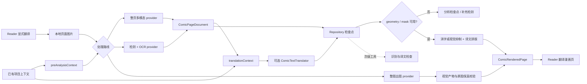

# NextE 漫画翻译设计与演进指南

- **状态**：产品定义重置与源码审计已完成；视觉 Reader V1 实施中，既有文字面板仅为待替换历史实现
- **首次整理**：2026-07-20
- **最近复核**：2026-07-21
- **外部调研**：[漫画翻译工作流调研](research/manga-translation-workflows.md)
- **适用范围**：Reader 漫画页检测/转录、翻译、跨页上下文、消字修复、排版渲染、人工修订与缓存

## 文档角色

本文件是漫画翻译领域的长期设计入口，用来保持数据语义、阶段接口和实施顺序一致。它不是全局任务
队列，也不授权模型费用、设备操作、远端上传或发布。每次实施仍由用户最新请求决定范围，并按
[Plan Lifecycle](plans/README.md) 建立有边界的 active plan。

当前产品方向是：**先交付低操作成本的 Reader 阅读翻译，但其用户结果仍是一张可直接阅读的视觉译制
漫画页。** 可持久化的画廊/页面翻译文档衔接分析、翻译、原文处理、排版和渲染；整页多模态和 OCR
只是可替换的上游分析器。中间文档、转录文本、质量信号和调试面板都不能替代视觉页面。

专业漫画制作是共享同一底层文档与渲染能力的后续产品分支，不是当前 V1 的同义词。Reader 分支追求
少操作、可失败回退、可缓存和足够好的即时阅读；制作分支才要求逐框编辑、精细修复、字体与布局调优、
批量校对和成品导出。两条分支可以兼得，但必须分别定义入口和验收，不能用制作工具的复杂度阻塞 Reader，
也不能用文字列表冒充“轻量阅读”。

## 产品不变量

- “漫画翻译”表示 Reader 在原漫画空间内呈现对应译文，用户继续通过漫画页而不是文本列表阅读；
- 当前产品是“轻量 Reader 阅读翻译”，其中“轻量”只降低操作、等待和专业校对要求，不降低为文字面板；
- “AI 辅助漫画制作”是后续独立工作流；它复用页面文档、术语、修订和渲染阶段，但增加可编辑中间产物、
  批量质检与导出，不反向改变 Reader 的主结果；
- 有文字页面只有在“区域定位 -> 原文处理 -> 译文排版 -> 渲染”形成闭环，或整图出图 provider 直接返回
  通过校验的视觉译制页后，才是可展示结果；只得到原文/译文文档时属于分析检查点；
- 整页多模态、OCR、检测器、文本模型、网关和本地/远端渲染都是内部实现选择，不得改变用户结果；
- 原文/译文对照、识别详情和待复核项只能作为翻译页的次级检查工具，不能成为主结果或阶段完成替代品；
- 任何阶段可以只交付基础设施，但必须明确标为基础设施，不能以“V1 漫画翻译完成”描述；
- 以后若要把视觉翻译页降级成文字阅读辅助，属于改变产品语义，必须先取得用户明确决定，不能写进计划后
  再视作默认授权。

## 目标与非目标

### 目标

- 用户在 Reader 中显式翻译当前页，并直接看到位于原文字区域的中文漫画页；
- 用户不需要进入专业编辑器即可完成日常阅读，失败时能立即回到原图；
- 文字区域、原文抑制/修复、译文布局和渲染结果具有可追溯的页面身份与 revision；
- 人名、地名、称谓和口癖可以在同一画廊内持续复用并由用户锁定；
- 整页多模态、检测/OCR 和未来其他后端能输出同一内部文档；
- 页面切换、失败重试、模型切换和应用重启不会把结果发到错误页面；
- 修改译文或术语不重新运行无关的视觉分析；
- 人工修改是一等数据，不被缓存清理或模型重跑静默覆盖；
- 分析、翻译和渲染可以独立重试，但只有组合后的翻译页进入 Reader 主阅读路径。

### 第一版非目标

- 第一版不承诺可发布印刷质量、原字体一比一还原或可编辑 PSD；
- 第一版不承诺所有艺术字、拟声词和复杂背景都能无人工复核地完美修复；
- 第一版不提供专业制作台、整章人工工作流或成品导出；
- 在图片预取过程中默认调用付费模型；
- 一次请求上传整本画廊图片；
- 把某个模型厂商的请求或响应格式变成内部持久化格式；
- 默认同步图片、模型原始响应、API Key 或可再生成的大体积缓存。

## 当前源码落点与边界

- Reader 的 [ReaderPage.ets](../feature/reader/src/main/ets/pages/ReaderPage.ets) 已通过
  `rememberImageFile(page, filePath, bytes)` 记录稳定的本地图片路径，可以作为显式翻译动作的输入。
- `ReaderCacheWarmers()` 和多个图片组件也会调用 `onImageFileReady`。因此文件就绪只表示图片可用，
  **不得直接触发模型请求**，否则预加载会产生不可见费用和队列竞争。
- 当前 [CommentTranslationService.ets](../shared/src/main/ets/services/CommentTranslationService.ets) 的
  `ChatMessage.content` 是纯字符串，缓存和调度也围绕评论文本设计。漫画翻译应建立独立 orchestrator、
  repository 和 provider 接口，不继续扩张评论服务。
- [EhGalleryImage.ets](../shared/src/main/ets/model/EhGalleryImage.ets) 明确把 `imageUrl` 定义为 one-shot
  per-IP 运行时地址。模型适配器应读取本地缓存文件，再按厂商能力使用文件上传、受控网关或编码后的
  图片输入，不能依赖模型服务器直接抓取 EH 地址。
- 当前 [AxiosHttpClient.ets](../shared/src/main/ets/network/AxiosHttpClient.ets) 的文本 POST 接口只接受
  字符串请求体。Phase 0 adapter 以受限大小的本地图片 data URI 调用 Responses 协议，没有改变现有
  评论翻译契约；文件上传、网关上传仍属于后续独立能力。
- [ComicResponsesPageAnalyzer.ets](../shared/src/main/ets/services/ComicResponsesPageAnalyzer.ets) 已提供公开
  Responses API 与实验性 Codex OAuth 两条整页分析路径，并共同输出 `ComicPageDocument`；当前适配器明确
  声明 `geometry=false` 并要求 `polygon=[]`，因此只能作为转录/翻译分析候选，不能单独产生 Reader 翻译页。
  Codex 路径已用原创两页样例取得真实结构与质量证据，但该证据不覆盖文字定位、消字、排版或渲染质量。
  默认 Responses transport 会在 Axios/平台 HTTP 接收阶段把响应限制为 8 MiB，协议解析层保留相同上限；
  远端异常大响应不会等到完整进入应用内存后才被拒绝，自定义 transport 也仍受协议层二次校验。
- [ComicTranslationSettingsPage.ets](../feature/settings/src/main/ets/pages/ComicTranslationSettingsPage.ets)
  提供独立 provider 设置。API Key 和 Codex OAuth 凭据不复用评论翻译配置。
- [ComicTranslationRepository.ets](../shared/src/main/ets/services/ComicTranslationRepository.ets) 与
  [ComicTranslationOrchestrator.ets](../shared/src/main/ets/services/ComicTranslationOrchestrator.ets) 已建立
  provider/model/prompt/language/image/revision 分键、并发去重、前两页上下文和成功后写入边界。当前实现是
  有界内存前置加 RDB 生成文档缓存；应用进程重启后可以按完整请求身份恢复，但缓存仍不进入备份或同步。
- [ComicTranslationRuntimeService.ets](../shared/src/main/ets/services/ComicTranslationRuntimeService.ets) 已把
  Reader 的稳定本地文件转换为带 SHA-256、尺寸、MIME 与上下文 revision 的请求。Reader 只在用户点击
  `翻译当前页` 后调用它，并以路由/画廊/页/文件/UI epoch 围住结果发布；切页不会串页，返回同页可命中
  内存或持久生成缓存。当前 Reader 将该分析文档显示为文字半模态，此用户路径不满足本文件的产品不变量，
  只能作为待替换的历史实现，不能继续作为漫画翻译入口验收。
- 模块依赖继续遵守 [architecture.md](architecture.md)：`feature/reader` 只负责入口和展示；可跨页面
  复用的模型、存储、provider 和服务放在 `shared`；feature 之间不互相导入。
- 任何 UI/响应式状态实现只使用 State Management V2。

## 核心架构



中间文档是唯一稳定衔接面：provider 原始 JSON 只在适配器内部解析和校验，Reader、上下文、缓存和
渲染器都不直接依赖厂商格式。

## 领域数据语义

下面是概念模型，不提前锁定 ArkTS 类名或 RDB 列形状；实现时可以在不改变语义的前提下细化。

### `ComicTranslationProject`

代表一个画廊在一种目标语言下的翻译项目：

```text
projectId
galleryIdentity
sourceFingerprint
sourceLanguage
targetLanguage
glossaryRevision
styleGuideRevision
contextRevision
documentRevision
rollingSummary
styleGuide
pages[]
```

- `galleryIdentity` 表示稳定画廊身份；`sourceFingerprint` 用页数和页面内容身份区分内容变化。
- `sourceLanguage` 可以来自用户选择或经过复核的自动判断，不能隐藏在 provider 私有请求中。
- 同一画廊的不同目标语言是不同项目，不能共用译文修订号。
- `rollingSummary` 是相关前情的短摘要，不保存无限增长的全部提示词。

### `ComicPageDocument`

```text
projectId
pageIndex
imageHash
imageWidth
imageHeight
imagePreparationProfile
analysisRevision
translationRevision
renderRevision
analysisState
translationState
renderState
hasText
pageSummary
blocks[]
qualitySignals[]
lastError?
```

- `pageIndex` 使用 Reader 内部的从 0 开始页序；来源协议若使用从 1 开始的 `image.page`，由接入适配层转换。
- `imageWidth`、`imageHeight` 是原图像素尺寸。`polygon` 也统一保存为原图像素坐标，provider 返回的归一化坐标、
  缩放图坐标或分块坐标必须由适配层换算后再进入文档。
- `imagePreparationProfile` 记录实际送入 provider 的格式、尺寸和分块策略，供缓存键和结果追溯使用；它不改变
  页面文档的原图坐标空间。
- 明确识别为无文字的页面仍完成了分析，因此保留当前 `analysisRevision`，但使用
  `hasText=false`、空 `blocks`、`translationState=missing` 和 `translationRevision=0`。请求与缓存只对这一
  完整组合放行零翻译修订；有文字页面不得借此绕过翻译修订匹配。

不要使用一个单线性 `status` 表示全部工作。分析、翻译和渲染可以独立缺失、就绪、过期或失败：

- `analysisState`: `missing | ready | stale | failed`
- `translationState`: `missing | provisional | ready | stale | failed | review_required`
- `renderState`: `unavailable | ready | stale | failed`

排队、运行和取消是任务运行态，不等于已持久化结果。应用重启后以最后成功 revision 恢复，不把旧的
`running` 状态当成仍在执行。

### `ComicTextBlock`

```text
blockId
readingOrder
kind
sourceText
normalizedSourceText?
translatedText?
polygon?
maskRef?
speakerId?
styleHint?
sourceOrigin            // vision | ocr | manual
translationOrigin       // vision | text | manual
providerConfidence?     // 仅为质量信号，不是事实
sourceRevision
translationRevision
manualSource
manualTranslation
```

- 整页多模态可以只提供阅读顺序、原文和上下文感知译文；这时页面只能成为分析检查点，不能发布为
  Reader 翻译结果。
- 分阶段渲染路线中，每个需要呈现的文本块必须具有原图坐标空间内的有效 geometry；mask 可以由分析器
  提供，也可以由后续区域处理器生成。缺失能力时编排器必须补充检测或返回明确未就绪，不能回退为主结果
  文本面板。整图出图路线可以没有 block geometry，但必须直接产出独立视觉页，并记录完整 artifact/provider
  identity；该结果不能伪装成可逐框编辑的结构文档。
- 所有模式都必须保存原文，不能只保存译文。
- 人工原文和人工译文具有更高优先级。重新分析时先产生候选 revision，再显式解决与人工内容的冲突。
- provider 自报 confidence 通常未校准，只能和空结果、重复文本、结构校验、跨引擎差异等共同构成
  `qualitySignals`。

### `ComicGlossaryTerm`

```text
sourceTerm
aliases[]
targetTerm
status                 // provisional | locked
provenance             // model | user | imported
firstSeenPageIndex
updatedRevision
notes?
```

- `provisional` 是模型建议，可以被后文证据或用户修改；
- `locked` 是用户确认或明确采用的译法，模型不得静默覆盖；
- 术语变更提高 `glossaryRevision`，只让受影响的翻译过期，不让视觉分析过期；
- 实现应维护术语到文本块的引用索引，以便按影响范围重翻。

## Provider 能力模型

`ComicPageAnalyzer` 应声明能力，而不是用“是不是多模态”判断后续功能：

```text
transcript
readingOrder
geometry
speakerAssociation
mask
contextAwareTranslation
```

推荐支持四类适配器：

1. **Whole-page vision**：可在一次请求中输出阅读顺序、原文、上下文感知译文和不确定项；通常不承诺
   可靠 geometry/mask。
2. **Detection + OCR**：输出区域、顺序、原文和识别信号；翻译交给独立文本 provider。
3. **Hybrid**：比较视觉转录和 OCR，在差异或质量信号异常时进入复核，不要求每页都运行两套模型。
4. **Whole-page render**：输入整页图像与画廊上下文，直接返回视觉译制图片；不要求中间 geometry，但必须
   声明 image-output 能力，并接受图片保真、尺寸/MIME/hash、缓存身份和失败回退校验。

Reader V1 的首条完整质量路线采用分阶段 sidecar：首个 profile 固定兼容 `manga-translator-ui v1.9.9`
的“导出原文 -> 导入 JSON 并渲染”API，由服务负责区域检测/OCR、原文处理和图片渲染；NextE 的 API/Codex
provider 负责接收区域原文、整页图像和画廊上下文并返回按 blockId 对齐的译文。sidecar 是可替换能力，
不是内部文档格式，也不与翻译 provider 共用认证。服务不可达、协议不兼容或输出校验失败时保留原图，
不能回退到文字面板并宣称完成。

首个 profile 固定到 commit `696dc63bd0b4803f96cc3d4f844322cef4910f8e`，使用
`/translate/export/original` 返回的 `translation.json` 作为短期 adapter template，再把按 blockId
校验过的译文写回 region 的 `translation` 字段并调用 `/translate/import/json`。不使用 TXT 模糊匹配，
避免重复原文被字典键合并。profile 之外的字段形状必须本地失败；新增上游版本需要显式增加并验证新 profile。

截至 2026-07-21，固定 profile 的客户端传输适配器已经实现并通过设备上的 fake transport 闭环：
export/import multipart 字段、ZIP central/local header、固定条目、JSON 模板、源图 hash、PNG 签名/解码/尺寸
和视觉产物 hash 都在写入前校验；公共 HTTP 被拒绝，私网 HTTP 仅供用户明确配置的本地 sidecar。该结论
只证明 NextE 适配器和协议夹具，不代表真实 sidecar、真实 OCR/修复质量或 Reader 视觉替换已经验收。
同级制图服务设置和不上传图片的 `/openapi.json` 能力检查已经实现；真实运行 sidecar 的连接验证、真实
OCR/修复质量和合法样页端到端结果仍按活动计划推进。

整图出图是并列的完整路线，不被废弃。若未来 API、Codex 兼容通道或其他 provider 能返回译制图片，
实现 `ComicWholePageRenderBackend` 后可以跳过 region export/import，直接进入渲染产物校验与缓存。当前
Responses/Codex analyzer 只重建结构化文本响应，因此尚不具备该能力。整图出图的优势是接入短、无需
客户端处理坐标；代价是可能改动画面、难以逐框修订、术语变化通常需要整页重跑，所以必须保留原图切换
并把非文字区域保真列入验收。

`ComicTextTranslator` 是独立能力，但不是每次页面翻译都必须额外调用：

- whole-page provider 已接收项目上下文并给出有效译文时，可以把它保存为 `provisional` 或 `ready`；
- OCR/analyze-only provider 只给原文时，再调用文本 translator；
- 术语变化、人工改原文或整章 consistency pass 时，只调用文本 translator，不重新上传图片。

上下文因此分成两次可复用装配：分析前的 `preAnalysisContext` 包含术语、前页和摘要，可供整页
多模态一次完成转录与翻译；分析后的 `translationContext` 再加入当前页原文，供独立文本翻译使用。

图片输入以原始缓存文件的 `imageHash` 作为内容身份。provider adapter 可以按模型限制生成缩放、压缩、
分块或上传后的临时输入，但必须把尺寸、格式、分块和压缩策略记入 `imagePreparationProfile`。Reader 的
显示缩放或图像增强结果不能默认当作识别真值；任何可能改变细小笔画的预处理都要先用评估集验证。

内部请求应包括版本化的结构 schema、prompt 和图片预处理配置。任何 provider 输出都先经过：

```text
解析 -> schema 校验 -> 页号/块数/文本基本校验 -> 规范化 -> 写入候选 revision
```

解析失败、空文本、异常重复或页身份不匹配时保留最后成功结果，并显示可重试失败；不能用部分新结果
覆盖已审核文档。

## 共享 LLM 源与漫画消费边界

当前 spike 已实现两条可切换、不可混用凭据的传输路径，但凭据暂时存放在漫画翻译专用设置中。视觉
Reader V1 在继续 provider 实现前先迁移到共享 LLM 源档案：评论翻译和漫画翻译选择源档案及各自模型，
源档案统一管理连接、认证、模型目录和账号用量；业务页只管理业务策略。迁移不能改变下面两条传输路径
的稳定性声明。

| 路径 | 认证与端点 | 响应处理 | 稳定性定位 |
|---|---|---|---|
| OpenAI/兼容 API | 用户填写 base URL、API Key；通过 `/models` 查询并选择 model，兼容端点可手动覆盖；调用 `/responses` | 非流式 Responses JSON | 正式候选；生产环境仍优先考虑代理，避免移动端长期持有服务端密钥 |
| Codex OAuth（实验） | 设备码登录；从 ChatGPT Codex backend 查询当前账号的 model catalog 与用量窗口 | SSE，按 `response.output_item.done`/文本 delta 重建结果，401 时刷新一次 | 兼容性试验；依赖非公开移动端集成契约，随时可能失效 |

两条路径通过共享源档案复用传输能力，但评论与漫画仍各自拥有 prompt、输入约束和响应协议。切换源不会
切换页面文档语义，
也不会把一条路径的凭据回退给另一条路径。两条路径都优先查询各自的模型目录；Codex 目录按账号返回，
客户端排除 `supported_in_api=false` 和隐藏项，并按上游 priority 排序。查询失败时保留已有选择并显示错误，
不能用 NextE 内置的过期白名单静默替换。API 路径保留手动 model 输入，仅用于兼容端点未实现标准
`/models` 或需要指定未列出模型的情况。单次目录最多接受 512 个源条目；空值、控制字符或超过 160 字符
的模型标识不会进入设置菜单。160 字符与翻译请求身份的模型字段边界一致，避免目录选择在真正请求时才失败。

Codex 登录后，设置页还会在进入页面时和用户手动点击刷新时只读查询账号用量。当前兼容层从
`/backend-api/wham/usage` 读取 `primary_window` 与 `secondary_window`，把上游已用百分比换算为剩余百分比，
并按实际 `limit_window_seconds` 识别 5 小时与 7 天窗口，再显示重置倒计时。不能把 primary/secondary
的位置直接当作窗口名称。设置页只用一条紧凑用量项展示 `5H`/`7D`；账号未返回的窗口直接省略，不能
误标另一个窗口，也不为刷新单独增加按钮或列表行，整条用量项仍可点击刷新。
查询失败时保留最后一次成功快照，不做持续轮询，也不影响已选模型。该端点与模型目录同属 ChatGPT
私有 backend，不是公开 Platform API，必须继续受同一实验性提示和失效边界约束。账号作用域的本地快照
在 JSON 解析前限制为 16 KiB，并限制账号 ID、计划名和时间戳；损坏缓存只会被忽略，随后仍可后台刷新。

设置侧的只读响应同样有双层大小边界：默认 Axios transport 在接收阶段把公开 API/Codex 模型目录限制为
2 MiB，把 Codex 用量与 OAuth 响应限制为 512 KiB；模型目录和用量解析器保留相同上限，OAuth 服务则在
任何状态判断或 JSON 解析前再次检查返回体。因此自定义 transport 不能绕过应用层边界，异常大响应也不会
等到完整进入后续解析和状态写入流程才被拒绝。

凭据边界如下：

- API Key 作为 secret 保存，只允许进入显式加密备份，不进入明文备份或同步；
- Codex access/refresh/id token 只保存在本设备 Preferences，完全排除备份和同步，避免旋转 refresh token
  被复制到多台设备后相互失效；
- 响应式状态只暴露“是否已登录、账号标识、过期时间”，不持有原始 OAuth token；
- 日志和错误不得带 Authorization、token、图片正文或完整提示词；
- 当前本地 Preferences 不是系统硬件密钥库。若该实验进入正式产品，应先迁移到 HUKS/系统凭据存储并
  重新做威胁模型；在此之前 UI 必须持续标记为实验性。

共享源不是共享业务选择：评论翻译和漫画翻译可以绑定同一源，也可以选择不同源/模型。源 ID 稳定，
端点、账号或协议类型变化提高 source revision；仅轮换同一账号的凭据不应使翻译缓存失效。删除正在被
消费的源时，业务进入明确“未配置”状态，不能自动选第一个源或把评论凭据回填给漫画。

OAuth 字段边界按用途分层：用户码最多 128 字符，设备授权 ID、授权码和 PKCE 校验器各最多 4096 字符，
单个 access/refresh/id token 最多 128 KiB，账号 ID 最多 160 字符，本地 token JSON 最多 512 KiB；这些
字段必须无控制字符且不能带首尾空白。服务返回的轮询间隔限制为 3–60 秒，token 有效期最多按 30 天写入，
避免异常响应造成超长请求头、长期失效缓存或计时器溢出。

用户可编辑的 provider 设置也在输入与持久化两层使用同一边界：API base URL 最多 2048 字符，API Key
最多 16 KiB，API/Codex model ID 最多 160 字符。恢复损坏 Preferences 或接收程序化 snapshot 时，非字符串、
超限或带控制字符的字段会清空，不会进入响应式状态、请求头或请求身份；该规则不改变 HTTPS 校验和兼容端点
手动模型的既有语义。

这里的“支持”表示代码适配器、设置、token 刷新、假传输测试和原创样例真实评测路径已存在。它不表示
OpenAI 对第三方移动应用承诺了 Codex OAuth 或 ChatGPT backend 的稳定兼容性，也不把两页样例结果外推
成通用模型质量。公开 API 路径仍只有结构与假传输证据；本轮真实证据来自实验性 Codex OAuth 路径。

## 端到端流程

### 当前页交互流程

1. 用户在 Reader 对当前页显式触发翻译；
2. Reader 获取该页已记录的本地文件，并生成/确认 `imageHash`；
3. `GalleryContextAssembler` 从已存项目组装 `preAnalysisContext`；
4. repository 先检查视觉分析缓存；
5. 缓存缺失时，orchestrator 调用当前 `ComicPageAnalyzer`，并在 provider 支持时一并请求上下文感知译文；
6. 转录和可选译文校验后写入页面文档检查点；
7. 若没有可用译文，或当前译文因术语/原文变化而过期，再组装包含当前页原文的
   `translationContext`，调用 `ComicTextTranslator`；
8. 缺少 geometry/mask 时调用具备对应能力的区域分析阶段；不能把无坐标文档当成 Reader 成品；
9. `ComicRenderer` 依据页面文档生成原文已被视觉抑制或修复、译文已排版的渲染页；
10. repository 以 page identity + analysis/translation/render revision 发布结果，Reader 只订阅当前页的
    `renderState=ready` 结果；
11. 用户可以从翻译页进入次级检查工具修改原文、译文或锁定术语；修改只使相关下游结果过期并触发重渲染。

整页多模态可以在一次调用里同时给出转录和译文，但仍需把两者拆进页面文档，并记录各自 revision、
origin 和状态。它的译文必须服从已提供的 locked 术语；若前文尚不完整，可以先标为 `provisional`，
后续只做文本一致性修订。这样既不强制双重模型调用，也不牺牲模型切换、人工纠错和整章复用。

### 跨页上下文

上下文按以下优先级组装：

1. 用户锁定术语和人工修订；
2. 当前页完整原文与块顺序；
3. 前 1～2 页已确认或最新译文；
4. 更早内容的滚动摘要；
5. provisional 术语和风格提示。

提示词必须使用确定性的分段预算。`projectId`、`pageIndex`、`imageHash`、图片尺寸和语言等请求身份字段
保持精确，不能为了塞入更多上下文而裁剪；滚动摘要、风格提示、术语和前页文本则分别限长。术语超出预算时
先保留 locked 项，前页只保留最近两页。字符串裁剪后仍必须是有效 JSON 字符串编码，省略内容不得写入日志。
调用方提供的前页记录和 repository 记录必须先合并再规范化：仅接受严格小于当前页的整数页码，同页以调用方
最后一个值为准，最终选择页码最大的两页并按升序发送；缓存身份只计算这份实际生效的上下文。

生成文档还会在本地审计最多最近 32 个已生成前页：当前块与前页块具有相同 `normalizedSourceText`（为空时
回退 `sourceText`），但译文不同时，为当前块添加 `translation_consistency_conflict` warning。该审计不增加
模型调用、不改写译文，也不把派生 warning 写入生成缓存；新结果和缓存命中都会按当时可见的画廊缓存重算。
页级 warning/error 会让对应页面退出对照，块级 warning/error 只排除对应块；当前页或当前块已有 actionable
review 时也不再叠加派生冲突。`INFO` 和同页未被定点复核的已译块仍可参与审计。
质量信号仍受 512 条硬上限约束；如果 provider `INFO` 已占满集合而本地发现了冲突，审计只淘汰最后一条
`INFO` 为派生 warning 腾出位置，绝不淘汰已有 warning/error，也不会修改输入文档。
模型 prompt 仍只携带最近两页，避免为审计扩大上传上下文或改变缓存身份。这个规则只能发现“相同规范化原文的
译法漂移”，不能替代别名、人物指代或语义级译名解析；后者仍需 glossary 与人工确认。

为了在不猜测术语的前提下减少同一句原文再次漂移，编排器会从最多最近 32 个已生成前页派生临时
exact-match translation memory：只有同一规范化原文在至少两个不同页面保持同一非空译文时才进入；历史
译法冲突、同页重复和长文本均排除。带 warning/error 的页级信号会排除整页，带块目标的 warning/error 只
排除对应块；`INFO` 不阻断 memory，其他未被定点复核的已译块也不会因同页另一个块缺译而丢失。memory 最多
64 项，有独立 1,800 字符 prompt 预算，完整前页上下文仍只发送最近两页。提示词明确要求仅在当前规范化原文
完全相等时采用，并让 glossary（尤其 locked 项）保持更高优先级。该 memory 每次从可再生成页面缓存重建，
不取得 glossary、人工修订、备份或同步语义；只有实际进入 prompt 的条目参与上下文指纹。

不默认发送整本原图。视觉分析可以按页有限并行；依赖前文的正式翻译按画廊页序执行。若允许跳页
交互翻译，缺少前页时先给出标记为 provisional 的结果，待上下文补齐后进入文本级一致性修订。

画廊阶段性完成后可以执行一次纯文本 consistency pass：输入所有已保存原文、译文和术语，输出按
`blockId` 定位的修改建议。它不得重新上传图片，也不得覆盖人工译文或 locked 术语。

### 页面切换与取消

- 每个任务携带 `projectId + pageIndex + imageHash + requestedRevision`；
- Reader 页面切换只取消当前 UI 等待，不一定丢弃已开始且仍有价值的结果；
- 完成结果始终写回其原页面，只有 identity 和 revision 仍匹配时才发布到当前 UI；
- 同一 cache key 的请求去重，用户交互任务优先于显式批量任务；
- 未提供成本确认的预加载任务不得升级成模型调用。

请求必须在缓存查询、图片读取和 provider 调用之前完成同一套 preflight：页码、尺寸、tile 数和所有 revision
都是有限安全整数，图片边长不超过既定上限，项目、路径、语言、provider、模型和 prompt 版本均有长度上限。
非法身份不得以“先调用、后解析失败”的方式消耗配额。

## 缓存、持久化与隐私

缓存至少拆成三层：

```text
analysisKey = imageHash
            + imagePreparationProfile
            + sourceLanguage
            + analyzer/provider/model
            + analysisPromptVersion
            + schemaVersion

translationKey = sourceDocumentHash
               + sourceLanguage
               + targetLanguage
               + glossaryRevision
               + styleGuideRevision
               + contextRevision
               + translator/provider/model
               + translationPromptVersion

renderKey = pageDocumentRevision
          + renderer/model
          + renderProfile
```

由此保证：改人名只重跑文本翻译；更换 OCR 不必删除已确认人工译文；改变排版不会重新识图。

数据需要分成两种所有权：

- **可再生成数据**：模型原始响应、自动分析、自动译文、临时图片和渲染产物，可以按缓存策略淘汰；
- **用户数据**：人工原文、人工译文、locked 术语和用户备注，不能随普通缓存清理丢失。

V1 建议全部保持本地。是否让用户数据参与备份/同步是未决的数据归属决策；实施前必须更新持久化
inventory，并明确合并和删除语义。可再生成数据、原图、API Key 和 provider 凭据默认不进入同步。

日志只记录 stage、provider/model 标识、页身份 hash、长度、耗时、缓存命中和脱敏错误。不得记录
图片内容、完整 OCR 文本、完整译文、提示词中的漫画正文、Authorization 或 API Key。

## 两条产品工作流

### 当前主线：Reader 轻量阅读翻译

Reader 的主结果是一张视觉翻译页：译文位于对应原文区域，原文已被遮盖、抑制或修复到不妨碍阅读，
缩放、平移、单双页、切页和缓存恢复继续服从 Reader 原有交互。加载、失败和待复核是这张页面的状态，
不是另一个文本列表页面。

V1 优先把原图与处理区域、译文布局合成为**单独的本地衍生页**，Reader 继续把它当作普通漫画图片显示；
原始缓存图片永不覆盖。衍生页可以被淘汰并按完整 render identity 重建，因此“轻量阅读”不需要先建设
专业编辑器，也不需要把叠层状态散落到 Reader 的每一种缩放/单双页实现中。后续制作分支可以保留可编辑
图层并导出最终图片，但不会改变 Reader 的这条非破坏性路径。

识别详情、原文/译文对照、术语和人工修改可以从翻译页进入次级检查工具。没有可用 geometry/mask 时，
系统应明确提示当前 provider 只能完成分析，或运行补充检测；不能把详情工具自动提升为翻译结果。

“阅读时自动翻译下一页”涉及持续费用、带宽和隐私，只能作为未来显式 opt-in 设置，并提供并发、页数
和费用/次数边界；不能通过现有 Reader 图片预取隐式开启。

### 后续分支：AI 辅助漫画制作

制作工作流从同一份可渲染页面文档继续扩展，增加区域/蒙版编辑、逐框原译文校对、术语审批、字体与
布局调优、背景修复返工、整章批处理、质量门禁和图片/项目导出。它可以把 Reader 自动生成的视觉页
作为草稿，也可以导入独立项目；但它必须有独立入口、状态和验收，不能把 Reader 变成专业编辑器。

共享边界如下：

```text
页面分析 -> 上下文翻译 -> 原文处理 -> 译文布局 -> 可渲染页面文档 -> 视觉草稿
                                                                  |-> Reader 即时阅读与缓存
                                                                  `-> 制作编辑、质检与导出
```

## 演进路线

### Reset：产品定义与现有实现审计（当前）

- 明确当前主目标是轻量 Reader 阅读翻译，但最终结果仍是 Reader 中可直接阅读的视觉译制漫画页；
- 将专业制作与导出定义为共享底层能力的后续独立分支，不把两套验收混成一个 V1；
- 将既有 Provider、文档模型、缓存、上下文和一致性逻辑降级为待复用基础设施候选；
- 将无 geometry 的 Responses analyzer 标记为分析能力，禁止单独满足产品完成状态；
- 替换 Reader 原文/译文半模态主路径，重新定义 render identity、状态和缓存；
- 在新规划确认前不修改功能实现、不调用模型、不操作设备。

已完成审计见 [漫画翻译产品重置计划](plans/completed/manga-translation-product-reset.md)，当前实施见
[视觉 Reader V1 计划](plans/active/manga-translation-reader-visual-v1.md)。历史 Phase 0
两页评测只证明整页多模态能返回有界结构文档；历史 Reader 测试只证明请求身份、缓存与切页隔离，
均不证明存在翻译漫画页。

### V1：单页视觉翻译闭环

- 一个有权使用的固定样页完成文字区域定位、原文视觉抑制/修复、上下文感知翻译和译文排版；
- `ComicPageDocument` 对可渲染块提供原图坐标空间 geometry，渲染产物具有独立 revision/profile/cache key；
- Reader 的“翻译当前页”直接切换到视觉翻译页，识别详情仅为次级入口；
- 首次生成、失败保留原图、缓存命中、快速切页、缩放/平移和应用重启恢复均不串页；
- 在设备上提供同页原图与翻译页截图，并以真实 Reader 交互证明，而不是以结构测试或文字列表替代。

退出条件：至少一张代表性漫画页在 Reader 内形成可直接阅读的中文视觉结果；原文字不与译文竞争；
返回同页命中渲染缓存且不调用模型；失败时保持原图可读。缺少任一项都只能称为实现候选。

### V1.5：多方式分析与人工复核

- 对比整页多模态、检测 + OCR 和混合分析，但所有路线必须输出同一可渲染页面文档；
- 对低质量块补充区域复核、手动原文/译文和术语锁定，不要求每页无差别双跑；
- 复杂背景、竖排、拟声词、长文本和多人物页面进入固定评估集；
- 人工修订只让受影响的翻译与渲染过期，不静默覆盖用户数据。

### 制作分支：完整制图与导出

- 提升背景修复、横竖排、字体回退、气泡溢出和艺术字处理；
- 支持批量/整章顺序翻译、纯文本 consistency pass 和可编辑中间产物；
- 在明确图片写入、许可证、资源与数据所有权后，评估导出最终图片或项目文件。

## 验证策略

### 数据与服务层

- 用 fake provider 验证 schema 解析、失败保留最后成功 revision、cache key 和并发去重；
- 验证 locked 术语与人工文本不会被 re-analysis/consistency pass 覆盖；
- 验证不同目标语言、图片 hash、prompt/model revision 不发生错误缓存命中；
- 验证过期结果只能写回原 page document，不能发布到新当前页；
- 验证日志和持久化中不出现凭据或未声明的原图/正文副本。

### Reader 用户路径

真实路径为：进入 Reader -> 当前页显式翻译 -> 页面内原文区域转换为对应译文 -> 保持缩放/平移阅读 ->
切到下一页 -> 返回前页命中视觉渲染缓存。至少检查加载中、失败保留原图、缓存命中、快速切页、长文本、
复杂背景和无 geometry 不能冒充完成。

静态检查和构建只能证明实现候选；模型请求、页归属、可见结果和交互仍需要受控 provider fixture、
日志及设备 UI 证据。不要为提示词、UI 形状或启发式准确率新增大量正则 contract；自动门禁只保护
安全、数据完整性、依赖方向和 V2 状态等严重稳定边界。

### 质量评估

固定评估集应记录：

- 原文漏字/补字/错字和阅读顺序错误；
- 人名、称谓和固定术语前后不一致；
- 结构解析失败和进入人工复核的比例；
- 首次/缓存延迟、图片上传字节、模型调用次数和费用；
- 人工修订后被错误覆盖的次数，该项目标必须为零。

不使用单一“模型自报置信度”宣布质量达标，也不把某次构建或少量顺眼页面当成整体准确率证据。

当前 `nexte-original-manga-eval-v1` 用两页原创日文漫画覆盖竖排对话、假名注音、小字、标牌、拟声词、
复杂背景和跨页人名 `優 -> 优`。manifest 只允许明确列出的标点/注音变体；evaluator 分开报告漏块、多块、
阅读顺序和必需译名，不进行无法解释的模糊匹配。它是最小可重复基线，不是通用准确率 benchmark；后续
仍需扩展彩页和多人密集场景，并通过显式 opt-in 在线运行记录 provider/model、耗时、上传字节和额度影响。

## 实施前仍需明确的产品决策

以下问题不阻止维护本设计，但在对应实现前需要用户确认：

1. 第一批支持的源语言和目标语言；
2. 正式发布时默认直接调用用户配置的多模态 API，还是优先经 NextE-compatible 网关；当前 spike 只
   证明两种直连适配器可以共用内部协议；
3. 漫画翻译凭据已与评论翻译分离；若以后升级为全局通用模型 provider，需要另行决定迁移语义；
4. 单页、按阅读自动翻译和显式批量翻译的费用确认与并发上限；
5. 人工译文和术语的保留、导出、备份与同步语义；
6. 首个可交付 detector/geometry 与 renderer 运行在应用内、用户自托管还是远端服务；
7. 消字/修复的质量档位、字体来源和渲染产物的磁盘上限。

## 维护规则

- 改变页面文档语义、数据所有权、模型输入隐私、上下文优先级或阶段退出条件时更新本文件的“最近
  复核”，并同步相关架构/持久化文档；不要追加按日期堆积的流水账。
- 上游项目能力、论文、许可证和模型限制只更新
  [调研文档](research/manga-translation-workflows.md)，本文件只保留 NextE 已采用的结论。
- 每次具体实现建立独立 active plan，写明本轮阶段、非目标、provider/fixture 和运行时验收；完成后按
  plan lifecycle 移动，不把本文件改成任务清单。
- 当前源码与新证据高于本文中过时的路径描述；发现漂移时先更新证据和最近复核日期，再继续实现。
