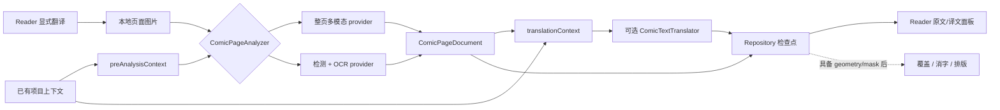

# NextE 漫画翻译设计与演进指南

- **状态**：持续维护；Phase 0 已闭环，V1 Reader 显式当前页路径与生成文档重启恢复已实现
- **首次整理**：2026-07-20
- **最近复核**：2026-07-21
- **外部调研**：[漫画翻译工作流调研](research/manga-translation-workflows.md)
- **适用范围**：Reader 漫画图片转录、翻译、跨页上下文、人工修订，以及未来可选的 OCR、覆盖和重绘

## 文档角色

本文件是漫画翻译领域的长期设计入口，用来保持数据语义、阶段接口和实施顺序一致。它不是全局任务
队列，也不授权模型费用、设备操作、远端上传或发布。每次实施仍由用户最新请求决定范围，并按
[Plan Lifecycle](plans/README.md) 建立有边界的 active plan。

当前方向是：**以可持久化的画廊/页面翻译文档为核心，整页多模态和 OCR 只是可替换的上游分析器。**
第一版优先完成阅读辅助和跨页一致性，不以修改原图为目标。

## 目标与非目标

### 目标

- 用户在 Reader 中显式翻译当前页，并看到可检查的原文和译文；
- 人名、地名、称谓和口癖可以在同一画廊内持续复用并由用户锁定；
- 整页多模态、检测/OCR 和未来其他后端能输出同一内部文档；
- 页面切换、失败重试、模型切换和应用重启不会把结果发到错误页面；
- 修改译文或术语不重新运行无关的视觉分析；
- 人工修改是一等数据，不被缓存清理或模型重跑静默覆盖；
- 后续增加文字坐标、覆盖层、消字和排版时不推翻第一版数据模型。

### 第一版非目标

- 自动生成可发布的汉化图片；
- 对每个气泡提供像素级可靠的框、蒙版和字体还原；
- 在图片预取过程中默认调用付费模型；
- 一次请求上传整本画廊图片；
- 把某个模型厂商的请求或响应格式变成内部持久化格式；
- 默认同步图片、模型原始响应、API Key 或可再生成的大体积缓存。

## 当前源码落点与边界

- Reader 的 [ReaderPage.ets](../feature/reader/src/main/ets/pages/ReaderPage.ets) 已通过
  `rememberImageFile(page, filePath, bytes)` 记录稳定的本地图片路径，可以作为显式翻译动作的输入。
- `ReaderCacheWarmers()` 和多个图片组件也会调用 `onImageFileReady`。因此文件就绪只表示图片可用，
  **不得直接触发模型请求**，否则预加载会产生不可见费用和队列竞争。
- 当前 [CommentTranslationService.ets](../shared/src/main/ets/services/CommentTranslationService.ets) 的
  `ChatMessage.content` 是纯字符串，缓存和调度也围绕评论文本设计。漫画翻译应建立独立 orchestrator、
  repository 和 provider 接口，不继续扩张评论服务。
- [EhGalleryImage.ets](../shared/src/main/ets/model/EhGalleryImage.ets) 明确把 `imageUrl` 定义为 one-shot
  per-IP 运行时地址。模型适配器应读取本地缓存文件，再按厂商能力使用文件上传、受控网关或编码后的
  图片输入，不能依赖模型服务器直接抓取 EH 地址。
- 当前 [AxiosHttpClient.ets](../shared/src/main/ets/network/AxiosHttpClient.ets) 的文本 POST 接口只接受
  字符串请求体。Phase 0 adapter 以受限大小的本地图片 data URI 调用 Responses 协议，没有改变现有
  评论翻译契约；文件上传、网关上传仍属于后续独立能力。
- [ComicResponsesPageAnalyzer.ets](../shared/src/main/ets/services/ComicResponsesPageAnalyzer.ets) 已提供公开
  Responses API 与实验性 Codex OAuth 两条整页分析路径，并共同输出 `ComicPageDocument`；Codex 路径已
  用原创两页样例取得真实结构与质量证据，也已由 Reader 的显式当前页动作通过 orchestrator 调用。
- [ComicTranslationSettingsPage.ets](../feature/settings/src/main/ets/pages/ComicTranslationSettingsPage.ets)
  提供独立 provider 设置。API Key 和 Codex OAuth 凭据不复用评论翻译配置。
- [ComicTranslationRepository.ets](../shared/src/main/ets/services/ComicTranslationRepository.ets) 与
  [ComicTranslationOrchestrator.ets](../shared/src/main/ets/services/ComicTranslationOrchestrator.ets) 已建立
  provider/model/prompt/language/image/revision 分键、并发去重、前两页上下文和成功后写入边界。当前实现是
  有界内存前置加 RDB 生成文档缓存；应用进程重启后可以按完整请求身份恢复，但缓存仍不进入备份或同步。
- [ComicTranslationRuntimeService.ets](../shared/src/main/ets/services/ComicTranslationRuntimeService.ets) 已把
  Reader 的稳定本地文件转换为带 SHA-256、尺寸、MIME 与上下文 revision 的请求。Reader 只在用户点击
  `翻译当前页` 后调用它，并以路由/画廊/页/文件/UI epoch 围住结果发布；切页不会串页，返回同页可命中
  内存或持久生成缓存。
- 模块依赖继续遵守 [architecture.md](architecture.md)：`feature/reader` 只负责入口和展示；可跨页面
  复用的模型、存储、provider 和服务放在 `shared`；feature 之间不互相导入。
- 任何 UI/响应式状态实现只使用 State Management V2。

## 核心架构



中间文档是唯一稳定衔接面：provider 原始 JSON 只在适配器内部解析和校验，Reader、上下文、缓存和
渲染器都不直接依赖厂商格式。

## 领域数据语义

下面是概念模型，不提前锁定 ArkTS 类名或 RDB 列形状；实现时可以在不改变语义的前提下细化。

### `ComicTranslationProject`

代表一个画廊在一种目标语言下的翻译项目：

```text
projectId
galleryIdentity
sourceFingerprint
sourceLanguage
targetLanguage
glossaryRevision
styleGuideRevision
contextRevision
documentRevision
rollingSummary
styleGuide
pages[]
```

- `galleryIdentity` 表示稳定画廊身份；`sourceFingerprint` 用页数和页面内容身份区分内容变化。
- `sourceLanguage` 可以来自用户选择或经过复核的自动判断，不能隐藏在 provider 私有请求中。
- 同一画廊的不同目标语言是不同项目，不能共用译文修订号。
- `rollingSummary` 是相关前情的短摘要，不保存无限增长的全部提示词。

### `ComicPageDocument`

```text
projectId
pageIndex
imageHash
imageWidth
imageHeight
imagePreparationProfile
analysisRevision
translationRevision
renderRevision
analysisState
translationState
renderState
hasText
pageSummary
blocks[]
qualitySignals[]
lastError?
```

- `pageIndex` 使用 Reader 内部的从 0 开始页序；来源协议若使用从 1 开始的 `image.page`，由接入适配层转换。
- `imageWidth`、`imageHeight` 是原图像素尺寸。`polygon` 也统一保存为原图像素坐标，provider 返回的归一化坐标、
  缩放图坐标或分块坐标必须由适配层换算后再进入文档。
- `imagePreparationProfile` 记录实际送入 provider 的格式、尺寸和分块策略，供缓存键和结果追溯使用；它不改变
  页面文档的原图坐标空间。
- 明确识别为无文字的页面仍完成了分析，因此保留当前 `analysisRevision`，但使用
  `hasText=false`、空 `blocks`、`translationState=missing` 和 `translationRevision=0`。请求与缓存只对这一
  完整组合放行零翻译修订；有文字页面不得借此绕过翻译修订匹配。

不要使用一个单线性 `status` 表示全部工作。分析、翻译和渲染可以独立缺失、就绪、过期或失败：

- `analysisState`: `missing | ready | stale | failed`
- `translationState`: `missing | provisional | ready | stale | failed | review_required`
- `renderState`: `unavailable | ready | stale | failed`

排队、运行和取消是任务运行态，不等于已持久化结果。应用重启后以最后成功 revision 恢复，不把旧的
`running` 状态当成仍在执行。

### `ComicTextBlock`

```text
blockId
readingOrder
kind
sourceText
normalizedSourceText?
translatedText?
polygon?
maskRef?
speakerId?
styleHint?
sourceOrigin            // vision | ocr | manual
translationOrigin       // vision | text | manual
providerConfidence?     // 仅为质量信号，不是事实
sourceRevision
translationRevision
manualSource
manualTranslation
```

- 整页多模态第一版可以只提供阅读顺序、原文和上下文感知译文，`polygon`、`maskRef`、`speakerId` 为空。
- 检测/OCR provider 可以在同一文档补充坐标；渲染器只能在所需能力存在时启用。
- 所有模式都必须保存原文，不能只保存译文。
- 人工原文和人工译文具有更高优先级。重新分析时先产生候选 revision，再显式解决与人工内容的冲突。
- provider 自报 confidence 通常未校准，只能和空结果、重复文本、结构校验、跨引擎差异等共同构成
  `qualitySignals`。

### `ComicGlossaryTerm`

```text
sourceTerm
aliases[]
targetTerm
status                 // provisional | locked
provenance             // model | user | imported
firstSeenPageIndex
updatedRevision
notes?
```

- `provisional` 是模型建议，可以被后文证据或用户修改；
- `locked` 是用户确认或明确采用的译法，模型不得静默覆盖；
- 术语变更提高 `glossaryRevision`，只让受影响的翻译过期，不让视觉分析过期；
- 实现应维护术语到文本块的引用索引，以便按影响范围重翻。

## Provider 能力模型

`ComicPageAnalyzer` 应声明能力，而不是用“是不是多模态”判断后续功能：

```text
transcript
readingOrder
geometry
speakerAssociation
mask
contextAwareTranslation
```

推荐支持三类适配器：

1. **Whole-page vision**：可在一次请求中输出阅读顺序、原文、上下文感知译文和不确定项；通常不承诺
   可靠 geometry/mask。
2. **Detection + OCR**：输出区域、顺序、原文和识别信号；翻译交给独立文本 provider。
3. **Hybrid**：比较视觉转录和 OCR，在差异或质量信号异常时进入复核，不要求每页都运行两套模型。

`ComicTextTranslator` 是独立能力，但不是每次页面翻译都必须额外调用：

- whole-page provider 已接收项目上下文并给出有效译文时，可以把它保存为 `provisional` 或 `ready`；
- OCR/analyze-only provider 只给原文时，再调用文本 translator；
- 术语变化、人工改原文或整章 consistency pass 时，只调用文本 translator，不重新上传图片。

上下文因此分成两次可复用装配：分析前的 `preAnalysisContext` 包含术语、前页和摘要，可供整页
多模态一次完成转录与翻译；分析后的 `translationContext` 再加入当前页原文，供独立文本翻译使用。

图片输入以原始缓存文件的 `imageHash` 作为内容身份。provider adapter 可以按模型限制生成缩放、压缩、
分块或上传后的临时输入，但必须把尺寸、格式、分块和压缩策略记入 `imagePreparationProfile`。Reader 的
显示缩放或图像增强结果不能默认当作识别真值；任何可能改变细小笔画的预处理都要先用评估集验证。

内部请求应包括版本化的结构 schema、prompt 和图片预处理配置。任何 provider 输出都先经过：

```text
解析 -> schema 校验 -> 页号/块数/文本基本校验 -> 规范化 -> 写入候选 revision
```

解析失败、空文本、异常重复或页身份不匹配时保留最后成功结果，并显示可重试失败；不能用部分新结果
覆盖已审核文档。

## 双 provider 接入与认证边界

当前 spike 支持两条可切换、不可混用凭据的传输路径：

| 路径 | 认证与端点 | 响应处理 | 稳定性定位 |
|---|---|---|---|
| OpenAI/兼容 API | 用户填写 base URL、API Key；通过 `/models` 查询并选择 model，兼容端点可手动覆盖；调用 `/responses` | 非流式 Responses JSON | 正式候选；生产环境仍优先考虑代理，避免移动端长期持有服务端密钥 |
| Codex OAuth（实验） | 设备码登录；从 ChatGPT Codex backend 查询当前账号的 model catalog 与用量窗口 | SSE，按 `response.output_item.done`/文本 delta 重建结果，401 时刷新一次 | 兼容性试验；依赖非公开移动端集成契约，随时可能失效 |

两条路径复用同一 prompt、图片输入约束、结构解析器和能力声明。切换 provider 不会切换页面文档语义，
也不会把一条路径的凭据回退给另一条路径。两条路径都优先查询各自的模型目录；Codex 目录按账号返回，
客户端排除 `supported_in_api=false` 和隐藏项，并按上游 priority 排序。查询失败时保留已有选择并显示错误，
不能用 NextE 内置的过期白名单静默替换。API 路径保留手动 model 输入，仅用于兼容端点未实现标准
`/models` 或需要指定未列出模型的情况。

Codex 登录后，设置页还会在进入页面时和用户手动点击刷新时只读查询账号用量。当前兼容层从
`/backend-api/wham/usage` 读取 `primary_window` 与 `secondary_window`，把上游已用百分比换算为剩余百分比，
并按实际 `limit_window_seconds` 识别 5 小时与 7 天窗口，再显示重置倒计时。不能把 primary/secondary
的位置直接当作窗口名称。设置页只用一条紧凑用量项展示 `5H`/`7D`；账号未返回的窗口直接省略，不能
误标另一个窗口，也不为刷新单独增加按钮或列表行，整条用量项仍可点击刷新。
查询失败时保留最后一次成功快照，不做持续轮询，也不影响已选模型。该端点与模型目录同属 ChatGPT
私有 backend，不是公开 Platform API，必须继续受同一实验性提示和失效边界约束。

凭据边界如下：

- API Key 作为 secret 保存，只允许进入显式加密备份，不进入明文备份或同步；
- Codex access/refresh/id token 只保存在本设备 Preferences，完全排除备份和同步，避免旋转 refresh token
  被复制到多台设备后相互失效；
- 响应式状态只暴露“是否已登录、账号标识、过期时间”，不持有原始 OAuth token；
- 日志和错误不得带 Authorization、token、图片正文或完整提示词；
- 当前本地 Preferences 不是系统硬件密钥库。若该实验进入正式产品，应先迁移到 HUKS/系统凭据存储并
  重新做威胁模型；在此之前 UI 必须持续标记为实验性。

这里的“支持”表示代码适配器、设置、token 刷新、假传输测试和原创样例真实评测路径已存在。它不表示
OpenAI 对第三方移动应用承诺了 Codex OAuth 或 ChatGPT backend 的稳定兼容性，也不把两页样例结果外推
成通用模型质量。公开 API 路径仍只有结构与假传输证据；本轮真实证据来自实验性 Codex OAuth 路径。

## 端到端流程

### 当前页交互流程

1. 用户在 Reader 对当前页显式触发翻译；
2. Reader 获取该页已记录的本地文件，并生成/确认 `imageHash`；
3. `GalleryContextAssembler` 从已存项目组装 `preAnalysisContext`；
4. repository 先检查视觉分析缓存；
5. 缓存缺失时，orchestrator 调用当前 `ComicPageAnalyzer`，并在 provider 支持时一并请求上下文感知译文；
6. 转录和可选译文校验后写入页面文档检查点；
7. 若没有可用译文，或当前译文因术语/原文变化而过期，再组装包含当前页原文的
   `translationContext`，调用 `ComicTextTranslator`；
8. repository 以 page identity + revision 发布结果，Reader 只订阅当前页对应状态；
9. 用户可以改原文、译文或锁定术语；修改只使相关下游结果过期。

整页多模态可以在一次调用里同时给出转录和译文，但仍需把两者拆进页面文档，并记录各自 revision、
origin 和状态。它的译文必须服从已提供的 locked 术语；若前文尚不完整，可以先标为 `provisional`，
后续只做文本一致性修订。这样既不强制双重模型调用，也不牺牲模型切换、人工纠错和整章复用。

### 跨页上下文

上下文按以下优先级组装：

1. 用户锁定术语和人工修订；
2. 当前页完整原文与块顺序；
3. 前 1～2 页已确认或最新译文；
4. 更早内容的滚动摘要；
5. provisional 术语和风格提示。

提示词必须使用确定性的分段预算。`projectId`、`pageIndex`、`imageHash`、图片尺寸和语言等请求身份字段
保持精确，不能为了塞入更多上下文而裁剪；滚动摘要、风格提示、术语和前页文本则分别限长。术语超出预算时
先保留 locked 项，前页只保留最近两页。字符串裁剪后仍必须是有效 JSON 字符串编码，省略内容不得写入日志。
调用方提供的前页记录和 repository 记录必须先合并再规范化：仅接受严格小于当前页的整数页码，同页以调用方
最后一个值为准，最终选择页码最大的两页并按升序发送；缓存身份只计算这份实际生效的上下文。

不默认发送整本原图。视觉分析可以按页有限并行；依赖前文的正式翻译按画廊页序执行。若允许跳页
交互翻译，缺少前页时先给出标记为 provisional 的结果，待上下文补齐后进入文本级一致性修订。

画廊阶段性完成后可以执行一次纯文本 consistency pass：输入所有已保存原文、译文和术语，输出按
`blockId` 定位的修改建议。它不得重新上传图片，也不得覆盖人工译文或 locked 术语。

### 页面切换与取消

- 每个任务携带 `projectId + pageIndex + imageHash + requestedRevision`；
- Reader 页面切换只取消当前 UI 等待，不一定丢弃已开始且仍有价值的结果；
- 完成结果始终写回其原页面，只有 identity 和 revision 仍匹配时才发布到当前 UI；
- 同一 cache key 的请求去重，用户交互任务优先于显式批量任务；
- 未提供成本确认的预加载任务不得升级成模型调用。

请求必须在缓存查询、图片读取和 provider 调用之前完成同一套 preflight：页码、尺寸、tile 数和所有 revision
都是有限安全整数，图片边长不超过既定上限，项目、路径、语言、provider、模型和 prompt 版本均有长度上限。
非法身份不得以“先调用、后解析失败”的方式消耗配额。

## 缓存、持久化与隐私

缓存至少拆成三层：

```text
analysisKey = imageHash
            + imagePreparationProfile
            + sourceLanguage
            + analyzer/provider/model
            + analysisPromptVersion
            + schemaVersion

translationKey = sourceDocumentHash
               + sourceLanguage
               + targetLanguage
               + glossaryRevision
               + styleGuideRevision
               + contextRevision
               + translator/provider/model
               + translationPromptVersion

renderKey = pageDocumentRevision
          + renderer/model
          + renderProfile
```

由此保证：改人名只重跑文本翻译；更换 OCR 不必删除已确认人工译文；改变排版不会重新识图。

数据需要分成两种所有权：

- **可再生成数据**：模型原始响应、自动分析、自动译文、临时图片和渲染产物，可以按缓存策略淘汰；
- **用户数据**：人工原文、人工译文、locked 术语和用户备注，不能随普通缓存清理丢失。

V1 建议全部保持本地。是否让用户数据参与备份/同步是未决的数据归属决策；实施前必须更新持久化
inventory，并明确合并和删除语义。可再生成数据、原图、API Key 和 provider 凭据默认不进入同步。

日志只记录 stage、provider/model 标识、页身份 hash、长度、耗时、缓存命中和脱敏错误。不得记录
图片内容、完整 OCR 文本、完整译文、提示词中的漫画正文、Authorization 或 API Key。

## Reader 第一版产品形态

V1 只需要一个清晰入口和一个可检查结果面板：

- 用户主动点击当前页“翻译”；
- 显示按阅读顺序排列的原文和译文；
- 标示待复核块、失败和缓存状态；
- 支持修改原文、译文、锁定/解锁术语和重试；
- 切页后结果归属不串页，返回时可复用；
- 不因缺少坐标伪装成气泡覆盖效果。

“阅读时自动翻译下一页”涉及持续费用、带宽和隐私，应作为未来显式 opt-in 设置，并提供并发、页数
和费用/次数边界；不能通过现有 Reader 图片预取隐式开启。

## 演进路线

### Phase 0：可行性样本与 provider spike

目标不是接 UI，而是用有权使用的代表性漫画页验证输入、结构输出和质量边界。

- 样本覆盖竖排/横排、假名注音、小字、艺术字、拟声词、复杂背景、彩漫和多人物对话；
- 对比至少一个整页视觉 provider 与一个漫画 OCR 路线；
- 记录原文错误、阅读顺序错误、人名漂移、结构解析失败、延迟、上传大小和可见费用；
- 验证本地图片输入，不依赖 EH one-shot URL；
- 定义第一版 `ComicPageDocument` schema 和 prompt/schema version。

当前进度：provider-neutral schema/parser、公开 Responses adapter、实验性 Codex OAuth adapter、账号模型
目录与限额查询、设置页、假传输测试和显式真实评测入口已经完成。2026-07-21 在设备 `237` 上用
`gpt-5.6-luna` 顺序处理两页原创日文样例，最终两页均返回可校验文档：参考块命中 `10/11`，阅读顺序错误
`0`，锁定译名 `優 -> 优` 错误 `0`，上传 `1,649,657` 字节，耗时 `53,638 ms`。第 2 页在补齐漏标的可见
站名后为 `6/6`；第 1 页仍有一个拟声词精确转录差异，按既定白名单规则进入 review，没有用模糊匹配掩盖。
真实迭代还暴露并修复了 Codex 不接受公共 API 的 `max_output_tokens`，以及 text-only 阶段不应请求
`polygon` 的契约矛盾。可见 7D 剩余额度在整轮真实诊断前后由 `95%` 变为 `94%`；该整数百分比只能说明
可见额度影响，不能当作单次精确计费。完整评测边界见
[Manga Translation Evaluation Set](research/manga-translation-evaluation-set.md)。

退出条件：至少一条路线能稳定返回可校验文档；主要失败能被识别并进入 review/failed，而不是静默展示；
provider、图片预处理和费用确认方式已形成明确选择。以上退出条件已经满足；它关闭的是 Phase 0
可行性边界，不代表 OCR 达到生产满分，也不取消 V1 的缓存、人工修订和 stale-result 验收。

### V1：Reader 阅读辅助与画廊一致性

- 建立 project/page/block/glossary 模型、repository、provider adapter 和 orchestrator；
- 当前页显式整页多模态转录与翻译；
- 前 1～2 页上下文、滚动摘要、provisional/locked 术语；
- 原文/译文面板、人工修改、失败重试、缓存和 stale-result 防护；
- 纯文本 consistency pass，不做图片重绘。

当前子进度：2026-07-21 已完成可替换 repository 契约、内存/RDB 生成缓存、orchestrator 与 Reader 显式当前页
路径。设备 fake-analyzer 测试覆盖缓存副本隔离、精确请求并发去重、前两页顺序上下文、滚动摘要链、实际上下文指纹、
image/language/model/prompt 分键和失败强制刷新保留旧成功文档；`237` 上的真实 Reader 调用返回 4 个待复核
块，同页重开命中缓存，切到第 2 页不残留第 1 页结果。真实调用还暴露了 provider 的翻译来源元数据与正文
不一致，现由管线按译文存在性与 source origin 规范化，未知来源仍拒绝。生成文档缓存只保存标准化页面文档，
不保存原始响应、图片或凭据，并明确排除备份/同步。人工修订与术语编辑仍未实现；两者在明确持久化、备份和
同步所有权前不得伪装为完成。`237` 上已验证一次真实七块结果在 `aa force-stop` 后由新进程返回
`缓存 · 待复核`，诊断为 `cache=1`，因此应用重启恢复验收项已经闭环。生产编排器现在会把最近前页的累积
摘要补入下一页请求，并要求 prompt v2 输出更新后的短摘要；显式调用方摘要仍优先。prompt v2 的一次真实
非缓存调用返回六个标准化块并显示 `已完成`。提示词现已对摘要、风格、术语和最近两页上下文分别设定预算；
超长 hostile 输入在设备测试中仍保持总长度不超过 48,000 字符，并优先保留 locked 术语和最新页面。编排器
与 provider 协议现共用前页规范化策略，过旧、重复、当前/未来和小数页码不会污染模型输入或缓存身份。请求
preflight 现同时覆盖编排器、直接 Responses adapter 和 Reader 文件入口，非有限/小数数值会在缓存、读图和网络前退出。
Reader 入口还会在文件哈希前要求 project/source/target 标识为无首尾空白的规范值，避免先读取整图再由下游身份校验拒绝。
缓存上下文指纹由具体 analyzer 提供；Responses analyzer 直接对实际进入受限 prompt 的上下文行做 SHA-256，
因此被预算裁掉的长文本尾部和未发送的术语元数据不再制造缓存 miss，而模型可见内容变化仍会失效。术语、
别名和候选前页集合也在复制请求之前设有数量上限。Responses analyzer 还会在 transport 前重新校验最终读取
字节的 SHA-256 和图片签名 MIME，确保实际发送内容与请求及缓存使用的图片身份一致。持久生成文档解码器
也只接受安全整数范围内的页码、修订和顺序字段，损坏缓存不会以失真数值进入身份比较或前页排序。

V1 验收至少覆盖：首次翻译、缓存命中、无凭据/不支持图片、无效结构、切页中返回、应用重启恢复、
术语锁定、后文纠名只重翻相关文本、清缓存不删除用户修订。Phase 0 单页演示不是可交付 V1；跨页
一致性和人工修订必须同时具备。

### V1.5：质量分流与可选 OCR

- 根据质量信号或用户动作运行检测/OCR，不强制每页双跑；
- 把 OCR 原文、坐标和视觉转录差异呈现给用户选择；
- 在具备 geometry 的块上提供原图定位或轻量覆盖预览；
- 支持导入/导出中间文档，便于外部校对。

退出条件：OCR 失败不会破坏已有多模态结果；人工选择可持久化；坐标缺失的页仍能继续使用文本面板。

### V2：消字、排版与导出

- 引入独立 `ComicRenderer` 能力和 render profile；
- 消字、背景修复、横竖排、字体回退和气泡溢出分别可检查；
- 渲染失败不影响原文、译文和人工修订；
- 支持导出可继续编辑的中间产物，再评估是否生成最终图片。

该阶段必须单独评估移动端资源、后端部署、模型/字体许可证和图片写入/导出产品语义，不能由 V1
自动延伸获得授权。

## 验证策略

### 数据与服务层

- 用 fake provider 验证 schema 解析、失败保留最后成功 revision、cache key 和并发去重；
- 验证 locked 术语与人工文本不会被 re-analysis/consistency pass 覆盖；
- 验证不同目标语言、图片 hash、prompt/model revision 不发生错误缓存命中；
- 验证过期结果只能写回原 page document，不能发布到新当前页；
- 验证日志和持久化中不出现凭据或未声明的原图/正文副本。

### Reader 用户路径

真实路径为：进入 Reader -> 当前页显式翻译 -> 查看原文/译文 -> 切到下一页 -> 上下文沿用 -> 修改并
锁定人名 -> 返回前页确认修订归属。至少检查加载中、失败重试、缓存命中、快速切页、长文本和无坐标
结果。

静态检查和构建只能证明实现候选；模型请求、页归属、可见结果和交互仍需要受控 provider fixture、
日志及设备 UI 证据。不要为提示词、UI 形状或启发式准确率新增大量正则 contract；自动门禁只保护
安全、数据完整性、依赖方向和 V2 状态等严重稳定边界。

### 质量评估

固定评估集应记录：

- 原文漏字/补字/错字和阅读顺序错误；
- 人名、称谓和固定术语前后不一致；
- 结构解析失败和进入人工复核的比例；
- 首次/缓存延迟、图片上传字节、模型调用次数和费用；
- 人工修订后被错误覆盖的次数，该项目标必须为零。

不使用单一“模型自报置信度”宣布质量达标，也不把某次构建或少量顺眼页面当成整体准确率证据。

当前 `nexte-original-manga-eval-v1` 用两页原创日文漫画覆盖竖排对话、假名注音、小字、标牌、拟声词、
复杂背景和跨页人名 `優 -> 优`。manifest 只允许明确列出的标点/注音变体；evaluator 分开报告漏块、多块、
阅读顺序和必需译名，不进行无法解释的模糊匹配。它是最小可重复基线，不是通用准确率 benchmark；后续
仍需扩展彩页和多人密集场景，并通过显式 opt-in 在线运行记录 provider/model、耗时、上传字节和额度影响。

## 实施前仍需明确的产品决策

以下问题不阻止维护本设计，但在对应实现前需要用户确认：

1. 第一批支持的源语言和目标语言；
2. 正式发布时默认直接调用用户配置的多模态 API，还是优先经 NextE-compatible 网关；当前 spike 只
   证明两种直连适配器可以共用内部协议；
3. 漫画翻译凭据已与评论翻译分离；若以后升级为全局通用模型 provider，需要另行决定迁移语义；
4. 单页、按阅读自动翻译和显式批量翻译的费用确认与并发上限；
5. 人工译文和术语的保留、导出、备份与同步语义；
6. V1 面板入口和信息层级；
7. 何时值得引入 OCR，以及采用应用内、用户自托管还是远端服务。

## 维护规则

- 改变页面文档语义、数据所有权、模型输入隐私、上下文优先级或阶段退出条件时更新本文件的“最近
  复核”，并同步相关架构/持久化文档；不要追加按日期堆积的流水账。
- 上游项目能力、论文、许可证和模型限制只更新
  [调研文档](research/manga-translation-workflows.md)，本文件只保留 NextE 已采用的结论。
- 每次具体实现建立独立 active plan，写明本轮阶段、非目标、provider/fixture 和运行时验收；完成后按
  plan lifecycle 移动，不把本文件改成任务清单。
- 当前源码与新证据高于本文中过时的路径描述；发现漂移时先更新证据和最近复核日期，再继续实现。
