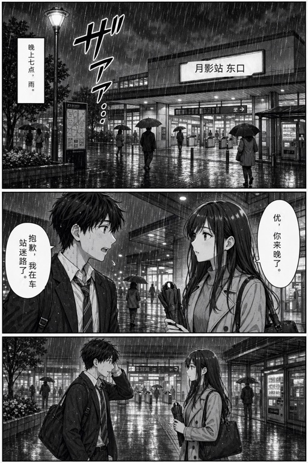
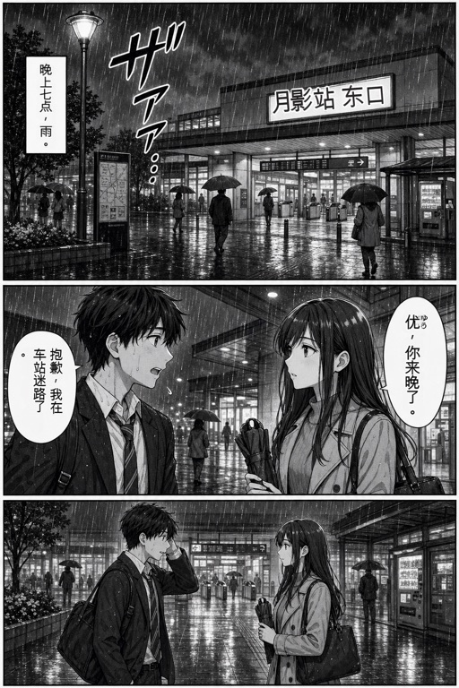
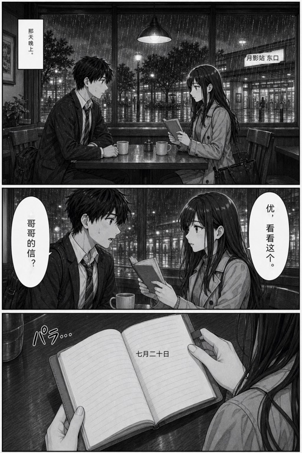
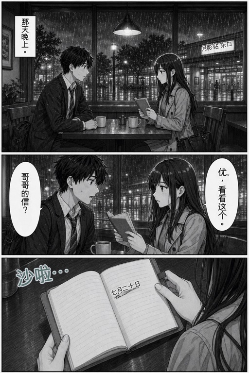

# 漫画翻译视觉后端与可替换技术栈

- **status**: active engineering reference
- **measured**: 2026-07-23
- **fixture**: `nexte-original-manga-eval-v1`, two original 1024 × 1536 pages
- **measured local profile**: `core-vision-ocr-directional-render-v13`
- **current Reader profile**: `core-vision-ocr-bubble-group-v30` /
  `reader-local-bubble-layout-v43` / `local-ctd-aot-inpaint-v29`
- **sidecar profile**: patched `manga-translator-ui v1.9.9-nexte2`, 48px OCR without hybrid retry

## 先说结论

当前实现不是“只能用系统 OCR”，也不是“LLM 只能翻译”。稳定边界已经把页面处理拆成区域分析、文本翻译、
原文处理、布局渲染和视觉产物发布；每一段都可以替换。生产 Reader 当前以 Core Vision 为主 OCR，并可按需
加载 YSGYolo、PP-OCRv5、CTD 和 AOT，再由 ArkGraphics2D 完成确定性排版；翻译继续复用用户选择的 API
或 Codex LLM 源。Docker sidecar 仍保留为研发质量对照，没有进入普通用户必需路径。

真正的限制是能力类型，而不是“本地模型还是大模型”：

- 普通文本 LLM 可以做上下文翻译、术语一致性和 OCR 文本纠错，但不能返回可校验的像素 mask 或译制图片；
- 多模态文本 LLM 还能阅读整页和区域裁图，帮助阅读顺序、漏字提示、说话人和语义判断，但仅返回文本时仍
  不能完成擦字与排版；
- 具有图片编辑/图片输出能力的模型可以直接生成整张译制页，属于并列的 whole-page render 路线，而不是
  当前文本 API/Codex 路线的隐藏能力；
- detector、OCR、inpaint 都可以换成下载到设备的本地模型，但要先解决模型格式、许可证、运行时、分块、
  内存和不同设备性能，不能把 Python/Docker 镜像直接塞进 HAP。

## 当前真实运行链路

```text
Reader 原图
  -> ComicTranslationRuntimeService：校验本地文件、尺寸和 SHA-256
  -> ComicLocalVisualBackend.analyze
       -> Core Vision Text Recognition
       -> 可选 YSGYolo 2048px 分片 region detector
       -> 可选 PP-OCRv5 补充未覆盖 region；低置信结果拒绝
       -> 可选 CTD 低阈值候选；没有可接受转录时保留原图
       -> 原图坐标 polygon、横竖方向、纵列合并和注音抑制
  -> ComicVisualTranslationOrchestrator
       -> 装配前页、摘要、术语和风格上下文
  -> ComicTextTranslator
       -> 已选 API 或 Codex Responses 源
       -> 整页图 + 区域裁图 + blockId 原文
       -> 返回逐块中文、页面摘要和上下文身份
  -> ComicLocalVisualBackend.render
       -> CTD 高阈值文字 mask
       -> AOT 256px 有界神经网络 inpaint；失败时保留原图
       -> ArkGraphics2D 横排/纵排布局和页级字号约束
       -> PNG 编码
  -> ComicRenderedPageRepository
       -> 按完整 pipeline identity 校验、缓存
  -> Reader 显示衍生页；失败时保留原图
```

当前端侧技术栈是 ArkTS、Core Vision Kit、ImageKit PixelMap、ArkGraphics2D Canvas/Font、ncnn、
共享 Responses API/Codex 传输和本地衍生页缓存。`model-pack-v1.1.4` 已把 YSGYolo 与 PP-OCRv5 接进
production profile；CTD 提供像素 mask，AOT 承担有界内容修复。模型缺失、低置信度、资源越界或任一阶段
失败时仍回退 Core Vision 或保留原图。当前没有接入 LaMa large，也不能把 AOT 表述成与 Docker LaMa
等价的复杂纹理修复。

`ComicRegionRenderBackend` 同时拥有 `analyze()` 和 `render()`，所以可把 Core Vision 替换为另一套端侧视觉
模型，而不改 LLM、上下文和 Reader。`ComicWholePageRenderBackend` 与 `WHOLE_PAGE_RENDER` identity 也已
定义并有契约测试，但截至本次复核只有接口和 fixture backend，没有生产 provider、编排器路由或设置选择；
因此“整图出图可接入”是真实架构能力，“现在已能调用任意整图模型”则不是事实。

## Docker 对照链路

固定 sidecar 以 Python/FastAPI 运行 `manga-image-translator` 模块：

```text
原图
  -> default detector 2048 + YOLO OBB
  -> 48px OCR（可选 MangaOCR hybrid）
  -> translation.json：region polygon、lines、angle、font size、方向、颜色和 mask
  -> NextE 选中的 API/Codex LLM 按 blockId 翻译
  -> NextE 专用 import 路由加载译文
  -> LaMa large ONNX CPU inpaint + upstream renderer
  -> PNG
```

sidecar 的 `translator=original` 是刻意配置：它只负责视觉分析和制图，不调用第二套 LLM。当前本机镜像在
Docker 中显示约 4.61 GB，首次混合 OCR/修复冷启动还下载约 591 MB 权重；完成本次运行后 `/app/models`
约 1.3 GB。这个栈可以作为桌面/局域网高级后端，但不等于可直接端侧部署的单个模型。

### Docker 模型不是一个整体

本次按容器实际缓存拆开后，主要视觉权重如下。它们负责不同阶段，不能只移植一个文件就得到 Docker 的
完整画质：

| 阶段/权重 | 容器文件大小 | 端侧意义 |
|---|---:|---|
| YSGYolo 1.2 OS1.0 ONNX | 10,838,944 bytes | 已转换并以按需模型包接入 production |
| default detector checkpoint | 308,380,176 bytes | 更重的检测/分割链路；未移植 |
| 48px OCR | 204,290,192 bytes | 漫画文字转录；未移植 |
| MangaOCR | 444,135,475 bytes | 日文 OCR fallback；未移植 |
| LaMa large ONNX | 207,482,655 bytes | 已完成静态 ncnn/真机否决性验证；不接入 |
| LaMa checkpoint | 204,544,673 bytes | 上游另一格式权重；未移植 |

YSGYolo 只输出 4 点 OBB、score 和五类 region 标签，不输出 OCR 文本或文字像素 mask。因此它能改善系统 OCR
漏掉整块、气泡空间估计和方向提示，但不能独立消除 `え?` 漏字、注音残留或完成 LaMa 级补背景。

### 首个模型移植结果

从 [manga-translator-ui v1.7.1](https://github.com/hgmzhn/manga-translator-ui/releases/tag/v1.7.1) 使用的
`ysgyolo_1.2_OS1.0.onnx` 提取并转为 ncnn，源 ONNX SHA-256 为
`6f3202925f01fdf045f8c31a3bf62e6c44944f56ce09107eb436bc5a5b185ebe`；转换后 param/bin SHA-256 分别为
`f3617c7834bf3f7ae67521db908a53709140aeb1c11a02f8c64b7c091b569987` 与
`7658e654db1a2e8a77c387607def85d5d297b26f110cc2b334dd52ae17a4fe00`。

前后处理已按上游 640 × 640 letterbox、RGB `/255`、`[11,8400]` 输出和旋转框去重重写为 C++。为了保持
ONNX 数值一致性必须关闭 ncnn FP16 storage/packed/arithmetic 与 packing layout；CPU FP32 的最大绝对误差
为 0.001312、平均绝对误差为 0.00001466。设备 `237` 的临时测试 HAP 在原始 1024 × 1536 页上得到 5 个
去重区域，加载 39 ms、首次 207 ms、热推理 160 ms，完整 Hypium 253/253。模型卡标记为
[MIT](https://huggingface.co/YSGforMTL/YSGYoloDetector?not-for-all-audiences=true)，checkpoint 内嵌元数据却
标记 `AGPL-3.0`；因此 `model-pack-v1.1.2` 按 `AGPL-3.0-only` 分发模型及对应源码，NextE 的独立接入代码
仍维持 MIT。这是按组件分别授权，不是把同一模型资产自行改成双许可。

Reader 的端侧路线现已接入可选模型下载、hash 校验和清理：模型存在时，Core Vision OCR 行按中心点归入
最小包含 OBB；模型缺失、超出 16M 像素边界或推理失败时回退原有 OCR 分组。detector OBB 不直接成为遮盖
或译文矩形。后续接入的 PP-OCRv5 只补充完全未覆盖的区域，CTD/AOT 只处理已接受文字；任一阶段都不能
凭 detector 区域独立补全 OCR、擦字或排版。

### LaMa large 端侧否决性验证

Docker 实际使用的 `/app/models/inpainting/lamalarge.onnx` 为 207,482,655 bytes，SHA-256 为
`107c8306ac1d27c83638d6535846986542dfe2707f1498b1ac9be25b4a963864`；输入为 `[1,3,H,W]` RGB float
与 `[1,1,H,W]` mask，输出为 `[1,3,H,W]` 修复图。模型来自
[AnimeMangaInpainting](https://huggingface.co/dreMaz/AnimeMangaInpainting) 的漫画/动画微调 Big LaMa；
Docker 应用本身与其打包边界仍按各自许可证处理，不能因为模型卡为 MIT 就复制上游 GPL 应用代码。

`pnnx 20260526` 只能成功得到固定 `256 × 256` 的 ncnn 图：param 约 275 KiB、bin 约 195 MiB，
估算 111.812 GFLOPs；动态 shape 转换在 `pass_ncnn` 崩溃。固定图包含 216 个 `Einsum`、144 个
`MatMul` 和 72 个 `Gemm`，说明 Fourier 层被展开成很重的通用算子图。相同确定性输入下，ncnn 与原 ONNX
的 MAE 为 `1.2777e-7`、最大误差 `4.2617e-6`、PSNR 134.19 dB，数值转换本身成立。

在三张自生成、具有干净真值的 256px 局部图上，LaMa 对复杂纹理明显优于 AOT，但不是全面替代：

| 样本 | AOT MAE / PSNR | LaMa MAE / PSNR | 判定 |
|---|---:|---:|---|
| 半调网点线稿 | 37.595 / 13.373 dB | 12.659 / 21.333 dB | LaMa 明显更好 |
| 平坦纸张气泡 | 1.621 / 41.805 dB | 2.348 / 39.024 dB | AOT 更好 |
| 雨纹背景 | 11.521 / 21.386 dB | 6.372 / 25.978 dB | LaMa 更好 |

但设备 `237` 的真实 ncnn FP32 路径冷/热推理分别为 23.968/23.759 秒与 23.780/24.212 秒，模型加载
约 0.39 秒；单独测试进程采样总 PSS 已达 1,142,558 kB。相比现有 AOT 真实区域约 238–468 ms，该导出慢
约 50–100 倍，并额外要求约 195 MiB 权重和固定输入。因此它不进入模型包、设置页或隐藏“高质量”分支。
LaMa 继续只作为 Docker/云端质量参考；只有更小的移动端模型或显著更合适的运行时同时通过画质、P50/P95、
峰值 PSS、连续页热稳定性和失败回退门，才允许重新提出端侧接入。

## 同页 A/B

本次给两条链路写入完全相同的人工中文译文，避免把翻译措辞差异混入视觉比较。Docker 使用 48px OCR、
YOLO OBB 和已下载的 LaMa，关闭 MangaOCR hybrid，避免其首次加载阻塞影响结果。

| 指标 | 端侧 v13 | Docker sidecar | 本次证据说明 |
|---|---:|---:|---|
| 第 1 页严格原文块 | 4/5 | 4/5 | 两边都漏掉融入雨景的 `ザアア…` |
| 第 2 页严格原文块 | 5/6 | 6/6 | Docker 额外检测到 `パラ…` |
| 两页合计 | 9/11 | 10/11 | 两页小样，不是总体准确率 |
| 第 2 页暖启动视觉耗时 | 1.677 s | 35.86 s | 端侧为设备 237；Docker 为本机 CPU 容器，不能当同硬件 benchmark |
| 区域表达 | OCR 行 polygon + 合并 block | OBB/逐行 polygon + angle + mask | sidecar 的边界和样式元数据更丰富 |
| 部署 | 系统能力，当前无额外模型包 | Docker 镜像 + 多个权重 | sidecar 不适合作为普通用户必需项 |

端侧第 2 页的 1.677 s 由 228 ms OCR 和 1449 ms 本地处理/PNG 构成；第 1 页为 380 ms + 487 ms。
渲染后进程 PSS 样点约为 136 MiB 和 167 MiB，但它不是独立峰值。Docker 第 2 页暖启动分别为 10.30 s
export 和 25.56 s import；模型冷启动、容器启动和 LLM 网络时间均不在这个数里。

### 第 1 页

| 端侧 v13 | Docker sidecar |
|---|---|
|  |  |

两者都保留了未识别的雨声拟声词。端侧对白字号经页级约束后更克制，但字体仍是普通系统字；sidecar
保留了更接近源图的站牌角度和描边，同时在“优”旁残留小注音，左侧对白标点位置也不自然。

### 第 2 页

| 端侧 v13 | Docker sidecar |
|---|---|
|  |  |

端侧漏掉 `パラ…`，但两个气泡字号已经接近，书页日期保持平直。sidecar 成功译出拟声词，也保留站牌
倾角；同时拟声词过重，右侧气泡标点/注音有残影，日期出现倾斜和下划线式瑕疵。结论不是 sidecar 或端侧
谁“绝对正确”，而是 detector 召回、mask/inpaint、字体/布局都需要分别验收。

## 哪些部分可以替换

| 阶段 | 当前实现 | 可替换方向 | LLM 能否承担 |
|---|---|---|---|
| 文字区域检测 | Core Vision OCR + 可选 YSGYolo OBB | DB/CRAFT 类 detector，或远端 sidecar | 多模态 LLM 可提示漏块；无可靠坐标输出时不能独立承担 |
| OCR/转录 | Core Vision + 可选 PP-OCRv5 补充 | 48px/MangaOCR 类模型、其他 OCR runtime、混合复核 | 多模态 LLM 很适合纠错和补充转录，但应保留 region 身份 |
| 上下文翻译 | 共享 API/Codex `ComicTextTranslator` | 任意满足结构协议的本地或远端 LLM 源 | 是；这是 LLM 最稳定的职责 |
| 原文 mask | CTD 高阈值像素 mask | 其他 segmentation、残留文字二次检测 | 文本 LLM 不行；视觉 LLM 只能给建议，像素 mask 仍需可验证输出 |
| 背景修复 | 端侧 AOT 256px 有界修复 | 更小移动模型、Telea 类算法、远端修复服务 | 图片编辑模型可以做，但画面保真和局部可控性要单独验证 |
| 排版 | ArkGraphics2D 确定性横/纵排、字号拟合 | 更完整 CJK 禁则、气泡分类、字体包、曲线/艺术字 renderer | LLM 可给方向/语气/style hint；最终几何拟合应保持确定性 |
| 整页出图 | 仅有接口与契约测试 | 接入真正返回图片的多模态生成/编辑 provider | 可以，但必须是 image-output 能力，不能把文本 Responses 当图片接口 |

“用其他本地模型”因此不是推翻现有工作流，而是新增一个实现同一接口的视觉 profile。例如本地高质量档
可以依次加入专用 detector、漫画 OCR 和可选 inpaint 模型；基础档继续使用系统 OCR 和确定性修复。二者
共享 `ComicPageDocument`、LLM 上下文、译文缓存和 Reader 产物协议。

## 推荐产品分层

1. **默认快速阅读档**：保持当前端侧路径，无服务地址；优先改善 detector 召回、残留原文检查、CJK
   排版和字体。单页失败立即回原图。
2. **端侧高质量档**：按需下载有 hash/version/license 的 detector、OCR、inpaint 模型包；支持设备能力
   探测、长图分块和资源上限。它仍只要求一个 LLM 源。
3. **高级 sidecar 档**：用户主动选择局域网/桌面服务，获得更重的模型和可编辑模板；不能成为默认失败
   原因或普通设置必填项。
4. **整图模型档**：只对真实提供图片输出的 provider 开放；输出经过尺寸、格式、非文字区域保真和缓存
   identity 校验。整图重跑成本和不可逐框编辑必须明确显示。

下一阶段不应继续把所有质量问题压进 `ComicLocalVisualBackend` 的启发式。YSGYolo、PP-OCRv5、CTD 与
AOT 已形成现有端侧组合；LaMa large 已因真机资源和延迟门被否决。v29 已把同一闭合气泡内的多列 AOT
从逐块调用改为一次有界并集调用，设备真实推理为 `239x454 -> 136x256`、208 ms；独立气泡和扩大超过
1.35 倍的 crop 仍逐块处理。后续优先测连续多页 CTD/AOT P50/P95、峰值 PSS 与更大的合法艺术字/负样本集，
再评估真正面向移动端的轻量修复模型。整图模型可并行接入，但不能代替这条可编辑、可缓存的分阶段主路径。
