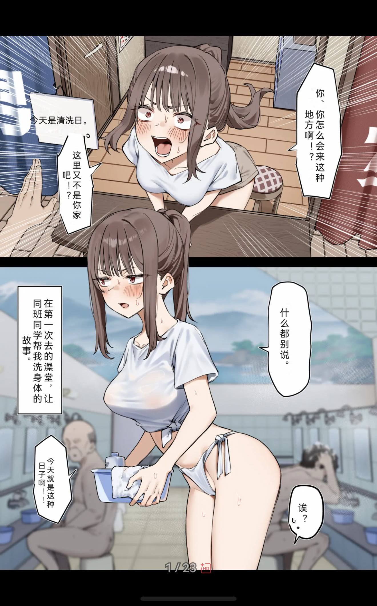
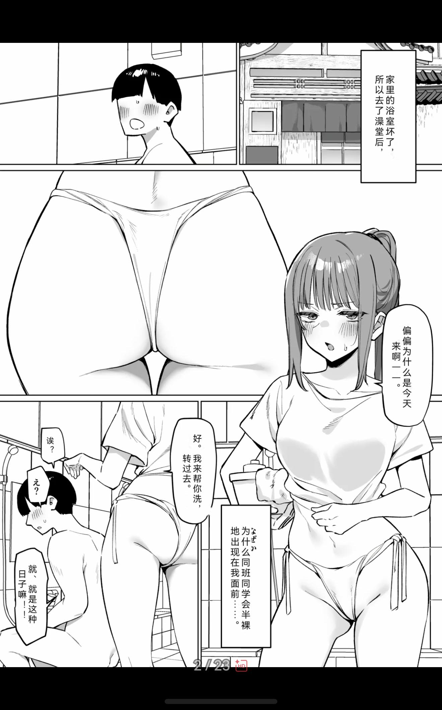

# 漫画翻译端侧质量基线

- **status**: active baseline; not a production-quality claim
- **measured fixture profile**: `core-vision-ocr-directional-render-v13`
- **current production analyzer**: `core-vision-ocr-bubble-group-v33`
- **current production render profile**: `reader-local-bubble-layout-v43` /
  `local-ctd-aot-inpaint-v29` / `local-bubble-typography-v37`
- **measured**: 2026-07-23
- **device**: user-selected device `237`
- **fixture**: `nexte-original-manga-eval-v1`, two original 1024 × 1536 PNG pages

## 结论

当前端侧路径的速度已经达到即时阅读可接受范围，但检测覆盖和制图质量还没有达到通用 Reader V1 的退出
条件。两页小样的严格原文块命中为 **9/11（81.8%）**；成功检测的 9 个普通文本块方向为 **9/9**，阅读
顺序错误为 0。漏掉的两个块都是融入画面的拟声词。这个结果只能说明当前原创小样上的确定性基线，不能
外推成真实漫画总体准确率。

早期 v13 输出已经修复几个明显问题：竖长气泡保持纵排和右到左分列；同一气泡被系统 OCR 拆开的
相邻列会重新合并；注音区域会随主文字进入清理范围。竖排禁则避免句号等闭合标点被单独挤到下一列。
原文处理不再绘制统一圆角块，而是检测文字区域内的高对比字形像素、膨胀 mask，并用局部邻域恢复背景。
v13 还以页面内纵排拟合字号的低中位数约束异常大字，第二页两个对白气泡不再出现约 42/30 px 的明显断层。

当前 production 已改为 YSGYolo/PP-OCRv5 辅助分析、CTD 文字 mask 与 AOT 256px 有界 inpaint，不再沿用
v13 的纯局部邻域恢复；但 AOT 对复杂纹理仍不等价于 Docker LaMa，艺术字/拟声词也会因 detector/OCR
未接受而保留原文。因此本基线的产品判定仍是 **可用于轻量阅读试验，但不可宣称通用制图可用**。与固定
Docker sidecar 的同页对照见
[视觉后端与可替换技术栈](manga-translation-backend-comparison.md)。

## 可复现测量

测试入口为 `entry/src/ohosTest/ets/test/ComicLocalVisualBackend.test.ets`。每次运行都会对两页执行真实 Core
Vision OCR、本地分组、确定性中文回填、PNG 编码、逐像素差异统计和进程 PSS 采样，并把 JSON 报告写入
测试 Ability cache。测试门要求至少命中 9/11、unexpected=0、所有已复核普通文本方向正确、改动画素低于
5%；这只是回归下限，不是 V1 质量门。

最终 v13 profile 在设备 `237` 连续三次目标质量用例均为 1/1。它是在完整 signed app 与显式 signed
`entry@ohosTest` 构建后运行；完整 Hypium 曾被既有 sidecar 长用例在本地 test runner 生命周期中提前
终止，因此这里不再沿用旧 profile 的“233/233”或“三次完整回归”表述。下表是第一轮保存的逐页报告：

| 指标 | 第 1 页 | 第 2 页 | 解释 |
|---|---:|---:|---|
| 严格原文块命中 | 4/5 | 5/6 | 每页均漏 1 个拟声词 |
| 已检测块方向 | 4/4 | 5/5 | 纵排/横排与人工复核一致 |
| OCR 分析耗时 | 380 ms | 228 ms | 单次 v13 目标用例 |
| 本地回填与 PNG 编码 | 487 ms | 1449 ms | 字形 mask、邻域恢复、排版与编码 |
| 单页端侧视觉总耗时 | 867 ms | 1677 ms | 不包含远端 LLM 翻译时间 |
| 改动画素比例 | 1.035% | 0.782% | 只衡量覆盖范围，不代表美观 |
| 输出 PNG | 3.13 MiB | 2.92 MiB | 无损测试产物 |

PSS 是测试进程阶段样点：两页渲染后分别约为 136 MiB 与 167 MiB，且 GC 会使阶段后数值低于阶段前；它
不能被解释为漫画翻译的独立峰值或增量。渲染器持有一张可编辑 RGBA PixelMap，并对单个有界文字区域读取
像素以建立 mask；没有额外保留整页 RGBA 副本。长图真实峰值、热降频和连续多页资源回收仍需单独测量。

## 真实 Reader 补充（2026-07-22）

设备 `237` 上用实际日文画廊补做了默认端侧路线，不配置 sidecar，只选择共享 Codex 源
`gpt-5.6-luna`。第 1 页系统 OCR 输出 10 个区域，第 2 页输出 7 个区域；第 2 页首次 OCR、远端逐块翻译、
端侧渲染到 Reader ready 约 16.6 秒。复用已有翻译文档只重做第 1 页端侧渲染约 1.8 秒；进程重启后同页
持久衍生页命中从 source identity 解析到 ready 为 8 ms，日志为 `cache=1`，没有再次运行 OCR 或 LLM。

生产 analyzer/render 现升至 v14/v19。v14 会把同一气泡中被系统 OCR 拆开的相邻纵列、横行重新合并，v19
按合并后的气泡空间统一拟合字号，不再逐行各算一套大小。实际日文页中，第 1 页 `な、なんで` 与后续正文、
横排叙述均已形成单一布局块；第 2 页 `はい。` 与 `洗うから後ろ向いて。` 已按同一气泡、同一字号排版，未再
出现同气泡字号跳变和译文相压。纵排原文处理仍只扫描原文字形附近，不会把扩大的排版区域整块抹白。

真实 Reader 已验证原图/译图切换、翻页返回、双击缩放和拖动平移，译文和页面作为同一张衍生 PNG 工作。
当前明确未解决的是第 2 页小气泡 `え?` 的 OCR 漏检，以及一处 `なぜか` 注音残留；两者都不能再靠扩大
圆角遮盖解决，分别需要漫画专用 region detector/OCR 与更可靠的文字 mask。

本次还固定了衍生页落盘契约：端侧后端只能发布 repository 管理的
`comic-translated-pages/<identity>-<artifact>.png`，路径与内容 hash 不匹配会在 Reader 发布前失败。该规则
防止“本地已经生成图片”被误当成可缓存、可恢复的 Reader 产物。

## 真实英文 Reader 补充（2026-07-23）

设备 `237` 对实际日文画廊第 1 页改用英文目标做了连续 v27–v31 复核。v27 直接沿用源纵排方向，导致英文
逐字竖排；v28 改成横排后仍把同一段落的 OCR 大块和内部小块重复绘制；v29 又错误合并左右两个独立段落。
v30/v31 最终采用以下边界：源 geometry 只负责清理，目标语种决定排版；被大段落包含的重复小块在渲染时
抑制；相邻源纵列只在有限水平间距内合并。页面文档仍保留 12 个翻译块，不为排版修复重新调用 LLM。

v31 把白色描边 pen 从最多 1.6 px 改为字号的 20%（限制 2–10 px）。由于深色填充会覆盖描边内侧，复杂
灰阶背景上最终留下的可见白边约等于一层正常字笔画；同一确定性规则同时用于横排和纵排。设备直接产物
为 1,171,810 bytes，artifact 前缀 `a1ceffbc38d3`。从 source identity 解析到 `reader_page_ready` 约 13.0 秒；
其中 detector 返回 32 个区域，补充 OCR 尝试 3 个、接受 0 个，text mask 约 0.94 秒，六个 AOT inpaint
区域合计约 7.26 秒。

v31 的包含块抑制只比较 geometry，会把“落在段落内、但译文并不重复”的小块也静默丢掉。v32 改为单一
区域 owner：已由大块译文表达的子块才抑制，独有子块先合入 owner 再停止单独绘制；拉丁文本按单词边界
比较，`Very` 不会误判为已包含在 `every` 中。横排目标同时加入安全页边距，并限制左右页区域不得越过
各自原始内边界。设备 `237` 上显式从 Torii 切回端侧后复用同一英文文档，真实 Reader 恢复了 `Very`、
`As a rule, condoms...`、`Who could “that guy” be...?` 和右侧压力段落，左下段落也不再贴住物理页边。
确定性回归为 12/12；signed app、signed `entry@ohosTest` 与 V2 inventory 均通过。

v33 将这条边界前移到翻译之前。同一 OCR tile 内，被明显更大纵排段落包含的窄纵列不再作为独立翻译块；
其中未在父段落出现的原文先并入父段落，再由 LLM 生成一份完整译文。设备 `237` 对同一第 1 页执行了新的
端侧识别、翻译和制图，左侧 `Very` / `As a rule` / `Who...` 短句堆叠消失，右侧仍保留“每天用于缓解
压力”的补充语义。该结果说明嵌套 OCR 的根因在分析/翻译边界，而不是继续在渲染后拼接短句。目标设备
回归仍为 12/12，signed app、signed `entry@ohosTest` 与 V2 inventory 均通过。

v36 修正横排空间计算中的独立缺陷：历史 360 px 扩展上限不再反向缩窄本来就更宽的源段落；实际宽度超过
360 px 时，额外宽度只用于减少换行，单块字号仍以 360 px 参考宽度拟合，不能随矩形变宽而增大。设备
`237` 复用同一 v20 英文文档重排后，左上段落从约 360 px 恢复到接近 435 px 源宽，行数和垂直占用下降，
右侧与左下段落保持稳定；目标设备回归升为 13/13，signed app、signed `entry@ohosTest` 与 V2 inventory
均通过。

v37 在原文处理全部结束后，只对至少四行且有明显垂直余量的拉丁横排块读取其局部 PixelMap，比较上/中/下
三个候选文字包围盒中的高对比边缘密度。只有候选相对居中的改善超过固定门槛才改变锚点，采样失败则回到
居中，不影响主渲染。真实页只有左上长段落从居中移至顶部，与下方拟声词拉开；右侧和左下保持 v36。
合成密集障碍用例加入后目标设备回归为 14/14。

v21 analyzer 在分组后增加窄边界页脚过滤，只处理页面底部 6% 内的横排明确网址/平台署名或短符号碎片；
中部网址和底部自然对白的回归用例均保留。设备 `237` 对同一真实页重新分析后，v20 的 7 个块中 3 个页脚
误识别不再进入 v21 文档，4 个正文块全部保留，并记录
`local_non_dialogue_footer_filtered: Ignored 3 likely non-dialogue footer artifact(s).`。页脚作者署名仍以原图
像素显示，这是预期保真结果，不是等待回填的翻译块。目标设备回归升为 15/15。

视觉结论仍是 **未达到生产可用**：v33 已消除重复短句，v36 已修复宽段落被错误压窄，v37 只加入有限的
边缘感知纵向锚点，v21 只排除窄边界内的非对白页脚块；它们不是人物分割、语义障碍检测、二维自由布局或
通用艺术字/拟声词识别。v30 完成时
还触发过 `THREAD_BLOCK_6S`，当时进程 RSS 约 1.95 GiB，主线程
停在结果完成后的系统 Toast 路径；Reader 现取消这条冗余成功 Toast，只保留结果图片和错误反馈。v31 在
ready 后继续响应控件点击并保持进程存活，但单次未复现不能替代连续页峰值内存与 appfreeze 回归门。

## 真实 Reader 资源补充（2026-07-23）

设备 `237` 对同一实际日文画廊第 1 页完成了端侧 CTD/AOT 的资源拆分。早期 v21 直接按文字区域原尺寸运行
AOT，三个区域 `427 × 644`、`563 × 446`、`262 × 673` 分别约为 2164/1883/1305 ms，单页 ready 后进程
PSS 仍约 1.84 GiB，不能进入连续阅读。v25 按上游 AOT 256 输入语义保持长宽比缩小、8 像素对齐，再把
模型结果放回原区域；同三区域实际输入为 `176 × 256`、`256 × 208`、`104 × 256`，合计推理约 1.19 秒，
但完成后 PSS 仍约 990 MiB，证明缩小 AOT 不能单独关闭资源门。

v28 将 detector、固定 `1024 × 1024` CTD text mask 与 AOT Extractor 的临时 blob/workspace 放入单次推理
拥有的 mmap pool，阶段结束统一解除映射，避免 ncnn 临时块长期留在 jemalloc。Reader 同时不再对已经生成
的 `comic-translated:` 衍生页执行第二次 2× 超分；原图超分设置和普通图片路径保持不变。冷启动 PSS 为
306,135 kB，第 1 页翻译前 Reader 样点约 506,830 kB，端侧视觉峰值 917,833 kB，完成后约 776,144 kB；
第 2 页进入时约 815,509 kB，翻译峰值 992,035 kB，最终回落到 716,860 kB（native heap 406,912 kB）。
第二页没有在第一页基础上继续累加，日志也没有在两个 `reader_page_ready` 之后出现译图
`reader-super-resolution.process_start`。

同一 v28 日志中，第 1 页 CTD 为 1018 ms，三个 AOT 为 411/468/271 ms；第 2 页 CTD 为 992 ms，唯一
AOT 区域 `515 × 906 -> 152 × 256` 为 351 ms。signed app、V2 inventory 和目标设备 Hypium 267/267
通过。资源泄漏/重复超分边界因此获得两页证据，但 B2/F 仍不能关闭：第 2 页聊天式多个独立气泡仍被合并成
一个长段并发生跨气泡重叠，下一阶段必须修正 region 分组与布局，不能把资源通过等同于制图可用。

## 真实 Reader 多气泡边界补充（2026-07-23）

继续检查同一画廊第 2 页后，确认 v28 的单一大块不是排版器单独造成：分析器先把相邻行合成两个段落，再以
“已合并段落总高度”计算下一次允许间距，两个都变高后会跨过 50 px 气泡间隔发生传递合并；渲染器又曾在
翻译后按 geometry 改变语义分组。v24 analyzer 为每个块保留原始 OCR 行高/列宽尺度，后续合并不再放大该
尺度；同段相邻行框允许 42% 以内轻微重叠。v38 render 则严格保持一个文档 block 对应一个 render plan。

设备 `237` 的 `1280 × 1780` P2 原图包含 5 个聊天气泡。YSGYolo 返回 14 个区域，v24 最终 geometry 为
`476,403–815,476`、`477,648–761,819`、`473,869–804,988`、`639,1051–853,1114`、
`466,1146–595,1181`；第二、第三长气泡之间保留 50 px，渲染日志为 `documentBlocks=5 plans=5`。CTD 为
864 ms，五个 AOT 分别为 322/391/350/328/240 ms，最终 PNG 为 808,123 bytes，artifact 前缀
`c8c663f311c5`。实图中 5 份英文译文均留在各自气泡内，没有再互相覆盖。

新增回归分别覆盖“两组多行段落不能因累计高度再次合并”和“同段轻微重叠行框仍应合并”；signed app、
signed `entry@ohosTest`、V2 inventory 与完整设备 Hypium 270/270 通过。该证据只关闭这一已知跨气泡重叠
回归；短气泡仍接近轮廓边界，气泡形状感知内边距、复杂背景残留、艺术字/拟声词覆盖和更多真实样本继续属于
B2/F 未关闭项。

## 真实 Reader 闭合气泡安全区补充（2026-07-23）

v39 render 在清理全部原文后，只对横排目标尝试从原始 OCR 区域进入与已采样底色相近的连通域。候选读取
范围有界；连通域触碰候选边缘、面积或宽高不足、像素读取失败时立即保留既有 geometry fallback。确认闭合后
裁掉稀疏的气泡尾部并做小幅内缩；同一解析结果同时用于字号拟合、障碍偏移和最终绘制，避免阶段间重算漂移。

设备 `237` 对同一 `1280 × 1780` P2 复测，五个 block 全部命中闭合安全区。关键短气泡从 fallback
`602,1039–890,1126` 收敛为 `642,1043–855,1126`，最小气泡为 `465,1144–599,1188`；五份译文均位于
各自轮廓内且无重叠。CTD 为 648 ms，五个 AOT 为 238/343/347/289/282 ms，最终图片 806,706 bytes，
artifact `c659d88ca744…`。确定性闭合气泡 fixture 记录 `fallback=542,398,758,482`、
`safe=471,350,739,560`、面积 68,796；signed app、signed `entry@ohosTest`、V2 inventory 和完整设备
Hypium 271/271 通过。

该证据关闭当前 P2 的普通闭合气泡贴边回归。开放尾部、复杂纹理或深色气泡仍会保守回退，艺术字/拟声词、
复杂背景修复、更多真实样本和连续页性能仍属于 B2/F 未关闭项。

## 真实 Reader 窄竖框拉丁排版补充（2026-07-23）

同一画廊 P3 是 1280 × 905 的黑底页，包含三个窄高八边形色块。v39 把英文按普通横排塞进窄宽度：右侧
`Whenever` 被拆成多个单字母，灰色块也出现词内断行，粉色块还跨出原色块。v40 只对“源 `vertical-rl`、
目标横排、物理矩形高度至少 120 px 且高宽比至少 1.8”的块交换逻辑宽高完成横排，再将整段顺时针旋转
90° 放回原长轴。单词与标点不会拆成逐字符纵排；未确认安全区的块保持原 OCR 矩形大小，并在既有页边
fallback 内保留 8 px 安全距离。

设备 `237` 的 v40 实际 PNG 为 136,656 bytes，artifact `62b1460cce966300…`；旧 v39 对照为
151,147 bytes、artifact `4ac43aa038300414…`。三段英文均位于各自色块内，没有词内断行、跨块重叠或物理
页边接触。新增 fixture 使用单词 `uncharacteristically`，要求改动画素长轴至少是短轴三倍，并继续通过既有
页边用例；signed app、signed `entry@ohosTest` 和设备完整 Hypium 272/272 通过。

这是轻量阅读模式对极窄竖框的确定性折衷：整段文字在页面上会侧转 90°，不是专业本地化中的气泡重绘或
自然英文朝向。该证据只关闭当前窄竖拉丁框的拆词、越界与相邻块重叠回归；开放尾部、曲线轮廓、复杂纹理、
艺术字/拟声词、内容感知修复和更多真实样本仍属于 B2/F 未关闭项。

## 真实 Reader 同气泡多列布局补充（2026-07-23）

同一画廊 P4 的 analyzer 保留了 24 个合法 document block，但其中多组纵列实际位于同一个闭合不规则气泡。
旧 v40 按 block 分别拟合和绘制，中央大粉气泡、顶部灰气泡、右侧窄气泡与底部粉气泡因此出现字号不一致、
文字相压或空间浪费。不能为了排版把这些 block 静默改写成新的语义文档：它们已经拥有稳定 blockId、译文和
缓存身份，且普通邻接不足以证明属于同一气泡。

v42 先保持一 block 一 plan，并按各自源 geometry 完成原文清理；随后只读取 v39 已确认的
`shapeConstrained` 闭合安全区。一个安全区必须包含组内每个源 block 的中心，才允许按原 document 顺序
拼接已有译文并在该安全区统一拟合、绘制一次；若只能传递连通、没有单一安全区覆盖全组，则全部退回独立
布局。该步骤不修改 document、translation batch、blockId 或源清理范围。中文/日文连接不插入拉丁空格，
拉丁目标保留词间空格。

设备 `237` 的真实 P4 重绘记录为 `documentBlocks=24 plans=24`、`groups=17 merged=7`、`cache=0`；PNG
为 691,220 bytes，artifact 前缀 `1204916145c8`。七组日志均给出组成 blockId 和唯一安全矩形；实图中上述
四类问题气泡均改为单次布局，独立相邻气泡没有被合并。确定性 fixture 另验证两个独立 OCR 列仍保留两个
analysis block，但渲染日志为 `plans=2 groups=1 merged=1`，改动画素不越出闭合气泡。目标设备回归为
21/21，完整 Hypium 为 273/273。

该证据只关闭“同一已确认闭合气泡中的多个合法 block 被重复排版”这一回归。边界识别失败时仍会保持旧的
独立布局；开放尾部、曲线/纹理气泡、艺术字/拟声词、内容感知修复和更广样本的 overflow 仍属于 B2/F
未关闭项。

## 窄竖拉丁框直立优先（2026-07-23）

v40 为防止英文拆词，把所有高宽比至少 1.8 的竖长源框整段侧转 90°；边界安全，但短句也被迫侧转。v43
保留该方案作为保底，同时在物理框内从大到小寻找不拆任何拉丁单词的正常横排候选。候选字号必须至少 10 px，
且不低于侧转候选的 75%；不满足任一条件仍沿用侧转。该判定不改变 OCR、翻译批次、原文清理或闭合气泡
安全区，只改变最终绘制方向。

设备 `237` 的确定性回归同时覆盖 `Please wait here` 的直立选择与 `uncharacteristically` 的侧转保底，目标
套件为 22/22。真实 P3 中左侧和中间色块恢复正常横排，最窄且长句的右侧色块继续侧转；P4 的中央、顶部和
多个中宽气泡恢复正常横排，长句窄框继续侧转。截图见本地证据 `audit-v49-p3-before/after.jpeg` 与
`audit-v49-p4-before/after.jpeg`；未观察到新增拆词、跨框重叠或越界。最终 signed app、signed
`entry@ohosTest`、V2 inventory、`git diff --check` 与设备完整 Hypium 274/274 通过。

该阶段只关闭“能以相近可读字号直立时仍强制侧转”的回归，不关闭 B2/F。低于门槛的窄框仍会侧转；要继续
减少侧转，必须获得更宽的可靠气泡边界或更短的译文，不能通过降低字号和允许词内断行伪造完成度。

## 漫画 detector 端侧移植试验（2026-07-22）

已从 Docker 对照链路单独提取 YSGYolo 1.2 OS1.0 detector，并转换成现有 HarmonyOS ncnn 运行时可加载的
`param/bin`。这里只移植独立模型和前后处理契约，没有把上游 Python、FastAPI 或 GPL 应用代码打入 HAP。
模型卡标记为 [MIT](https://huggingface.co/YSGforMTL/YSGYoloDetector?not-for-all-audiences=true)，但 checkpoint
内嵌的 Ultralytics 元数据标记为 `AGPL-3.0`。当前分发按更保守的 `AGPL-3.0-only` 处理：NextE 接入代码仍按
项目 MIT 许可，模型资产在独立 model-pack 中按自身许可、来源、hash 和对应源码分别标注，不能把模型资产
重新标成 MIT。

| 产物 | 大小 | SHA-256 |
|---|---:|---|
| `ysgyolo_1.2_OS1.0.onnx` | 10,838,944 bytes | `6f3202925f01fdf045f8c31a3bf62e6c44944f56ce09107eb436bc5a5b185ebe` |
| ncnn param | 26 KiB | `f3617c7834bf3f7ae67521db908a53709140aeb1c11a02f8c64b7c091b569987` |
| ncnn bin | 10 MiB | `7658e654db1a2e8a77c387607def85d5d297b26f110cc2b334dd52ae17a4fe00` |

转换后输入/输出为 `in0 -> out0`，输出形状为 `[11, 8400]`。ncnn 默认 FP16 storage 会把本模型的最大绝对
误差放大到约 15.204；关闭 FP16 storage/packed/arithmetic 与 packing layout 后，相对 ONNX Runtime 的最大
绝对误差为 0.001312、平均绝对误差为 0.00001466，`atol=1e-3` 一致性成立，因此首个设备 profile 固定为
CPU FP32，不能擅自切回默认 FP16。

临时把转换产物放入显式测试 HAP 后，设备 `237` 在合法 1024 × 1536 原图上返回 5 个去重区域：模型加载
39 ms、首次推理 207 ms、热推理 160 ms；带该临时用例的完整 Hypium 为 253/253。随后模型以
`model-pack-v1.1.2` 独立发布，HAP 不内置二进制；设置页可选下载 10,747,791 bytes，安装时逐文件校验大小
与 SHA-256，缺包或推理失败时无损回退 v14 Core Vision。production `ComicLocalVisualBackend` 只用 detector
OBB 归并系统 OCR 行，不把整块 OBB 当作遮盖或排版矩形，因此不会重新引入粗暴圆角块。

最终分发与安装也在设备 `237` 实测：NextE-Models Actions run `29893521705` 成功创建
`model-pack-v1.1.2` Release；tag 对应提交为 `9f57c3995aa83518f43db48a64cdd560b4fc83c4`。最终 signed app 的
真实下载从 `download_start` 到 `download_success` 约 5.4 秒，校验并原子安装 10,747,791 bytes 后，设置页由
“未安装”切换为 `YSGYolo`。同一最终代码边界的完整设备 Hypium 为 254/254。该结果证明按需模型包可达、
校验与 production 选择生效，不表示 OCR transcript、背景修复或最终排版质量已经达标。

## PP-OCRv5 补充识别移植试验（2026-07-22）

第二个端侧组件采用官方 `PaddlePaddle/PP-OCRv5_mobile_rec`，固定 source commit
`682f20538d8c086cb2128e5cfac775e6c4904e85`，按 Apache-2.0 单独记录。官方 Paddle inference 文件经
`paddle2onnx 2.1.0` 与 `pnnx 20260526` 转为 CPU FP32 ncnn；Runtime 不包含 Paddle Python 依赖。

| 产物 | 大小 | SHA-256 |
|---|---:|---|
| ncnn param | 19,637 bytes | `7be8d21064ec730db52c03b144b57f6022ecdd1703e1fe410ca209c2bf0e4d47` |
| ncnn bin | 16,442,228 bytes | `1d73b6e2ee6cbd02cabfac6ef9b6a48e62ae76ae02200ea23ac57b121e29697c` |
| 字典 | 74,012 bytes | `d1979e9f794c464c0d2e0b70a7fe14dd978e9dc644c0e71f14158cdf8342af1b` |

桌面 ncnn 对 12 个手工隔离、覆盖三种方向的合法文本行，最佳方向严格转录为 7/12，平均最佳相似度
0.797222，平均推理 16.251 ms；与 Paddle 输出的转录一致性为 33/36。设备 `237` 的直接 NAPI 测试识别
`月影駅東口`、`午後七時雨`、`七月二十日`，模型加载 53 ms，推理分别 162/46/47 ms。纵向样本虽转录正确，
置信度只有 0.736，因此 production 的 0.85 安全阈值会拒绝它：当前策略优先防止错误文字进入翻译和制图，
不把“模型能猜中”误写成可接受结果。

production 仍以 Core Vision 为主，只对 YSGYolo 已检测、且没有任何系统 OCR 行归属的区域调用 PP-OCRv5；
它不会改写已有 transcript。首批拟声词样本仍未闭环：一处只得到 0.608，另一处未被 detector 覆盖，所以
本次不能声称拟声词或艺术字问题已经解决。`model-pack-v1.1.4` Release run `29898205012` 成功，tag 解引用到
`312bbe09df402b9615b2ffbc150115d2e5a7284a`；从 Release 重新下载的三份资产大小和 hash 与上表完全一致。
最终 signed app 已在设备 `237` 通过设置页安装该 Release，状态由“未安装”切换为
`YSGYolo + PP-OCRv5`；该状态只在五份 detector/recognizer 资产逐文件通过大小与 SHA-256 后发布。最终
`ComicLocalVisualBackend` 目标用例为 6/6，设备完整 Hypium 为 256/256。ohosTest 与正式应用数据目录隔离，
因此不把测试模块读取正式安装目录作为验收方式；正式模型位由生产下载校验与同设备直接 NAPI 测试共同覆盖。

## 长图 detector 分块（2026-07-22）

旧实现只按 16 MP 总像素数决定是否调用 detector，导致 `720 × 14804` 这类 10.7 MP 长图被整体压入
640 × 640 letterbox，实际文字宽度只剩约 31 px。当前 profile 改为 2048 × 2048、256 px 重叠分块，逐块
OBB 回映原图后按同类中心距离 `< 10 px` 或轴向 IoU `> 0.3` 去重；上限为 64 块和 512 个区域，任一分块
失败即整页回退 Core Vision，不发布不完整 detector 结果。生产 YSGYolo profile 升为
`ysgyolo-1.2-os1-ncnn-fp32-tiled-v2`，revision 升为 2，使旧页面缓存自然失效。

设备 `237` 的离线 `720 × 4608` fixture 被切为高度 `2048/2048/1024` 三块，跨块重复 OBB 合并后得到 3 个
原图区域，最大 Y 坐标为 3834，验证了重叠、去重和坐标回映。临时真实发布模型探针另用 `720 × 14804`
合成长图跑 9 块 ncnn 推理：模型加载 48 ms，总推理 1731 ms，目标用例 7/7；探针和测试沙箱模型随后移除，
正式测试只保留离线 fixture。合成白页没有文字，因此该数据只证明长图资源边界和推理稳定性，不证明真实
长图 region recall、OCR 或最终制图质量。

## CTD 候选补漏与局部排版失败隔离（2026-07-23）

同一画廊 P5 是当前艺术字缺口的真实反例：YSGYolo 返回 27 个常规文字区域，但左右两处融入画面的手写字
没有 detector 候选；旧结果只有左侧被 Core Vision 偶然识别，右侧始终漏译。生产 backend profile v29
保留 0.3 阈值 CTD 作为擦字 mask，同时增加 0.15 proposal-only CTD 输出。低阈值连通域只负责提出候选，
不能直接触发擦除或进入 LLM；候选覆盖率按 4 px 网格的真实并集计算，不能把多个重叠 OCR 框面积相加。
页边短拉丁标签会拒绝，内部候选依次经过 PP-OCRv5 整块、上下重叠半块，再在仍失败时把至多 512 px 的
放大裁片交回 Core Vision。只有最终转录通过长度与位置约束才发布 block。

设备 `237` 的 P5 上，右侧候选为 `732,488–876,652`；PP-OCRv5 整块和半块均低于安全阈值，放大裁片的
Core Vision 返回 3 字并被接受。左侧候选 `404,524–596,628` 已有系统 OCR 覆盖，没有重复补块；页眉
`LIVE` 和中央小噪声均未进入文档。detector 为 144 ms，proposal CTD 为 757 ms；32 个初始组在允许相邻
日文列约三分之一字宽交叠后收敛为 16 个文档块。该交叠规则有确定性 8 px detector-box 重叠 fixture，仍
保留既有“已增长段落不得吸收下一气泡”反例。

同页还暴露了渲染事务顺序问题：旧代码先擦除全部 22 个区域，再计算排版；任一长译文无法放入区域就让整页
失败。当前实现先在未修改原图上解析安全区、完成组级预排版和障碍偏移，再只擦除可绘制组。单组失败时保留
该组原文，其余组继续；全部组失败才返回错误。首轮 fail-open 已从整页失败改为 20 组中 18 组输出、2 组
保留原文；随后确认两组其实是同一气泡遗漏的重叠纵列，分析阶段完整合并后 v29 为 `drawable=16 skipped=0`。
拉丁排版同时改为先缩小字号保证单词完整，再换行，不再为保留大字号拆开 `Bareback` 一类单词。

最终真实结果均为 cache miss：P5 从开始本地分析到 ready 约 44.3 秒，其中端侧分析约 3.4 秒、LLM 等待约
31.6 秒、render 约 9.4 秒，PNG 659,259 bytes，artifact `66ced9bb52d0…`；P4 为 21 个 document plan、
18 个视觉组、`skipped=0`，PNG 695,513 bytes，artifact `9e11a4f828fe…`；P3 为 3/3 组、`skipped=0`，
PNG 126,376 bytes，artifact `2dea63d68e43…`。P3 继续保持短句直立、最窄长句侧转；P4 未出现跨气泡或
词内断行；P5 两处手写字均回填且没有日文残列。证据截图为本地
`nexte-v59-p3-final.jpeg`、`nexte-v59-p4-final.jpeg`、`nexte-v59-p5-final.jpeg`。

目标设备套件现有 24 项；23 项确定性用例通过，唯一错误仍是端点无关 Core Vision 实测偶发超过 Hypium
固定 5 秒，最终复测为约 5.22 秒，不是断言失败。设备完整 Hypium 为 276 项、275 项通过、同一实测用例超时，
没有其他失败。该阶段关闭当前 P5 的 detector 外手写候选、整页排版单点失败、
同气泡残列和拉丁词内断行，不关闭通用艺术字 recall：proposal 仍必须有 OCR 可读转录，P3 一个低置信候选
也按设计被拒绝。更复杂拟声词、曲线/纹理背景和跨样本误检率继续属于 B2/F。

## CTD 双阈值单次推理与一次性缓存（2026-07-23）

v29 首轮实现让 analysis 的 0.15 proposal mask 和 render 的 0.3 treatment mask 分别执行一次 CTD。两者模型、
输入、分块和输出张量完全相同，只在阈值阶段不同；真实 P5 日志分别为 757 ms 和 692 ms。当前
`ctd-seg-1024-ncnn-fp16-tiled-v3` 在一次原生 forward 后同时阈值化两张 mask，analysis 只消费低阈值候选，
高阈值 mask 以源图 hash 和尺寸为 key 暂存给同页 render。缓存命中后立即消费删除，最多 2 项、合计
16 MiB；缺失、尺寸不符、跨进程或超预算时仍按 0.3 阈值重新推理，不影响正确性。

设备 `237` 的新鲜 P5 cache miss 只出现一次 `local_text_mask_inferred`：`masked=71521`、
`secondary=64137`、load 178 ms、inference 846 ms；随后写入 1,158,400 bytes，并在 render 记录
`local_text_mask_cache_hit`，没有第二次 CTD。页面从 source identity 到 ready 约 56.1 秒，其中 analysis
约 3.9 秒、LLM 等待约 43.2 秒、render 约 9.0 秒；端侧节省的是旧 render 的约 0.7 秒 CTD，不掩盖 LLM 与
AOT 仍是主要等待。最终 16/16 组可绘制，两处手写字继续回填且没有日文残列，证据为
`nexte-v60-p5-final.jpeg` 和 `nexte-log-20260723-093255.txt`。

目标设备套件增至 25 项，24 项确定性用例通过；唯一错误仍是端点无关 Core Vision 实测超过 Hypium 固定
5 秒（约 5.14 秒），不是断言失败。完整 Hypium 为 277 项、276 项通过、同一实测用例超时，没有其他失败。
该阶段关闭 analysis/render 重复 CTD，不关闭艺术字 recall、AOT 批处理或连续页资源门。

## 生产模型组合基准与失败保护（2026-07-23）

新增显式 opt-in `ComicLocalProductionQuality`，在设备测试进程中读取已安装的生产模型目录，并对两张原创
1024 × 1536 漫画 fixture 运行真实 YSGYolo、PP-OCRv5、CTD 与 Core Vision。该用例默认关闭，只有传入
`comicProductionVisualQuality=true` 和显式 `comicProductionModelRoot` 才运行，因此不会把正式应用目录、
下载状态或设备资产伪装成普通确定性单测。

初始组合严格命中 9/11：第 1 页 4/5、第 2 页 5/6，两个缺口都是融入画面的拟声词。第 2 页曾把一块画面
误转录为 `O ラ 00O`，说明 detector/CTD 有候选不等于可以擦除。v30 增加两道失败保护：短小的拉丁/数字与
单个假名混合转录拒绝发布；CTD 连通域记录真实占用网格，少于 64 格的稀疏碎片不调用补充 OCR。误识别由
1 降为 0，普通文字命中保持 9/11；未识别的拟声词保留原图，不进入 LLM、擦除或排版。

同一设备同一模型的两页分析由 18.486 s + 8.958 s 降为 4.992 s + 7.824 s，总计约 27.4 s 降至 12.8 s。
PP-OCRv5 补充候选从 5/2 个收敛为 1/1 个，质量没有回退。一次整页 RGBA 解码复用和 PixelMap 绕行均曾
实测，但总耗时仍约 27.6 s，证明不是主要瓶颈，相关复杂度未保留。当前剩余缺口是漫画专用艺术字识别能力，
不是继续放宽 CTD 或 OCR 阈值；下一模型试验必须在扩大评测集上独立报告拟声词 recall 与误擦率。

最终 `ComicLocalVisualBackend` 在显式 60 秒测量上限下为 27/27。生产组合基准为 1/1，并以 9/11 命中、
0 个意外块作为回归下限；signed app 与 signed `entry@ohosTest` 构建通过。默认 5 秒上限的完整 Hypium 为 280 项、
279 项通过，唯一 Error 仍是端点无关 Core Vision 实测用例在 5.76 秒返回，不是断言或业务回归失败。
该证据关闭当前稀疏 CTD 噪声的无效识别与已知画面误转录，不关闭通用艺术字/拟声词、复杂背景修复或
跨设备性能门。

## 漫画专用 recognizer 候选对照（2026-07-23）

本轮没有再调整 CTD 或 OCR 阈值，而是把两个漫画专用 recognizer 放到同一组真实 CTD 裁片上离线对照。
[manga-image-translator 48px CTC](https://github.com/zyddnys/manga-image-translator/blob/main/manga_translator/ocr/model_48px_ctc.py)
的官方 checkpoint 为 169,075,247 bytes，字典为 19,264 项；仓库为 GPL-3.0，`beta-0.3` release 没有为
模型资产声明独立许可证，因此只能按 GPL/许可待澄清的外置模型处理，不能当作 MIT 应用资产。

PyTorch 在生产基准的精确候选框上，7 个普通对白/旁白全部正确；第 2 页拟声词正确返回 `パラ…`
（0.946），第 1 页仍错为 `ザ7？`（0.505）。5 个画面负样本中 4 个为空，1 个低置信度误读为 `モ→`
（0.234），可由现有安全阈值拒绝；真实 P5 的 `732,488–876,652` 候选仍返回空。`pnnx 20260526` 的动态
宽度 ncnn 转换数值不等价并全部偏向 CTC blank，不能使用；固定 320 px 宽转换可保持 argmax 一致，FP16
模型约 82 MiB，Apple Silicon CPU 单裁片约 45–50 ms。它目前只让原创基准从 9/11 理论提升到 10/11，
对已复核真实 P5 没有增益，体积和许可成本不符合接入门槛，因此不进入模型包或 production runtime。

[manga-ocr-base](https://huggingface.co/kha-white/manga-ocr-base) 为 Apache-2.0、发布权重约 444 MB，普通
对白识别良好，第 2 页拟声词返回 `パラ．．．`；但第 1 页错为 `ドアァ．．．`，5/5 个画面负样本均生成了
非空文字，真实 P5 候选也错为 `ノＮ`。这与上游“无文字图片也会尝试生成文字”的已知限制一致；在没有
可靠拒绝分数的情况下会直接破坏 fail-closed 约束，因此也不接入端侧管线。

同一 production opt-in 用例现额外记录 Core Vision 的精确拟声词裁片探针：第 1 页返回 `N 000`，第 2 页
返回 `O ラ 00O`，两者均被当前短混合脚本规则拒绝。由此确认 9/11 缺口不是“页边没有重试”造成，放宽
重试范围或接受阈值只会恢复已知误擦风险。当前 production 继续冻结 v30 的识别接受阈值，backend identity
因后续资源与重试预算修正升至 v33；下一 recognizer 必须在扩大
的合法艺术字集合上同时提高 recall、保持 accepted negative 为 0，并报告许可、模型大小、端侧 P50/P95
和峰值内存，满足后才允许接入。

## Reader 连续页与补充 OCR 预算（2026-07-23）

设备 `237` 使用同一 9 页真实画廊，从未命中 `core-vision-ocr-bubble-group-v33` 缓存的第 8 页开启会话级
自动翻译。第 8 页先完整收敛，日志随后才出现第 9 页 `prefetch=1`，没有并行提交或继续预取第 10 页；
翻入第 9 页时直接显示已完成译图。最终 v33 复测中，第 8 页分析/LLM/渲染为
2.886/25.959/3.078 秒，总计 31.991 秒；第 9 页为 5.531/6.473/0.949 秒，总计 12.982 秒。
LLM provider 的 6.381–25.811 秒仍是普通页主要波动源，请求图片准备只有 81–141 ms，因此没有以降低
区域裁图质量换取无意义的小幅节省。

第 9 页 CTD 产生 13 个未覆盖候选。旧无界流程的分析为 19.158 秒；v33 只尝试最强 2 个 CTD 候选，
其中只有第 1 个执行两次半块识别和一次系统 OCR，日志为
`attempted=2 attemptedCtd=2 fallbackRegions=1 splitRecognitions=2 systemRetries=1`，分析降至 5.531 秒，
最终仍只发布两个原有可信文本块。YSGYolo detector 未覆盖区域不使用这条 CTD 两候选上限，长图 fixture
继续恢复 3 个 detector 区域，避免以性能优化牺牲 detector recall。连续翻入第 9 页后的进程 PSS 为
641,297 kB；此前同路径基线约 604 MB、运行峰值约 930 MB、完成后约 833 MB，未观察到逐页持续增长。

## LaMa large 修复模型否决性验证（2026-07-23）

本轮没有用“模型更大”直接替换 AOT，而是先固定输入、真值、转换误差和设备资源做独立 A/B。Docker 的
`lamalarge.onnx` 为 207,482,655 bytes，SHA-256
`107c8306ac1d27c83638d6535846986542dfe2707f1498b1ac9be25b4a963864`。`pnnx 20260526` 只成功转换固定
`256 × 256` ncnn 图，param 约 275 KiB、bin 约 195 MiB；动态 shape 转换在 `pass_ncnn` 崩溃。固定图与
原 ONNX 的同输入 MAE 为 `1.2777e-7`、最大误差 `4.2617e-6`、PSNR 134.19 dB，排除转换失真。

三张自生成、带干净真值的局部图表明两者各有优势：半调线稿 LaMa/AOT PSNR 为 21.333/13.373 dB，雨纹为
25.978/21.386 dB，平坦纸张则为 39.024/41.805 dB。LaMa 确实更擅长复杂纹理，但不应全面替换平坦气泡上
更轻且更准的 AOT。

决定性失败来自设备资源。设备 `237` 的 LaMa ncnn FP32 冷/热区域推理为 23.968/23.759 秒，复测为
23.780/24.212 秒；加载约 0.39 秒，测试进程总 PSS 样点最高 1,142,558 kB。现有 AOT 同类真实区域约
238–468 ms，因此当前 LaMa 导出慢约 50–100 倍，并额外携带约 195 MiB 权重。实验代码、下载模型和设备
临时文件已经撤回/清理；该候选阶段 production 继续使用 AOT v28，不得把该 LaMa 以隐藏开关、设置项或“高质量档”
重新加入。只有显著更小的移动端模型或更合适的运行时同时通过固定画质集、设备 P50/P95、峰值 PSS、
连续页热稳定性和失败回退，才允许重新评估。

## AOT 同气泡多列分组验证（2026-07-23）

source treatment v29 复用 v42 已确认的闭合气泡视觉组，不修改文档 block 或翻译缓存身份。同一气泡的多个
drawable block 以一个外围 crop 送入 AOT，但像素 mask、膨胀和 fallback 填色只取各 block treatment
区域的并集；每个 block 仍须分别命中 CTD mask。若合并 crop 最长边超过最大单块 crop 的 1.35 倍，立即
回退逐块修复。该门同时避免“为了少一次推理而擦掉列间画面”和“扩大 crop 后降低 AOT 有效分辨率”。

确定性设备用例中，同一闭合气泡的两列从 2 次 AOT 降为 1 次；两个相邻但独立的气泡仍是 2 次。设备
`237` 再使用 `model-pack-v1.1.6` 的真实 AOT ncnn 权重验证，诊断为
`blocks=2 region=239x454 inference=136x256 load=114ms inference=208ms`，全部变化像素仍限制在
闭合气泡 `x=430–590, y=320–740` 内。带临时权重下载的 opt-in 目标套件在 60 秒上限下 28/28 通过，
测试结束清理 param/bin，不依赖或改动主应用模型安装状态；最终完整设备 Hypium 为 281/281。

该结果证明已确认同气泡多列可以安全消除一次重复 AOT；它不是跨气泡 batch，也未给出连续真实 Reader
页面的 P50/P95 或峰值 PSS。下一性能项必须保持独立气泡 fail-closed 边界，测连续多页 CTD/AOT 热稳定性，
不能把本次 208 ms 单区域推理外推成整页延迟。

## CTD/AOT 连续原生压力与 mask 内存归属（2026-07-23）

新增 opt-in `comicContinuousIterations` 基准，最多 20 轮；同一个 ohosTest 进程先加载 AOT，再加载 CTD，
每轮只返回推理耗时，使上一轮大输出退出异步函数作用域。日志记录 P50/P95、逐轮 PSS 和系统热档位。模型
仍从 `model-pack-v1.1.6` 下载到测试沙箱，成功结束后删除；默认测试不触发下载或压力循环。

基准首先暴露了 CTD 的输出归属问题。旧 NAPI 把 0.15/0.3 两张 1024 × 1536 mask 作为 external
ArrayBuffer 返回；HarmonyOS 的 Node-API 标准库不导出 `napi_adjust_external_memory`，VM 无法按每轮约
3 MiB 外部输出建立正确 GC 压力。热档位 2 的旧实现 20 轮从 514,482 kB 持续升到 582,502 kB，峰值和
最终值相同。生产实现因此只把 CTD mask 改为 `napi_create_arraybuffer` 的 VM 管理内存并复制同一字节；
模型、阈值、坐标、mask 内容、profile 和缓存 identity 均不变。

最终候选在设备 `237` 的同进程 20 轮结果如下：

| 阶段 | P50 | P95 | PSS 起点 | PSS 峰值 | PSS 终点 | 热档位 |
|---|---:|---:|---:|---:|---:|---|
| AOT `427×644 -> 176×256` | 261 ms | 428 ms | 437,720 kB | 449,986 kB | 410,757 kB | 1 全程 |
| CTD 双阈值 `1024×1536` | 643 ms | 972 ms | 540,646 kB | 561,721 kB | 454,164 kB | 2 全程 |

CTD 在第 12、18 轮附近分别出现明显回收，最低回到 432,968 kB；最终值比起点低 86,482 kB。相同测试的
两个原生类 2/2 通过，最终完整 Hypium 281/281。此前连续多轮开发压力曾令 AOT 用例超过 60 秒测试上限，
但当时没有热档位采样，不能把该次超时写成已量化的温控结论；当前数据只证明热档位 2 下 20 轮仍能完成。

该阶段关闭 CTD mask 未计入 VM 内存压力造成的短窗口连续增长，也建立了可重复的原生 P50/P95/热档位基准。
它没有模拟真实 20 页 Reader：没有重复解码、Core Vision、LLM、PNG 编码与衍生页缓存，因此 B2/F 的完整
连续多页和长图门继续开放。

## 完整端侧视觉流水线与长图压力（2026-07-23）

生产视觉基准已从“单独跑 detector/OCR/CTD/AOT”扩展为无 LLM 的完整端侧阶段：
YSGYolo、Core Vision、PP-OCRv5、CTD proposal/treatment、AOT、排版、PNG 编码和衍生页写盘均经过同一
`ComicLocalVisualBackend`。生产诊断新增无内容的阶段耗时，只记录阶段毫秒数、tile/block/group 数和输出
字节，不记录原文、译文、图片或凭据。基准使用确定性译文，因此测量的是视觉流水线而非网络和 LLM 波动。

设备 `237` 在 4 个重模型线程下连续处理两张 1024×1536 合法固定页各 3 轮，普通页 6 个样本结果为：

| 阶段 | P50 | P95 |
|---|---:|---:|
| 分析（detector + OCR + CTD） | 4,253 ms | 6,673 ms |
| 渲染（mask + AOT + 排版 + PNG） | 1,947 ms | 2,347 ms |

PSS 阶段终点序列为
`166,668, 450,842, 424,408, 425,739, 430,261, 434,437, 432,321, 425,890 kB`，
热档位由 0 升至 1。它们是阶段结束检查点，不是运行中采样峰值。

同一进程随后处理由两张合法固定页纵向拼接的受控 1024×3072 压力图。持续热负载后的分析/渲染为
40.380/43.752 秒，其中 CTD proposal 24.268 秒、AOT 38.361 秒，是主要瓶颈。单轮较轻负载重跑时长图为
17.793/4.643 秒，其中 detector 5.772 秒、CTD proposal 4.384 秒、补充 OCR 7.024 秒、AOT 3.702 秒。
这证明长图耗时明显受热状态和此前持续负载影响，但该拼接图不能替代真实 webtoon 的版式、纹理和高度分布。

拉回的普通页和受控长图均完成视觉复核：纵排方向、字号一致性、白色描边、气泡空间利用和 AOT 局部修复
没有出现接缝或粗暴矩形覆盖；未命中的长图块保持原文，不再用基准占位译文污染结果。2 线程对照虽降低
人工持续压力下的波动，却把普通页分析 P50/P95 拉到 8.202/9.148 秒、渲染拉到 3.221/3.822 秒，因此不进入
生产。Reader 保持一个受 `comicTranslationRunning` 保护的任务；会话级自动翻译只串行前瞻一页，不做
多页并发，继续保留 4 线程默认值。

本阶段关闭“普通页完整视觉阶段 P50/P95”和“受控双高长图端到端可运行”两个子门。真实 Reader 连续翻页、
真实 webtoon、运行中峰值 PSS、LLM 与缓存命中、自动批量调度和长期热稳定性仍未关闭。

## Reader 零预载自动前瞻与真实页耗时（2026-07-23）

原实现把隐藏预热图完全绑定到“预载页数”，且隐藏图只回报本地文件路径、不回报解码尺寸。因此预载为 0
时没有隐藏图；即使有文件，自动翻译也可能一直等到页面变为可见后才取得尺寸。修复后，自动翻译开启期间
至少保留一个隐藏前瞻位，并由隐藏图的 `Image.onComplete` 回报原始宽高。普通图片预载关闭时仍只多准备
紧邻下一页，不改变用户的预载设置，也不扩展为整章队列。

设备 `237` 将原有预载 5 临时改为 0 后，在 9 页真实画廊第 3 页开启自动翻译。当前页完成后、尚未切页，
日志已经记录 `reader_auto_start pageIndex=3 page=4 prefetch=1`；后台页完成时为
`reader_page_ready page=3 visible=0 prefetch=1`。继续翻入第 4 页后，第 5 页同样以
`visible=0 prefetch=1` 完成。两张未命中缓存页的生产阶段如下：

| 后台页 | 分析 | LLM 翻译 | 修复/排版/编码 | 持久化 | 总计 |
|---|---:|---:|---:|---:|---:|
| P4 | 3.417 s | 5.971 s | 3.266 s | 0.022 s | 12.676 s |
| P5 | 3.173 s | 5.191 s | 1.917 s | 0.081 s | 10.365 s |

P4 的图片与 crop 请求准备为 0.155 秒，不是主要瓶颈；本样本中 LLM 请求最慢，本地分析次之，AOT 修复与
排版随块数波动。验证后预载恢复为 5 并退出 Reader。完整设备 Hypium 在 10 秒 runner 宿主上限下为
288/288；用例内部性能阈值未放宽。该证据关闭“预载为 0 时只在切页后启动”的回归，不构成跨设备 P50/P95、
运行中峰值 PSS、真实 webtoon 或长会话热稳定性结论。

## 当前缺口与后续门槛

下一阶段不能继续靠扩大启发式来掩盖根因，必须以漫画专用 detector/OCR 和内容感知修复补齐能力：

1. 扩展到至少包含横排、纵排、多列气泡、彩色页、低清扫描、倾斜字、描边字和复杂拟声词的合法评测集；
2. 单独报告 region recall、OCR transcript、方向/阅读顺序、残留原文、遮盖越界和排版 overflow，不能只报
   一个总准确率；
3. 扩大真实 Reader 样本并分别统计 LLM、端侧视觉和缓存命中的 P50/P95；缓存命中继续禁止重新 OCR 或
   调用 LLM；
4. 普通页完整视觉阶段 P50/P95 和受控 1024×3072 长图已建立；下一步在真实 Reader 连续翻页和真实
   webtoon 场景补齐运行中峰值 PSS、LLM/缓存命中、失败回退与长期热稳定性；
5. 在已发布 detector、补充 recognizer 与 Core Vision OCR 行归属基础上补齐长图分块、扩展样本和持续
   性能门；同气泡重复 AOT、原生输出回收、普通页完整视觉基准和受控长图均已完成，下一步测真实 Reader
   连续页/真实长图的端到端 P50/P95、运行中峰值 PSS 和热稳定性，资源缺失、低置信度或推理失败继续
   无损回退当前系统 OCR；
6. 只有拟声词/艺术字覆盖、复杂背景修复和跨样本视觉复核通过后，才允许关闭 B2/F 的 V1 质量项。
